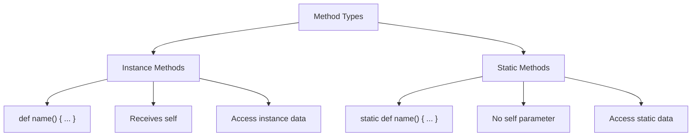
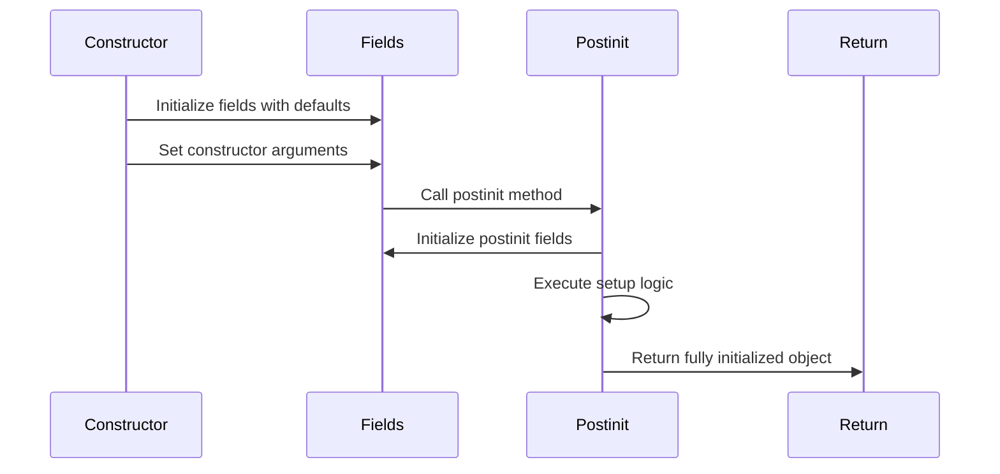

**Archetype bodies** define the internal structure and behavior of objects, classes, nodes, edges, and walkers. The body enclosed in braces (lines 5-47) contains member statements that specify data fields, methods, nested types, and initialization logic.

**Documentation Strings:**

Lines 1 and 3 show module-level docstrings using triple quotes. Line 6 demonstrates a member docstring - string literals appearing before member statements provide inline documentation for the archetype and its members.

**Has Statements - Declaring Fields:**

Lines 9-10 show the `has` keyword declaring data fields. Each field requires a type annotation using colon syntax (`: type`). Multiple fields can be declared in a single statement separated by commas, terminated by a semicolon.

**Important: `class` vs `obj` Behavior:**

The example uses `obj Vehicle` (line 5), where **all `has` fields automatically become instance variables**. In contrast:
- **In `obj` archetypes**: `has` fields are **instance variables** by default (each instance gets its own copy)
- **In `class` archetypes**: `has` fields with defaults become **class variables** initially (shared across instances), but can be shadowed when assigned

**Method Self Parameter:**
- **In `obj` archetypes**: Methods have **implicit `self`** - it doesn't appear in the parameter list (e.g., `def display() -> str { return self.year; }`)
- **In `class` archetypes**: Methods require **explicit `self` parameter with type annotation** (e.g., `def display(self: MyClass) -> str { return self.year; }`)

See [class_archetypes.md](class_archetypes.md) for detailed explanation

| Declaration Pattern | Example | Meaning |
|-------------------|---------|---------|
| Single field | `has name: str;` | One field with type |
| Multiple fields | `has name: str, year: int;` | Multiple fields, one statement |
| With default | `has count: int = 0;` | Field with initial value |
| With access | `has :pub id: str = "V123";` | Field with visibility modifier |

**Static vs Instance Members:**

Line 13 shows `static has` creating a class-level attribute shared across all instances in **both `obj` and `class`**. Compare:

- **Instance fields** (lines 9-10 in `obj`): Each object gets its own copy, accessed via `self.name`
- **Static fields** (line 13): One copy shared by all instances, accessed via `Vehicle.count` (line 24)

Line 33 demonstrates `static def` for static methods - no `self` parameter in both `class` and `obj` archetypes. For **instance methods**, `obj` archetypes have implicit `self` while `class` archetypes require explicit `self` with type annotation. Static methods are called on the archetype itself (line 53).

**Access Modifiers:**

Lines 16-17 control member visibility using colon-prefix syntax after `has`:

- `:pub` - Public (accessible from anywhere)
- `:priv` - Private (restricted to this archetype)
- `:prot` - Protected (accessible to subclasses)

The modifier appears between `has` and the field name.

**Postinit Initialization:**

Line 20 shows `by postinit` - defers field initialization to the `postinit` method. The special `postinit` method (lines 22-25) executes after construction but before the object is returned. This enables:

- Computed field initialization (line 23)
- Cross-field validation
- Side effects like registration (line 24 increments static counter)
- Setup requiring fully initialized state

**Methods:**

Line 28 shows an instance method with return type annotation (`-> str`). Line 33 shows a static method returning class-level data.

**Nested Archetypes:**

Lines 38-40 demonstrate nesting - a `class Part` defined inside `Vehicle`. This creates logical grouping and namespace organization. Access nested types via parent name: `Vehicle.Part()`.

**Inline Python:**

Lines 43-46 show embedding raw Python code using `::py::` delimiters. Code between markers executes as native Python, allowing:
- Python-specific methods
- Direct library usage
- Performance-critical sections
- Interop with Python codebases

**Member Statement Categories:**

| Category | Keywords | Lines | Purpose |
|----------|----------|-------|---------|
| Data | `has`, `static has` | 9-10, 13, 16-17, 20 | State storage |
| Behavior | `def`, `static def` | 22-25, 28-30, 33-35 | Operations |
| Types | `class`, `obj`, etc. | 38-40 | Nested definitions |
| Interop | `::py::` | 43-46 | Python integration |

**Field Initialization Flow:**

Line 50 calls the constructor with `name` and `year`. Fields get values, then `postinit` runs (setting `config` and incrementing `count`), finally the object is returned.

**Type Annotations:**

All fields require type annotations (colon followed by type). Common types include:
- Primitives: `str`, `int`, `float`, `bool`
- Collections: `list`, `dict`, `set`, `tuple`
- Custom: Any archetype name
- Generic: `list[str]`, `dict[str, int]`

**Usage Patterns:**

Line 50-51 show object creation - constructors accept named arguments matching field declarations. Line 53 demonstrates:
- Instance method calls: `v1.display()`
- Static method calls: `Vehicle.get_count()`

The output would be: `2020 Car 2021 Truck 2` (two displays and the count).
