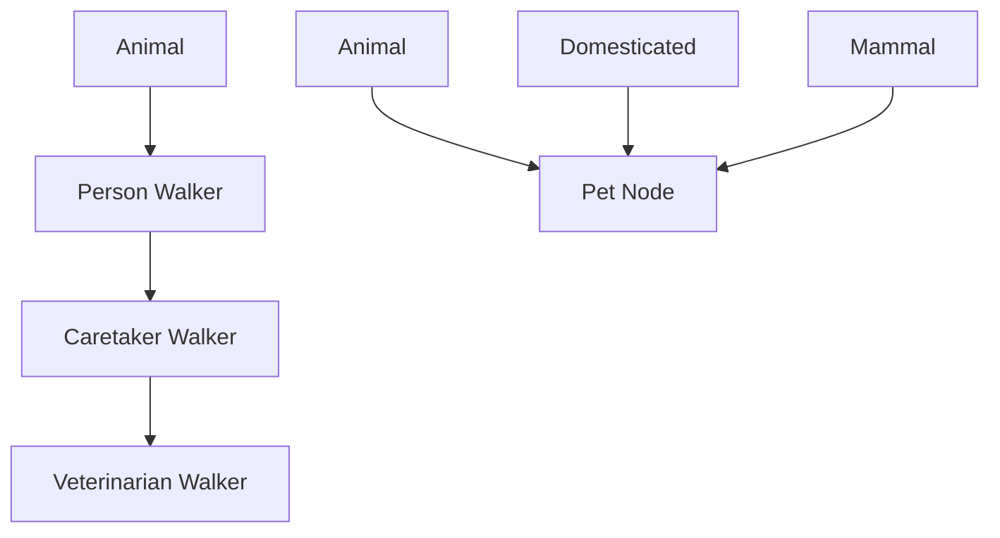
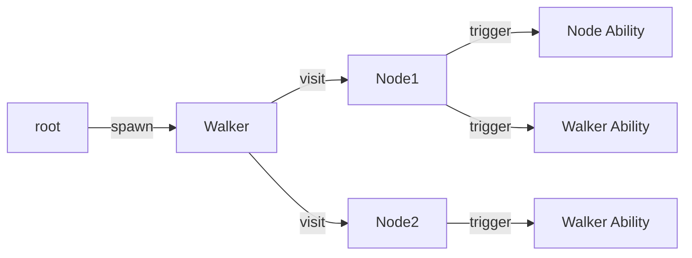

**Archetypes** are Jac's fundamental type declarations, providing five distinct keywords for building both traditional object-oriented and Object-Spatial programs.

**The Five Archetype Types:**

| Type | Purpose | Spatial? | Use Case |
|------|---------|----------|----------|
| `class` | Traditional OOP classes | No | Pure object-oriented programming without graph features |
| `obj` | OOP objects compatible with spatial | Hybrid | Bridge between OOP and spatial programming |
| `node` | Graph vertices | Yes | Data locations that can be connected and visited |
| `edge` | Graph relationships | Yes | First-class connections with state and behavior |
| `walker` | Mobile computation | Yes | Traversal logic that flows to data |

**Key Difference: `class` vs `obj`**

The fundamental distinction between `class` and `obj` is their variable semantics:

- **`class`**: Uses traditional Python class semantics. `has` variables with defaults become **class variables** initially, but can be shadowed by instance variables when assigned (e.g., `self.species = "Dog"`). **Methods require explicit `self` parameter** with type annotation (e.g., `def init(self: MyClass, ...)`).
- **`obj`**: Uses Python dataclass semantics where all `has` variables automatically become **instance variables** with each instance having its own copy. **Methods have implicit `self`** - it doesn't appear in the parameter list.

This difference is critical when choosing between `class` and `obj`:
- Use **`class`** when you need class variables (shared state), Python-style explicit `self`, and traditional class behavior
- Use **`obj`** when you need guaranteed instance variables, implicit `self`, or compatibility with spatial archetypes (`node`, `edge`, `walker` also use implicit `self`)

**Basic Archetype Declaration:**

Lines 4-8 show a basic `class` archetype with member variables (`has` statements) and a method (`def`). The `has` keyword declares attributes with type annotations and default values. **In `class` archetypes, these become class variables** shared across all instances initially, but can be shadowed by instance variables when assigned (as demonstrated in lines 169-180).

Lines 11-23 demonstrate a `class` with custom `init` constructor (Python-style with explicit `self`). The `has` declarations (lines 12-14) define class variables (since it's a `class` archetype), and the custom `init` method (lines 16-20) provides initialization logic with explicit `self: ClassicAnimal` parameter and a default parameter for `name`. **Note: In `class`, all methods including `init` require explicit `self` with type annotation**. The `describe` method (line 22) also has `self: ClassicAnimal` parameter.

Lines 26-33 demonstrate another `obj` archetype (`Domesticated`), which works like a Python dataclass. All `has` variables in `obj` are instance variables, making each object's attributes independent. Objects can be inherited by nodes for hybrid OOP/spatial designs.

Lines 23-31 show a `node` archetype with multiple inheritance from both `Animal` and `Domesticated` objects, plus `Mammal`. Nodes represent graph vertices and can define both methods and abilities. The `can` keyword (line 28) defines an ability that triggers automatically when a specific walker type visits.

Lines 34-41 demonstrate an `edge` archetype with the `:pub` access modifier, member variables, and a method. Edges are first-class relationships that carry state and behavior.

Lines 53-65 show a `walker` archetype inheriting from `Animal`. Walkers traverse graphs and execute node-specific abilities. Line 56 shows the special `` `root `` type for the entry ability.

**Inheritance Patterns:**

Lines 67-81 demonstrate walker inheritance chains. `Veterinarian` inherits from `Caretaker`, which inherits from `Person`, creating a three-level hierarchy. Each child accumulates all parent abilities plus its own.

Lines 23-31 show multiple inheritance where `Pet` combines three parent archetypes. When inheriting from both `obj` and `class` types, `obj` attributes become constructor parameters while `class` attributes must be set post-construction.

**Access Modifiers:**

Lines 98-100 demonstrate the three access levels using colon syntax:
- `:priv` - Private to defining module
- `:pub` - Publicly accessible
- `:protect` - Protected to subclasses

Access modifiers appear after the archetype keyword and before the name.

**Methods vs Abilities:**

| Feature | Methods (`def`) | Abilities (`can`) |
|---------|----------------|-------------------|
| Invocation | Explicit call | Automatic trigger on visit |
| Availability | All archetypes | Only `node`, `edge`, `walker` |
| Polymorphism | Standard OOP | Bidirectional (walker→node and node→walker) |
| Context | `self` | `self`, `here`, `visitor` |

Line 7 shows a method definition - must be explicitly called like `animal.make_sound()`.

Lines 28-30 show a node ability that triggers when a `Person` walker visits. Line 29 accesses the visiting walker via `visitor`.

Lines 46-49 show an edge ability triggered during edge traversal. Abilities enable event-driven spatial programming.

**Bidirectional Polymorphism:**

When a walker visits a node, both execute matching abilities:
- Walker's abilities dispatch based on visited node type (lines 60-64)
- Node's abilities dispatch based on visiting walker type (lines 28-30)

This creates rich interaction patterns where both parties respond to encounters.

**Forward Declarations and Implementations:**

Lines 103-105 show forward declarations - declaring archetype names without bodies. These enable:
- Breaking circular dependencies
- Organizing large codebases
- Separating interface from implementation

Lines 108-125 provide implementations via `impl` blocks. Each impl block adds members, methods, and abilities to the forward-declared archetype.

**Decorators:**

Lines 128-140 demonstrate decorator usage. Decorators are Python functions that transform archetypes at definition time. Multiple decorators stack and apply bottom-up (line 140 applies `track_creation` first, then `print_bases`).

**Async Walkers:**

Lines 84-95 show async walker declaration. The `async` keyword enables concurrent operations:
- Async walkers can have async abilities (line 86, 90)
- Async abilities can use `await` for asynchronous operations
- Useful for I/O-bound traversal logic

**Spatial Integration:**

Lines 184-204 demonstrate Object-Spatial Programming:
- Line 184: Create graph structure with `++>` (connect operator)
- Line 189: Spawn walker at root with `root spawn person`
- Line 203: Connect with typed edge using `+>: EdgeType() :+>`
- Line 204: Spawn walker to trigger edge abilities

Spatial archetypes (`node`, `edge`, `walker`) enable computation that flows to data locations rather than data flowing to functions - a fundamental shift from traditional programming paradigms.

**Execution Flow:**

When a walker spawns and visits nodes, abilities automatically trigger based on type matching, creating declarative traversal patterns.
