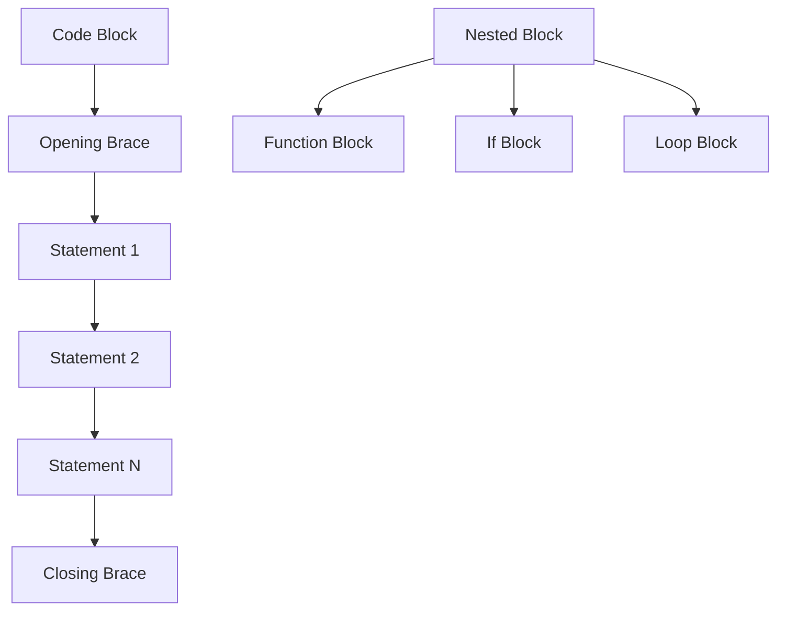
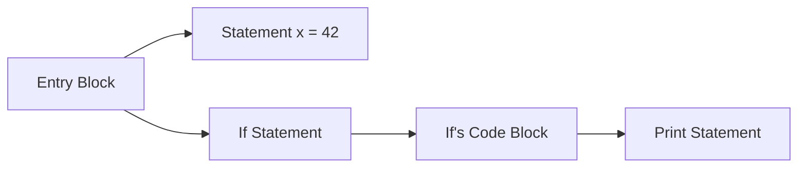

Code blocks organize sequences of statements within curly braces, providing structure for functions, control flow, and entry points.

**Entry Point Code Block**

Lines 3-20 show an entry code block - the starting point when the module executes:

The `with entry` construct creates a code block that runs when the program starts. Everything inside the curly braces `{ }` is part of this block.

**Expression Statements**

Line 5 demonstrates an expression statement:

An expression followed by a semicolon becomes a statement. The expression is evaluated for its side effect (in this case, printing output). The semicolon is required to mark the end of the statement.

**Function Definitions Inside Blocks**

Lines 8-10 show that you can define functions inside code blocks:

This function is defined within the entry block's scope. The function itself contains its own code block (lines 9-10) with a return statement.

**Code Block Structure**

Every code block has:
- Opening brace `{`
- Zero or more statements
- Closing brace `}`

**Function Call Statements**

Line 13 shows a function call as a statement:

The function call `add(10, 89)` is evaluated, its result is passed to `print()`, and then the statement completes. Function calls can be statements when their return value isn't assigned.

**Multiple Statement Types**

Lines 16-19 demonstrate that code blocks can contain various statement types:

| Line | Statement Type | Example |
|------|----------------|---------|
| 16 | Assignment | `x = 42;` |
| 17 | If statement | `if x > 0 { ... }` |
| 18 | Expression | `print("Positive");` |

Line 16 assigns a value to variable `x`. This is an assignment statement that stores 42 in the variable.

Lines 17-19 contain an if statement with its own nested code block. The condition `x > 0` is evaluated, and if true, the nested block executes.

**Nested Code Blocks**

The if statement on lines 17-19 creates a nested structure:

The outer code block (entry block) contains an if statement, which itself contains a code block. Code blocks can nest arbitrarily deep:

**Semicolons in Jac**

Jac requires semicolons to terminate most statements:
- Assignment statements: `x = 42;`
- Expression statements: `print(...);`
- Return statements: `return value;`

Semicolons are not used after code blocks themselves:
- Function definitions: `def foo() { ... }` (no semicolon after `}`)
- If statements: `if x > 0 { ... }` (no semicolon after `}`)
- Loops: `while x < 10 { ... }` (no semicolon after `}`)

**Statement Categories**

Code blocks can contain:

| Category | Examples | Purpose |
|----------|----------|---------|
| Expression | `print(x);` `x + y;` | Evaluate and use side effects |
| Assignment | `x = 10;` `y += 5;` | Bind values to variables |
| Control Flow | `if`, `while`, `for` | Change execution path |
| Definitions | `def`, `class`, `enum` | Declare new elements |
| Return | `return value;` | Exit function with value |

**Scope and Code Blocks**

Code blocks create scope boundaries for variables:
- Variables defined in a block are local to that block
- Nested blocks can access variables from outer blocks
- Outer blocks cannot access variables from inner blocks

The function `add` defined on line 8 is scoped to the entry block. Variables `x` and `y` (line 8) are scoped to the function's code block.

**Practical Code Block Usage**

Code blocks serve several purposes:

1. **Grouping**: Related statements stay together
2. **Scope Control**: Variables have defined lifetimes
3. **Structure**: Clear visual organization
4. **Control Flow**: Define what executes conditionally or repeatedly

Every control structure in Jac uses code blocks to define what should execute under certain conditions. The curly brace syntax makes it explicit where blocks begin and end.

**Code Block Best Practices**

- Keep blocks focused on a single purpose
- Use proper indentation for readability (even though braces define the structure)
- Avoid deeply nested blocks when possible
- One statement per line for clarity
- Always use braces, even for single-statement blocks

Code blocks are fundamental to organizing Jac programs, providing the structure that makes complex logic manageable and understandable.
