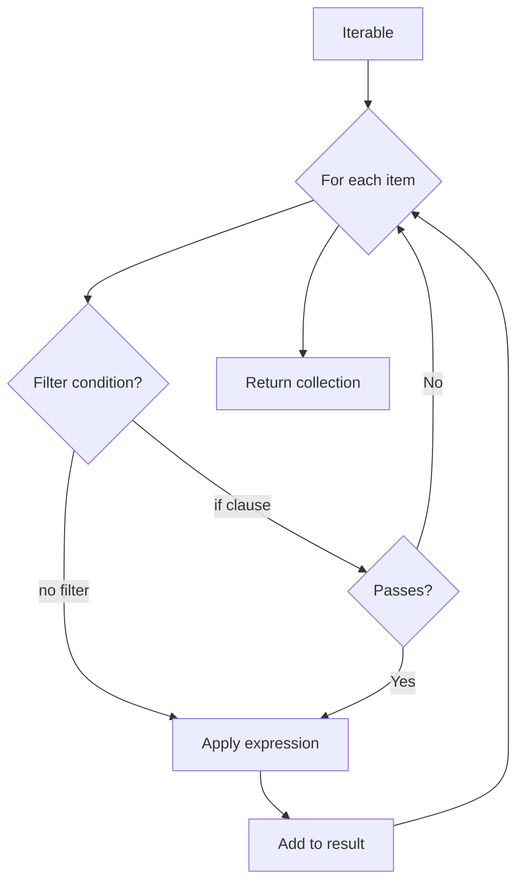

**Collection Values in Jac**

Jac provides powerful syntax for creating and manipulating collections including lists, tuples, dictionaries, sets, and comprehensions. This example demonstrates literal notation and comprehension expressions.

**Collection Types Overview**

| Type | Syntax | Mutable | Ordered | Allows Duplicates |
|------|--------|---------|---------|-------------------|
| List | `[1, 2, 3]` | Yes | Yes | Yes |
| Tuple | `(1, 2, 3)` | No | Yes | Yes |
| Dictionary | `{"a": 1, "b": 2}` | Yes | Yes (insertion order) | Keys: No, Values: Yes |
| Set | `{1, 2, 3}` | Yes | No | No |

**Literal Syntax (Lines 4-8)**

The example shows basic collection literals:

- Line 5: `lst = [1, 2, 3]` creates a list
- Line 6: `tpl = (1, 2, 3)` creates a tuple
- Line 7: `dct = {"a": 1, "b": 2}` creates a dictionary with string keys
- Line 8: `st = {1, 2, 3}` creates a set

**Empty Collections (Lines 10-13)**

Empty collections have special syntax considerations:

- Line 11: `empty_lst = []` creates an empty list
- Line 12: `empty_dct = {}` creates an empty dictionary (note: `{}` is dict, not set)
- Line 13: `empty_tpl = ()` creates an empty tuple
- For empty sets, use `set()` since `{}` is reserved for dictionaries

**List Comprehension (Lines 15-17)**

List comprehensions provide concise syntax for creating lists from iterables:

Line 16: `squares = [x ** 2 for x in range(5)]`

- Produces `[0, 1, 4, 9, 16]` - squares of numbers 0-4
- Syntax: `[expression for variable in iterable]`

Line 17: `filtered = [x for x in range(10) if x % 2 == 0]`

- Produces `[0, 2, 4, 6, 8]` - only even numbers
- Syntax: `[expression for variable in iterable if condition]`

**Dictionary Comprehension (Line 20)**

Line 20: `dict_comp = {x: x ** 2 for x in range(5)}`

- Creates `{0: 0, 1: 1, 2: 4, 3: 9, 4: 16}`
- Syntax: `{key_expr: value_expr for variable in iterable}`
- Keys and values can be different expressions

**Set Comprehension (Line 23)**

Line 23: `set_comp = {x ** 2 for x in range(5)}`

- Creates `{0, 1, 4, 9, 16}` - a set of squares
- Syntax: `{expression for variable in iterable}`
- Automatically removes duplicates

**Generator Comprehension (Line 26)**

Line 26: `gen_comp = (x ** 2 for x in range(5))`

- Uses parentheses instead of brackets
- Creates a generator that produces values lazily
- Memory efficient for large datasets - values computed on demand
- Convert to list with `list(gen_comp)` (shown in line 38)

**Comprehension Flow Diagram**

**Multiple Loops (Line 29)**

Line 29: `multi = [x * y for x in [1, 2] for y in [3, 4]]`

- Nested iteration producing all combinations
- Results: `[1*3, 1*4, 2*3, 2*4]` = `[3, 4, 6, 8]`
- Outer loop (`x`) runs first, inner loop (`y`) runs for each `x`

**Multiple Filters (Line 30)**

Line 30: `multi_if = [x for x in range(20) if x % 2 == 0 if x % 3 == 0]`

- Multiple `if` clauses act as AND conditions
- Only includes values divisible by both 2 AND 3 (multiples of 6)
- Results: `[0, 6, 12, 18]`

**Nested Comprehensions (Line 33)**

Line 33: `matrix = [[i * j for j in range(3)] for i in range(3)]`

- Creates a 2D matrix (list of lists)
- Outer comprehension creates rows, inner creates columns
- Results:

**Dictionary Unpacking (Line 36)**

Line 36: `merged = {**dct, "c": 3}`

- Spreads all key-value pairs from `dct` into a new dictionary
- Adds additional key `"c": 3`
- If `dct = {"a": 1, "b": 2}`, result is `{"a": 1, "b": 2, "c": 3}`
- Later values override earlier ones for duplicate keys

**Comprehension Performance Characteristics**

| Type | Memory | Use Case |
|------|--------|----------|
| List `[...]` | Eager (full list in memory) | Need all values, multiple iterations |
| Generator `(...)` | Lazy (values on demand) | Large datasets, single iteration |
| Dict `{k:v...}` | Eager | Key-value mappings |
| Set `{...}` | Eager | Unique values, membership testing |

**Common Patterns**

Transform and filter:

Create lookup tables:

Flatten nested structures:

Matrix operations:
