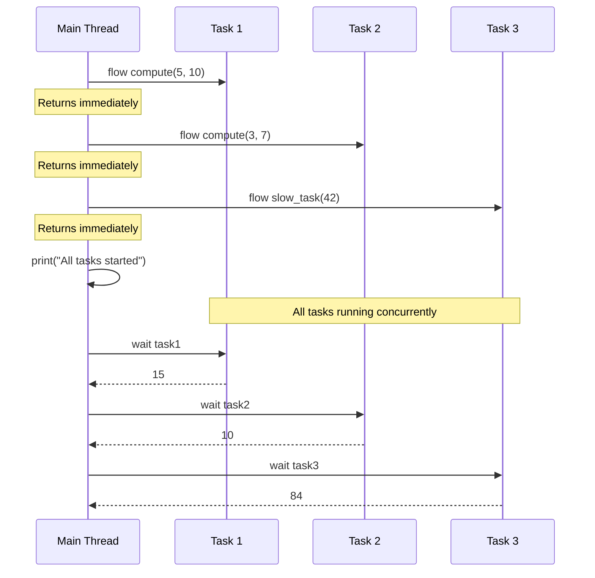

**Concurrent Expressions in Jac**

Jac provides `flow` and `wait` keywords for thread-based concurrency, allowing functions to run in parallel and improving performance for I/O-bound operations.

**Concurrency Keywords**

| Keyword | Purpose | Returns | Blocks |
|---------|---------|---------|--------|
| `flow` | Start concurrent execution | Task/Future handle | No |
| `wait` | Get result from task | Result value | Yes (until complete) |

**Flow Keyword - Starting Concurrent Tasks (Lines 19-24)**

The `flow` keyword initiates concurrent execution without blocking:

Line 20: `task1 = flow compute(5, 10)`
- Starts `compute(5, 10)` in a background thread
- Returns immediately with a task handle
- Function executes concurrently

Line 21: `task2 = flow compute(3, 7)`
- Starts another concurrent task
- Both tasks run in parallel

Line 22: `task3 = flow slow_task(42)`
- Third concurrent task

Line 24: `print("All tasks started concurrently")`
- Executes immediately without waiting for tasks to complete
- All three tasks are running in the background

**Execution Flow Diagram**



**Wait Keyword - Collecting Results (Lines 26-29)**

The `wait` keyword blocks until a task completes and returns its result:

Line 27: `result1 = wait task1`
- Pauses execution until `task1` finishes
- Returns the function's return value (15)
- If task already finished, returns immediately

Line 28: `result2 = wait task2`
- Waits for second task (returns 10)

Line 29: `result3 = wait task3`
- Waits for third task (returns 84)

**Function Execution (Lines 5-16)**

The example includes two functions to demonstrate concurrency:

**compute function (Lines 5-9)**:
- Line 6: Prints message showing which computation is starting
- Line 7: `sleep(1)` simulates a time-consuming operation (1 second delay)
- Line 8: Returns the sum of x and y

**slow_task function (Lines 11-16)**:
- Line 12: Prints task start message
- Line 13: `sleep(1)` simulates work
- Line 14: Prints completion message
- Line 15: Returns n * 2

**Concurrency Model**

Under the hood, Jac's `flow`/`wait` uses Python's `ThreadPoolExecutor`:
- `flow` submits the callable to a thread pool and returns a Future-like object
- `wait` calls the future's `.result()` method to retrieve the value
- Thread pool is shared across the program
- This is **thread-based**, not event-loop based (different from async/await)

**Performance Characteristics**

| Aspect | Details |
|--------|---------|
| Execution | Parallel for I/O-bound tasks |
| GIL Impact | CPU-bound tasks limited by Python's Global Interpreter Lock |
| Memory | Each thread has its own stack |
| Best For | I/O operations, network requests, file operations |
| Exception Handling | Exceptions propagate through `wait` |

**Timing Analysis**

Without concurrency (sequential):
```
compute(5, 10): 1 second
compute(3, 7): 1 second
slow_task(42): 1 second
Total: ~3 seconds
```

With concurrency (lines 20-29):
```
All three tasks start simultaneously
All run in parallel for ~1 second
Total: ~1 second
```

**Common Patterns**

Parallel I/O operations:
```
# Multiple network requests
results = []
tasks = [flow fetch_url(url) for url in urls]
results = [wait task for task in tasks]
```

Concurrent processing:
```
# Process items in parallel
data = [1, 2, 3, 4, 5]
tasks = [flow process(item) for item in data]
results = [wait task for task in tasks]
```

Mix of serial and concurrent:
```
# Prepare data (serial)
data = prepare_data()
# Process concurrently
task1 = flow process_a(data)
task2 = flow process_b(data)
# Continue other work
do_something_else()
# Collect results when needed
a_result = wait task1
b_result = wait task2
```

**Comparison: flow/wait vs async/await**

| Feature | flow/wait | async/await |
|---------|-----------|-------------|
| Execution Model | Thread-based | Event-loop based |
| Blocking Operations | Allowed | Requires async versions |
| Function Definition | Regular functions | Must be `async def` |
| Concurrency Type | Parallel threads | Cooperative multitasking |
| GIL Impact | Yes (CPU-bound) | Yes (but better for I/O) |
| Use Case | Mixed workloads, blocking I/O | Event-driven I/O |

**Best Practices**

1. **Use flow for I/O-bound tasks**: File operations, network requests, database queries
2. **Wait strategically**: Don't wait immediately after flow - let tasks run first
3. **Handle exceptions**: Wrap `wait` in try/except if tasks might fail
4. **Avoid excessive threads**: Too many concurrent tasks can cause overhead
5. **CPU-bound tasks**: Consider alternatives (multiprocessing) due to GIL limitations

**Exception Handling**

If a flow task raises an exception, `wait` will re-raise it:
```
task = flow might_fail()
# ... do other work ...
try:
    result = wait task
except SomeError as e:
    # Handle error from background task
    print(f"Task failed: {e}")
```
