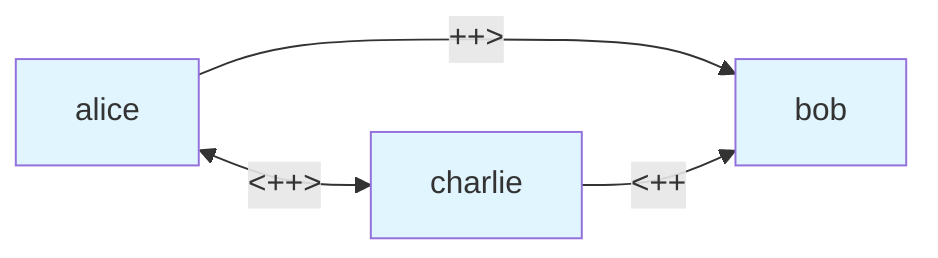
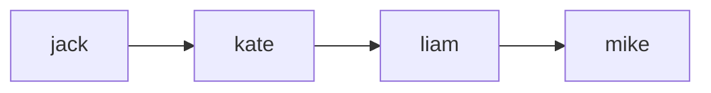
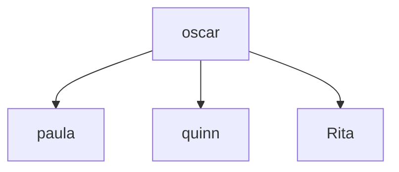
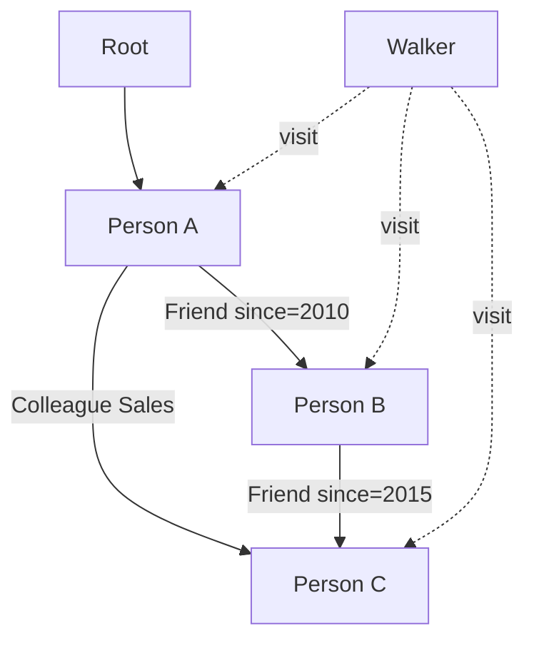

**Connect Expressions - Graph Edge Creation**

Connect expressions are specialized operators for creating edges between nodes in graph structures. These operators are fundamental to Jac's Object-Spatial Programming, providing first-class syntax for spatial relationships.

**Connect Operator Types**

| Direction | Untyped | Typed | With Attributes |
|-----------|---------|-------|-----------------|
| Forward (A → B) | `++>` | `+>:Type:+>` | `+>: Type(...) :+>` |
| Backward (A ← B) | `<++` | `<+:Type:<+` | `<+: Type(...) :<+` |
| Bidirectional (A ↔ B) | `<++>` | `<+:Type:+>` | `<+: Type(...) :+>` |

**Node and Edge Definitions (Lines 4-23)**

The example defines nodes and edges for the graph:

Lines 4-7: `Person` node with `name` and `age` attributes
Lines 9-11: `City` node with `name` attribute
Lines 13-15: `LivesIn` edge with `years` attribute
Lines 17-19: `Friend` edge with `since` attribute
Lines 21-23: `Colleague` edge with `department` attribute

**Untyped Connect Operators (Lines 28-41)**

These create generic edges without specifying an edge type:

**Forward connection (Line 34)**:
- Arrow points right: alice → bob
- Line 35 prints confirmation

**Backward connection (Line 37)**:
- Arrow points left: charlie → bob (not bob → charlie!)
- Line 38 notes the actual direction

**Bidirectional connection (Line 40)**:
- Creates alice → charlie AND charlie → alice
- Line 41 confirms both directions created

**Direction Flow Diagram**

**Typed Connect Operators (Lines 43-58)**

These specify the edge archetype during connection:

**Forward typed (Line 51)**:
- Creates `LivesIn` edge from diana to nyc
- Edge type is explicitly `LivesIn`
- Line 52 shows the syntax

**Backward typed (Line 54)**:
- Creates `LivesIn` edge from london to eve (not eve to london!)
- Line 55 clarifies the actual direction

**Bidirectional typed (Line 57)**:
- Creates `Friend` edges in both directions
- Both diana → eve and eve → diana are `Friend` type

**Edge Attribute Initialization (Lines 60-73)**

Initialize edge attributes during connection:

**Forward with attributes (Line 66)**:
- Creates `Friend` edge from grace to henry
- Sets `since` attribute to 2015
- Line 67 shows the full syntax

**Backward with attributes (Line 69)**:
- Creates `Friend` edge from iris to henry
- Edge has `since=2018`

**Bidirectional with attributes (Line 72)**:
- Creates `Colleague` edges in both directions
- Both edges have `department="Engineering"`

**Chained Connections (Lines 75-83)**

Connect operators can be chained left-to-right:

Line 82: `jack ++> kate ++> liam ++> mike;`
- Creates path: jack → kate → liam → mike
- Evaluates left-to-right
- Line 83 shows the resulting chain

**Chaining Visualization**

**Inline Node Creation (Lines 85-92)**

Create nodes directly in connect expressions:

Line 89: `nina ++> Person(name="InlineNode1", age=35);`
- Creates a new `Person` node inline
- Immediately connects nina to it
- No need for intermediate variable

Line 90: `nina +>:Friend:+> Person(name="InlineNode2", age=40);`
- Inline node creation with typed edge

Line 91: `nina +>: Friend(since=2010) :+> Person(name="InlineNode3", age=45);`
- Combines inline creation with edge attributes

**Multiple Target Connections (Lines 94-103)**

One node can connect to multiple targets:

Lines 100-102:
- Oscar connects to three different nodes
- Creates a hub/star pattern
- Line 103 confirms all connections

**Hub Pattern Diagram**

**Disconnect Operator (Lines 105-108)**

Line 107: `node del [-->] target`
- Deletes edges from node to target
- Uses `del` keyword with edge reference syntax
- Can specify edge type: `node del [->:Type:->] target`

**Connect in Expressions (Lines 110-116)**

Connect expressions return values and integrate with other expressions:

Lines 115-116:
- Connect can be part of larger expressions
- Returns a value that can be used in subsequent code

**Edge Traversal Integration (Lines 123-146)**

The example demonstrates how created edges are traversed:

**Building the graph (Lines 133-136)**:

**Traversing edges (Line 140)**:
- Visits all outgoing edges from current node
- Uses edge reference syntax (different from connect operators)

**Traversal Flow**

**Connect vs Edge References**

| Aspect | Connect Operators | Edge References |
|--------|------------------|-----------------|
| Purpose | CREATE edges | TRAVERSE edges |
| Examples | `++>`, `+>:Type:+>` | `[-->]`, `[->:Type:->]` |
| Usage | Graph construction | Visit statements, queries |
| Action | Imperative (make connection) | Declarative (find connections) |
| Context | Building graph structure | Navigating graph structure |

**Common Graph Patterns**

Linear chain (line 82):

Star/hub (lines 100-102):

Bidirectional network:

Heterogeneous typed graph (lines 134-136):

**Operator Directionality Guide**

Understanding arrow direction is critical:

| Code | Actual Edge Direction | Memory Aid |
|------|----------------------|------------|
| `a ++> b` | a → b | Arrow points to target |
| `a <++ b` | b → a | Arrow points away, so b → a |
| `a <++> b` | a ↔ b | Arrows both ways = both edges |

**Best Practices**

1. **Choose typed edges for clarity**: Use `+>:Type:+>` when edge semantics matter
2. **Initialize attributes during connect**: Cleaner than setting attributes after
3. **Use backward operators intentionally**: `<++` can improve code readability
4. **Chain for linear structures**: Paths and sequences benefit from chaining
5. **Inline creation for temporary nodes**: Reduces variable clutter
6. **Document edge semantics**: Comment complex graph structures

**Integration with OSP**

Connect expressions work seamlessly with walkers:

Building during traversal:

Conditional connections:
