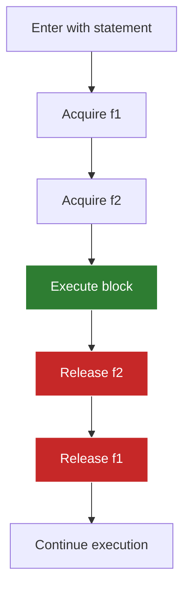
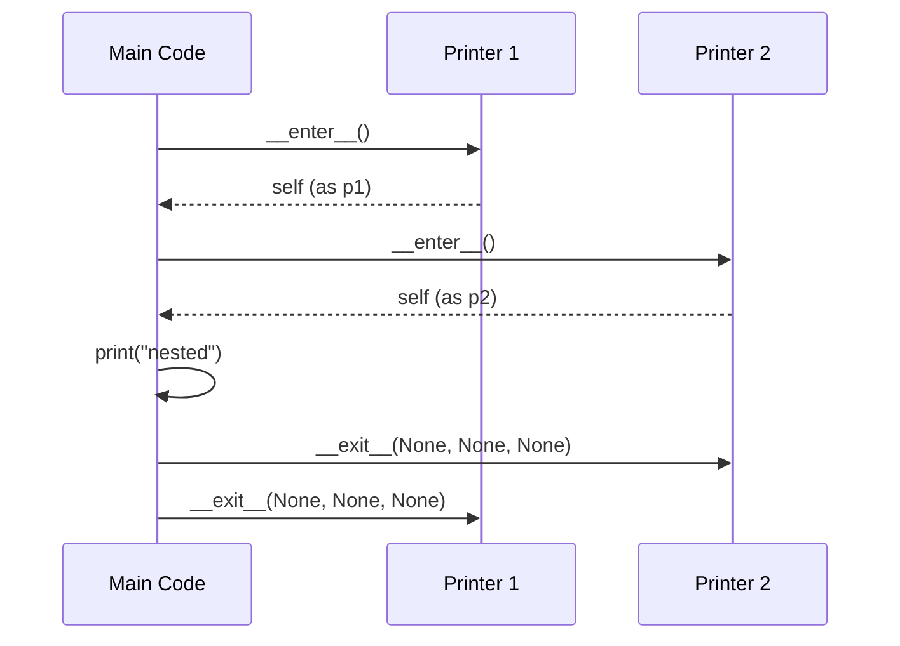

**Context Managers in Jac**

Context managers provide automatic resource management using the `with` statement, ensuring proper setup and cleanup of resources even when errors occur. This is essential for handling files, locks, network connections, and other resources requiring paired acquire/release operations.

**Basic With Statement (Lines 4-7)**

Line 5: `with open(__file__, 'r') as f {`
- Opens the file in read mode
- Binds the file object to variable `f`
- Automatically closes the file when the block ends
- Works even if exceptions occur

The `as` clause binds the context manager's return value (from `__enter__`) to a variable for use within the block.

**Context Manager Protocol**

| Method | When Called | Purpose | Returns |
|--------|-------------|---------|---------|
| `__enter__` | Block starts | Acquire resource | Resource object (bound to `as` variable) |
| `__exit__` | Block ends | Release resource | None (or True to suppress exceptions) |

**Multiple Context Managers (Lines 9-12)**

Line 10: `with open(__file__, 'r') as f1, open(__file__, 'r') as f2 {`
- Manages multiple resources in one statement
- Separated by commas
- All resources properly cleaned up in reverse order
- Equivalent to nested `with` statements

**Cleanup Order Diagram**

**Custom Context Manager (Lines 14-33)**

The example defines a `Printer` class implementing the context manager protocol:

**__enter__ method (Lines 16-19)**:
- Line 16: `def __enter__(self: Printer) -> Printer {`
- Called when entering the `with` block
- Line 17: Prints "entering" (setup logic)
- Line 18: Returns `self` (the object to bind to `as` variable)

**__exit__ method (Lines 21-23)**:
- Line 21: `def __exit__(self: Printer, exc_type: object, exc_val: object, exc_tb: object) -> None {`
- Called when exiting the `with` block
- Receives exception information if an error occurred:
  - `exc_type`: Exception class (or None if no error)
  - `exc_val`: Exception instance (or None)
  - `exc_tb`: Traceback object (or None)
- Line 22: Prints "exiting" (cleanup logic)
- Returns None (doesn't suppress exceptions)

**Using Custom Context Managers (Lines 26-33)**

**Without as binding (Lines 26-28)**:
- Line 26: Creates Printer, enters context
- Prints: "entering", "inside", "exiting"
- The `as` clause is optional when you don't need to reference the resource

**With as binding (Lines 31-33)**:
- Line 31: Binds the returned object to `p`
- Can use `p` within the block
- Still automatically calls cleanup

**Nested Context Managers (Lines 36-40)**

Lines 36-40:
- Outer context entered first (p1)
- Inner context entered second (p2)
- Cleanup happens in reverse: p2 exits, then p1 exits
- Ensures proper resource ordering

**Execution Flow**

**Async Context Managers (Lines 42-58)**

Line 43: `async def test_async_with {`
- Defines an async function demonstrating async context managers

**AsyncContext class (Lines 44-53)**:
- Line 45: `async def __aenter__(self: AsyncContext) -> AsyncContext {`
  - Async version of `__enter__`
  - Used with `async with` statements
  - Can perform async operations during setup

- Line 50: `async def __aexit__(self: AsyncContext, ...)`
  - Async version of `__exit__`
  - Can perform async cleanup

**Using async context managers (Lines 55-57)**:
- Uses `async with` instead of `with`
- Only works in async functions
- Allows await operations in setup/cleanup

**Exception Safety**

The key benefit of context managers is guaranteed cleanup:

| Scenario | __enter__ Called | __exit__ Called | Cleanup Happens |
|----------|-----------------|-----------------|-----------------|
| Normal execution | Yes | Yes | Yes |
| Exception in block | Yes | Yes | Yes |
| Return in block | Yes | Yes | Yes |
| Break/continue in loop | Yes | Yes | Yes |

**Exception Handling in __exit__**

The `__exit__` method receives exception details:

**Common Use Cases**

File I/O (line 5):

Database connections:

Locks and synchronization:

Temporary state changes:

**Best Practices**

1. **Always use for resources**: Files, connections, locks should use context managers
2. **Keep blocks focused**: Context manager blocks should contain only resource-dependent code
3. **Avoid suppressing exceptions**: Return False from `__exit__` unless you have a specific reason
4. **Document cleanup behavior**: Make it clear what resources are managed
5. **Use multiple managers**: Prefer `with a, b, c` over deeply nested statements

**Context Manager Types Comparison**

| Type | Syntax | Use Case | Example |
|------|--------|----------|---------|
| Synchronous | `with` | Regular I/O, locks | File operations |
| Asynchronous | `async with` | Async I/O | Network connections |
| Multiple | `with a, b` | Multiple resources | Multiple files |
| Nested | `with a { with b }` | Ordered setup/cleanup | Transaction contexts |

**Implementation Pattern**

To create a context manager:

1. Define `__enter__` method:
   - Acquire/setup resource
   - Return resource object

2. Define `__exit__` method:
   - Accept exception parameters
   - Perform cleanup
   - Return True to suppress exceptions (rare)

3. Use with `with` statement:
   - Resource automatically managed
   - Cleanup guaranteed
