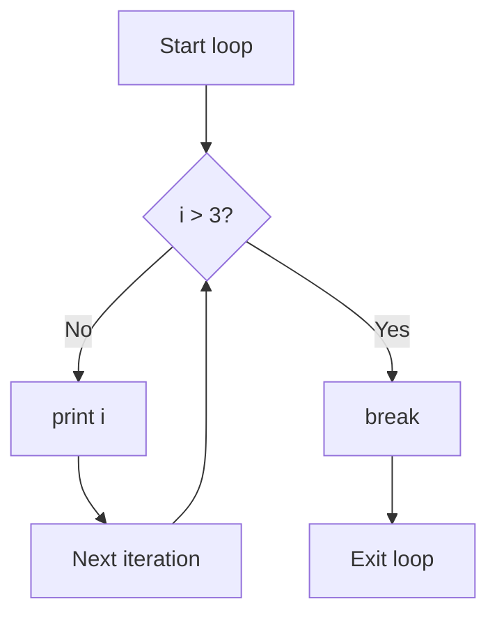
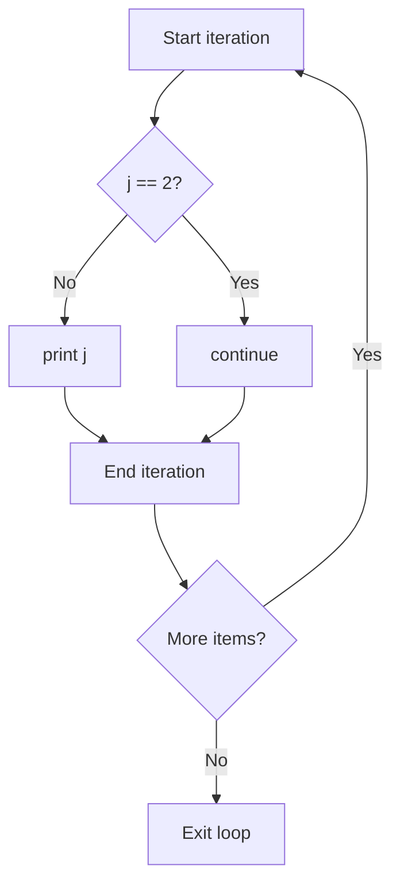
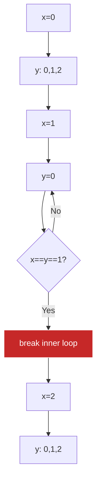

**Control Statements in Jac**

Control statements alter the normal flow of execution within loops, providing mechanisms to exit early or skip iterations. Jac supports `break`, `continue`, and the walker-specific `skip` statement.

**Control Statement Types**

| Statement | Context | Scope | Effect |
|-----------|---------|-------|--------|
| `break` | Loops (for/while) | Innermost loop | Exit loop completely |
| `continue` | Loops (for/while) | Current iteration | Skip to next iteration |
| `skip` | Walker abilities | Current node | Skip node, continue traversal |

**Break Statement (Lines 4-10)**

The `break` keyword immediately exits the innermost loop:

Lines 5-10:
- Loop starts with `i` from 0 to 9
- Line 6: When `i > 3` (i.e., when i=4), condition is true
- Line 7: `break` executes, exiting the loop
- Only 0, 1, 2, 3 are printed
- Remaining iterations (4-9) never execute

**Break Flow Diagram**

**Continue Statement (Lines 12-18)**

The `continue` keyword skips the rest of the current iteration and proceeds to the next:

Lines 13-18:
- Loop iterates j from 0 to 4
- Line 14: When `j == 2`, condition is true
- Line 15: `continue` skips to next iteration
- Line 17: `print(j)` is skipped for j=2
- Output: 0, 1, 3, 4 (2 is skipped)

**Continue Flow Diagram**

**Break in While Loop (Lines 20-28)**

Break works the same in while loops:

Lines 21-28:
- Line 22: Infinite loop (`while True`)
- Line 23: Increment counter
- Line 24: When count exceeds 3, break executes
- Prints: 1, 2, 3
- Without break, this would be an infinite loop

**Continue in While Loop (Lines 30-38)**

Continue skips iterations in while loops:

Lines 31-38:
- Line 33: Increment n first (important!)
- Line 34: If n is even, skip print
- Line 37: Only odd numbers are printed
- Output: 1, 3, 5

**Skip Statement - Walker-Specific (Lines 40-45)**

Line 41-44:
- `skip` is used in walker contexts (not regular loops)
- Stops processing current node
- Walker continues to next queued node
- Different from `break` (which exits loops) and `disengage` (which stops the walker)

**Control Statements Comparison**

| Feature | break | continue | skip |
|---------|-------|----------|------|
| Exits loop | Yes | No | N/A |
| Skips iteration | Remaining iterations | Current iteration | Current node |
| Continues loop | No | Yes | N/A |
| Walker-specific | No | No | Yes |
| Affects outer loops | No | No | No |

**Nested Loops with Break (Lines 47-55)**

Lines 48-55:
- Nested loops: outer (x) and inner (y)
- Line 50: When x=1 and y=1, break executes
- **Break only exits inner loop**, not outer loop
- When x=1, prints (1,0) then breaks; outer loop continues with x=2

**Break Scope Visualization**

**Nested Loops with Continue (Lines 57-65)**

Lines 58-65:
- Line 60: When a equals b, skip that iteration
- **Continue only affects inner loop**
- Prints all pairs where a ≠ b
- Output: (0,1), (0,2), (1,0), (1,2), (2,0), (2,1)

**Common Patterns**

Early exit on condition:

Filter during iteration:

Bounded loop:

Skip diagonal in matrix:

**Best Practices**

1. **Use break for early termination**: When you've found what you need, exit the loop
2. **Use continue for filtering**: Skip unwanted items instead of wrapping code in if statements
3. **Avoid deep nesting**: Multiple levels of break/continue can be confusing
4. **Consider alternatives**: Sometimes restructuring with functions is clearer
5. **Document intent**: Comment why you're breaking or continuing

**Break vs Return**

| Aspect | break | return |
|--------|-------|--------|
| Exits loop | Yes | N/A |
| Exits function | No | Yes |
| Continues after | Yes (after loop) | No (leaves function) |
| Can return value | No | Yes |

**Loop Control Limitations**

1. **Only affects innermost loop**: Cannot break/continue outer loops directly
2. **No labeled breaks**: Jac doesn't support labeled break statements
3. **Function boundaries**: Cannot break/continue across function calls
4. **Walker context**: Use `skip` for walker-specific control, not break/continue

**When to Use Each**

Use `break` when:
- Search finds target
- Error condition detected
- Maximum iterations reached
- Early termination improves performance

Use `continue` when:
- Filtering items in a collection
- Skipping invalid data
- Processing only subset of items
- Avoiding nested if statements

Use `skip` when:
- Walker should skip current node
- Node doesn't meet criteria
- Avoiding duplicate processing
- Conditional graph traversal
