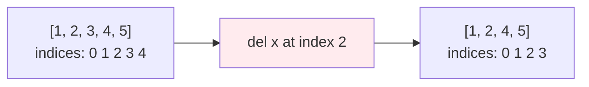
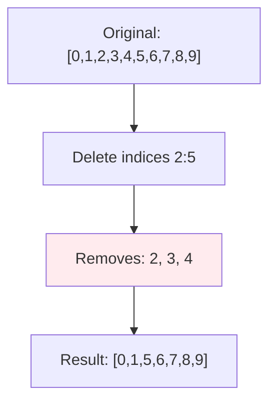
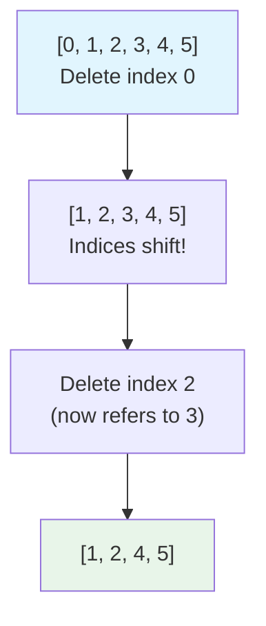

**Delete Statements in Jac**

The `del` statement removes bindings, deletes collection elements, or removes object attributes. It provides explicit control over memory management and data structure modification.

**Delete Statement Targets**

| Target Type | Syntax | Effect | Error if Missing |
|-------------|--------|--------|------------------|
| Variable | `del var` | Remove binding from scope | NameError |
| List element | `del list[index]` | Remove element, shift remaining | IndexError |
| List slice | `del list[start:end]` | Remove range, shift remaining | None (empty slice OK) |
| Dict key | `del dict[key]` | Remove key-value pair | KeyError |

**Deleting List Elements (Lines 4-8)**

Lines 5-8:
- Line 5: Creates list `[1, 2, 3, 4, 5]`
- Line 7: `del x[2]` removes element at index 2 (value 3)
- Result: `[1, 2, 4, 5]`
- Subsequent elements shift down to fill the gap
- Indices are updated after deletion

**List Deletion Flow**

**Deleting Variables (Lines 10-13)**

Lines 11-13:
- Line 11: Creates variable binding `y = 100`
- Line 13: `del y` removes the binding completely
- Variable name no longer exists in scope
- Attempting to access `y` after deletion raises `NameError`
- The value 100 may be garbage collected if no other references exist

**Deleting Dictionary Items (Lines 15-19)**

Lines 16-19:
- Line 16: Creates dictionary with three key-value pairs
- Line 18: `del d["b"]` removes the key "b" and its value
- Result: `{"a": 1, "c": 3}`
- Attempting to delete non-existent key raises `KeyError`

**Deleting Slices (Lines 21-25)**

Lines 22-25:
- Line 22: Creates list with 10 elements
- Line 24: `del numbers[2:5]` removes elements at indices 2, 3, 4
- Slice syntax: `[start:stop]` removes range [start, stop)
- Result: `[0, 1, 5, 6, 7, 8, 9]`
- Remaining elements shift to fill the gap

**Slice Deletion Visualization**

**Deleting Nested Elements (Lines 27-31)**

Lines 28-31:
- Line 28: Creates 2D list (list of lists)
- Line 30: `del matrix[1]` removes entire second row `[3, 4]`
- Result: `[[1, 2], [5, 6]]`
- Works on any list element, including nested structures

**Multiple Sequential Deletions (Lines 33-36)**

Lines 34-36:
- Line 34: Initial list `[10, 20, 30]`
- Line 35: `del lst[1]` removes 20
- Result: `[10, 30]`
- Note: Indices shift after each deletion

**Multiple Deletions with Index Shifts (Lines 38-42)**

Lines 39-42:
- Line 39: Initial `[0, 1, 2, 3, 4, 5]`
- Line 40: `del data[0]` removes 0 → `[1, 2, 3, 4, 5]`
- Line 41: `del data[2]` removes element at index 2 (which is now 3) → `[1, 2, 4, 5]`
- **Important**: Indices change after each deletion!

**Index Shifting Diagram**

**Delete Semantics Summary**

**Variable deletion**:
- Removes name from namespace
- Value may be garbage collected
- Cannot use variable after deletion

**List element deletion**:
- Removes element at index
- All subsequent elements shift left
- Indices are renumbered
- Raises `IndexError` if index out of range

**List slice deletion**:
- Removes range [start:stop)
- Remaining elements shift to fill gap
- No error if slice is empty

**Dictionary deletion**:
- Removes key-value pair
- Other pairs unaffected
- Raises `KeyError` if key doesn't exist

**Common Patterns**

Remove by index:

Remove range:

Clear dictionary entry:

Free variable reference:

Remove from end (efficient):

**Best Practices**

1. **Be careful with multiple deletions**: Remember indices shift after each deletion
2. **Delete from end to start**: When deleting multiple indices, iterate backwards
3. **Use list comprehensions for filtering**: Often clearer than deleting elements
4. **Check existence first**: Use `if key in dict` before `del dict[key]`
5. **Consider alternatives**: Sometimes rebuilding a list/dict is clearer than deleting

**Delete vs Alternatives**

| Task | Using del | Alternative |
|------|-----------|-------------|
| Remove element | `del list[i]` | `list.pop(i)` (returns value) |
| Clear list | `del list[:]` | `list.clear()` |
| Filter list | Loop with del | List comprehension |
| Remove dict entry | `del dict[key]` | `dict.pop(key, default)` |

**Memory Management**

Deleting a variable removes the binding, not necessarily the object:
- If other references exist, object persists
- When reference count reaches zero, object is garbage collected
- `del` doesn't directly free memory - it removes references
- Python's garbage collector handles actual memory reclamation

**Error Handling**

Attempting to delete non-existent items raises errors:

Safe deletion patterns:

**When to Use Del**

Use `del` when:
- Removing specific list elements by index
- Deleting dictionary entries
- Freeing large data structures from memory
- Removing variable bindings from scope
- Cleaning up temporary variables

Avoid `del` when:
- Filtering lists (use list comprehensions)
- Removing by value (use `list.remove()`)
- Need the deleted value (use `pop()`)
- Clearing entire collection (use `.clear()`)
