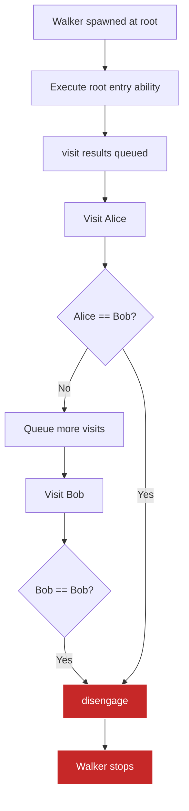
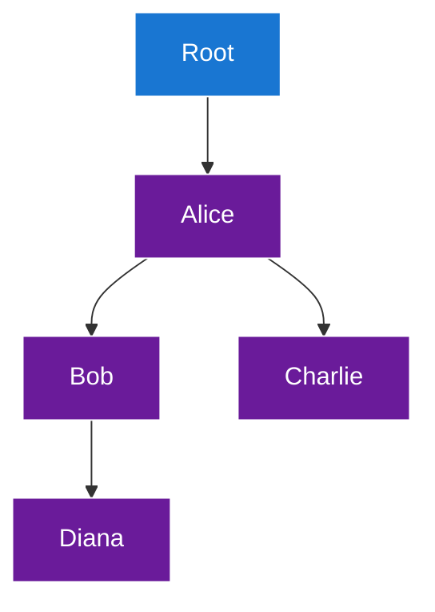

**Disengage Statements in Jac**

The `disengage` statement is a walker-specific control flow mechanism that immediately terminates walker execution and returns control to the spawn point. It's essential for controlling graph traversal and implementing search patterns.

**Walker Control Statements**

| Statement | Context | Effect | Continues After |
|-----------|---------|--------|-----------------|
| `disengage` | Walker abilities | Stop entire walker | No (walker terminates) |
| `skip` | Walker abilities | Skip current node only | Yes (next node) |
| `break` | Loops (for/while) | Exit innermost loop | Yes (after loop) |
| `continue` | Loops (for/while) | Skip current iteration | Yes (next iteration) |

**Basic Disengage (Lines 7-22)**

The example defines `BasicDisengage` walker to demonstrate core functionality:

**Walker structure (Lines 8-22)**:
- Lines 9-12: `start` ability with `root entry` - executes when walker begins at root
- Lines 14-21: `visit_person` ability with `Person entry` - executes when visiting Person nodes

**Disengage execution (Lines 16-18)**:
- Line 16: Checks if current node's name is "Bob"
- Line 17: Prints message
- Line 18: `disengage` stops the walker immediately
- Line 20: `visit [-->]` will NOT execute if disengage was called

**Disengage Flow Diagram**

**Conditional Disengage (Lines 24-42)**

The `ConditionalDisengage` walker demonstrates using state to control termination:

**Walker attributes (Lines 26-27)**:
- `max_visits: int = 2` - maximum allowed visits
- `visit_count: int = 0` - tracks visits made

**Visit counting (Lines 33-40)**:
- Line 34: Increments visit counter
- Line 35: Prints visit information
- Line 36: Checks if max visits reached
- Line 38: Disengages when limit hit
- Line 40: Only executes if disengage not called

**Search Walker Pattern (Lines 44-62)**

The `SearchWalker` demonstrates a common pattern - searching for a specific node:

**Walker state (Lines 46-47)**:
- `target_name: str` - what we're looking for
- `found: bool = False` - whether we found it

**Search logic (Lines 53-60)**:
- Line 55: Compares current node name to target
- Line 56: Prints success message
- Line 57: Updates walker state
- Line 58: Disengages (stops searching)

**Graph Construction (Lines 64-74)**

Lines 66-74 build a test graph:

**Graph Structure Visualization**

**Walker Execution Examples**

**BasicDisengage execution (Line 77)**:
- Starts at root
- Visits Alice (processes normally)
- Visits Bob (disengages immediately)
- Charlie and Diana are NEVER visited

**ConditionalDisengage execution (Line 80)**:
- Visits Alice (count=1, continues)
- Visits Bob (count=2, disengages)
- Limit reached, walker stops

**SearchWalker execution (Lines 83-84)**:
- Line 83: Spawns walker looking for "Charlie"
- Walker visits nodes until finding Charlie or exhausting graph
- Line 84: Prints result from walker's state

**Disengage vs Skip Comparison**

**Disengage semantics**:
1. Stops walker execution immediately
2. Clears all queued visits
3. Returns control to spawn point
4. Walker state preserved and accessible

**Skip semantics** (not shown but compared):
1. Stops processing current node only
2. Queued visits continue
3. Walker moves to next node
4. Walker continues running

**Comparison Table**

| Scenario | disengage | skip |
|----------|-----------|------|
| Current node processing | Stops | Stops |
| Queued nodes | Discarded | Processed |
| Walker state | Preserved | Preserved |
| Walker continues | No | Yes |
| Return to spawn | Yes | No |
| Use case | Search complete, error | Filter node |

**Execution Model**

When a walker is spawned:
1. Walker created at spawn node
2. Entry ability for spawn node type executes
3. `visit` statements queue nodes to visit
4. Walker processes queued visits in order
5. For each node, matching entry abilities execute
6. Process continues until:
   - No more queued visits (normal completion)
   - `disengage` called (early termination)
   - Exception raised (error)

**Walker State Preservation**

The walker object persists after disengage:

After disengage:
- All `has` attributes accessible
- Can inspect walker's final state
- Useful for collecting data during traversal
- Return values from graph exploration

**Common Disengage Patterns**

**Search pattern** (lines 55-58):

**Depth limit** (lines 36-38):

**Error condition**:

**Resource limit**:

**Goal achievement**:

**Best Practices**

1. **Document termination conditions**: Make it clear when/why walker disengages
2. **Update walker state before disengage**: Set result flags for caller to check
3. **Use for early termination**: Don't traverse entire graph if you found what you need
4. **Combine with skip for filtering**: Skip unwanted nodes, disengage when done
5. **Consider depth limits**: Prevent infinite traversal in cyclic graphs

**Disengage Use Cases**

| Use Case | Pattern | Example |
|----------|---------|---------|
| Search | Find target, disengage | Find node by ID (lines 55-58) |
| Limit depth | Track depth, disengage at max | Bounded exploration (lines 36-38) |
| Collect data | Gather until satisfied, disengage | Collect N samples |
| Validate | Check condition, disengage on fail | Schema validation |
| Count nodes | Increment counter, disengage at threshold | Count specific types |

**Multiple Disengage Points**

A walker can have multiple conditional disengage points:

The walker stops at the first matching condition.

**Disengage and Visit Interaction**

Lines 11 and 20 show `visit` statements:
- `visit [-->]` queues outgoing nodes for visiting
- If disengage is called, queued visits are discarded
- Walker stops immediately without processing queue

**Before disengage**:

**After disengage**:

**Walker Abilities Execution Order**

If multiple abilities match a node type, they execute in definition order:

If `first` disengages, `second` never executes.

**Return to Spawn Point**

Line 77: `root spawn BasicDisengage();`

Disengage returns control to the spawn statement:
- Spawn expression completes
- Next statement executes
- Walker object available for inspection
- Normal program flow continues

**Disengage in Different Abilities**

Disengage works in any walker ability:

**Root entry** (lines 9-12):

**Node entry** (lines 14-21):

**Exit ability** (if defined):

Note: Exit abilities may still run after disengage, depending on implementation.

**Comparison with Return**

| Feature | disengage | return |
|---------|-----------|--------|
| Context | Walker abilities | Functions |
| Stops | Entire walker | Current function |
| Returns value | No (use walker state) | Yes |
| Continues after | No | Yes (caller continues) |
| State preservation | Walker object persists | Function locals lost |
