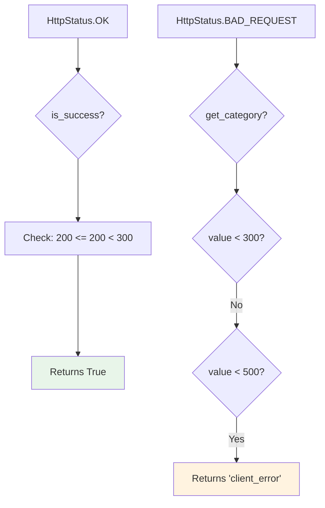
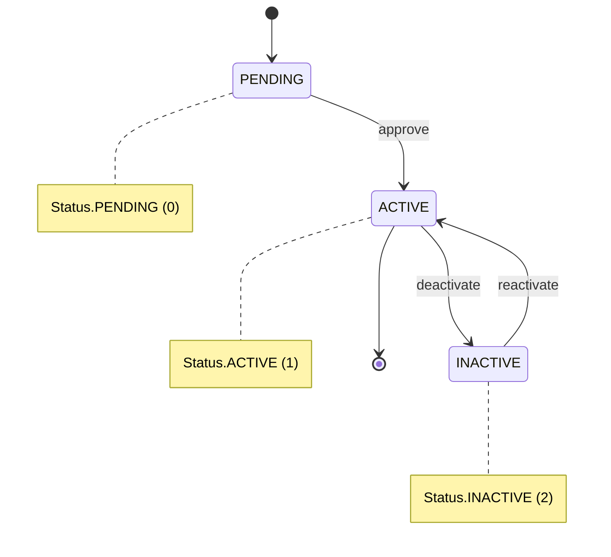
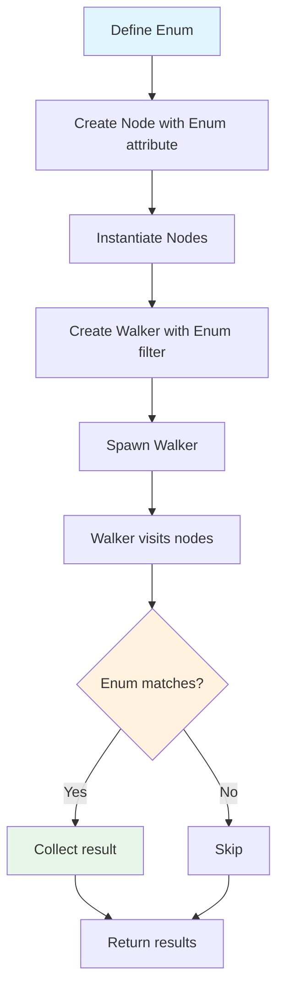

**Enumerations in Jac**

Enumerations provide type-safe named constants with associated values. Jac enums support integer and string values, Python code blocks for methods, iteration, and seamless integration with Object-Spatial Programming.

**Basic Enum Syntax (Lines 6-16)**

Lines 6-10 define an integer enum:
- Members are named constants with explicit values
- Access via `Color.RED`, `Color.GREEN`, etc.
- Trailing commas are allowed and recommended

Lines 12-16 define a string enum:
- Values can be strings instead of integers
- String enums useful for API constants and configuration

**Enum Value Types**

| Type | Example | Use Case |
|------|---------|----------|
| Integer | `RED = 1` | Numeric codes, priorities |
| String | `ADMIN = 'admin'` | API values, database fields |
| Float | `PI = 3.14159` | Constants with decimals |
| Tuple | `RGB = (255, 0, 0)` | Composite values |

**Accessing Enum Members (Lines 18-21)**

Line 20: `print(f"Color.RED: {Color.RED.value}, Role.ADMIN: {Role.ADMIN.value}");`
- `.value` retrieves the enum member's value
- `.name` retrieves the member's name as a string
- `Color.RED.value` returns `1`
- `Color.RED.name` returns `"RED"`

**Forward Declaration with Decorator (Lines 23-36)**

Lines 24-25 show forward declaration:
- Declares enum without defining members
- Allows applying decorators before implementation
- `@unique` decorator ensures all values are unique (from Python's enum module)

Lines 27-31 implement the enum:
- `impl` block provides the member definitions
- Separates declaration from implementation

**Enum with Access Modifier (Lines 38-48)**

Lines 39-43:
- Access modifiers: `:pub`, `:protect`, `:priv`
- Controls enum visibility across modules
- `:protect` makes it accessible to submodules

**Python Code Blocks in Enums (Lines 50-73)**

Lines 51-67 define an enum with methods:

**Method features**:
- Lines 56-67: Python code between `::py::` delimiters
- Methods have access to `self.value` and `self.name`
- Can contain any Python logic
- Called on enum members: `HttpStatus.OK.is_success()`

**Enum Method Flow**

**Enum Comparison (Lines 75-98)**

Lines 82-90 define a function using enum comparison:
- Line 83: Enum members compared with `==`
- Type-safe comparison prevents invalid values
- Line 94: `s1 == s2` compares enum instances

**Enum Iteration and Lookup (Lines 100-110)**

**Iteration (Lines 105-107)**:
- Enums are iterable
- Iterates in definition order
- Each iteration yields an enum member

**Lookup methods (Line 109)**:
- `Color(2)` - lookup by value, returns `Color.GREEN`
- `Role['ADMIN']` - lookup by name, returns `Role.ADMIN`
- Raises `ValueError` if value not found
- Raises `KeyError` if name not found

**Lookup Patterns**

| Method | Syntax | Returns | Error |
|--------|--------|---------|-------|
| By value | `Color(2)` | Enum member | ValueError |
| By name | `Role['ADMIN']` | Enum member | KeyError |
| Attribute access | `Color.RED` | Enum member | AttributeError |

**Enums in Data Structures (Lines 112-123)**

Lines 116-117 show enums in lists:
- Enum members can be list elements
- List comprehension accesses `.name` attribute

Lines 119-122 show enums as dictionary keys:
- Enum members make excellent dict keys (hashable, unique)
- Provides type-safe mapping

**Enums in Node Attributes (Lines 125-138)**

Lines 126-130 define a node with enum attributes:
- Node attributes can be enum-typed
- Provides type safety for node state
- Default values from enum members

Lines 134-137 show usage:
- Initialize with enum members
- Access both name and value

**Enum State Machine**

**Enums in Walker Logic (Lines 140-174)**

Lines 141-161 define a walker that filters by enum:
- Line 142: Walker has enum-typed attribute
- Line 151: Compares node's enum attribute to walker's
- Enables type-safe filtering during graph traversal

Lines 165-173 demonstrate usage:
- Creates tasks with different priorities
- Spawns walker that filters for HIGH priority
- Walker collects matching tasks in `self.matched`

**Enum Integration Flow**

**Common Enum Patterns**

**State management**:

**Priority levels**:

**Feature flags**:

**API constants**:

**Best Practices**

1. **Use enums for fixed sets**: Status codes, priorities, states, types
2. **String values for external APIs**: Use string enums when values leave the system
3. **Integer values for internal logic**: Use int enums for comparisons and ordering
4. **Add methods for complex logic**: Encapsulate enum-specific behavior in methods
5. **Type annotations**: Use enum types in function signatures for type safety
6. **Avoid magic values**: Replace hardcoded strings/numbers with enums

**Enum vs Constants**

| Feature | Enum | Constants |
|---------|------|-----------|
| Type safety | Yes | No |
| Grouping | Built-in | Manual |
| Iteration | Yes | No |
| Reverse lookup | Yes | No |
| Methods | Yes | No |
| Namespace | Automatic | Manual |

**When to Use Enums**

Use enums when:
- Values form a fixed, known set
- Need type safety and validation
- Want reverse lookup (value to name)
- Implementing state machines
- Defining API or database constants
- Comparing priority or severity levels

Avoid enums when:
- Values are dynamic or user-defined
- Set changes frequently
- Need arbitrary value types
- Simple boolean flag suffices
