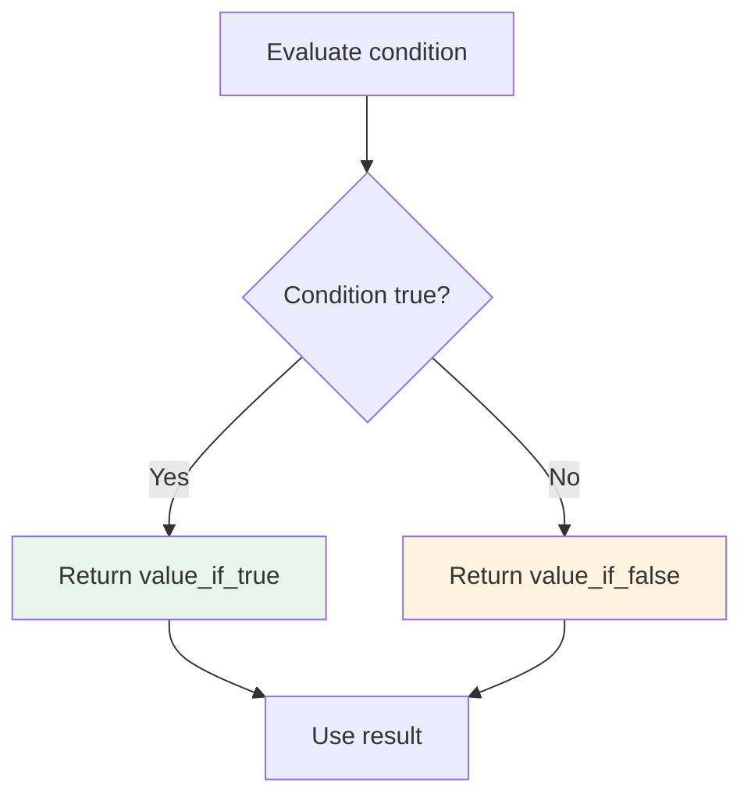
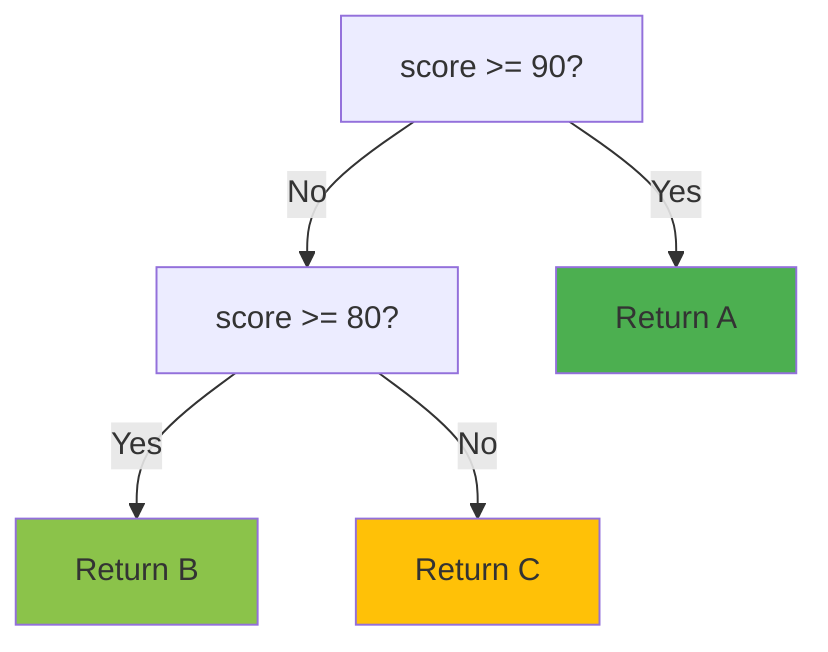
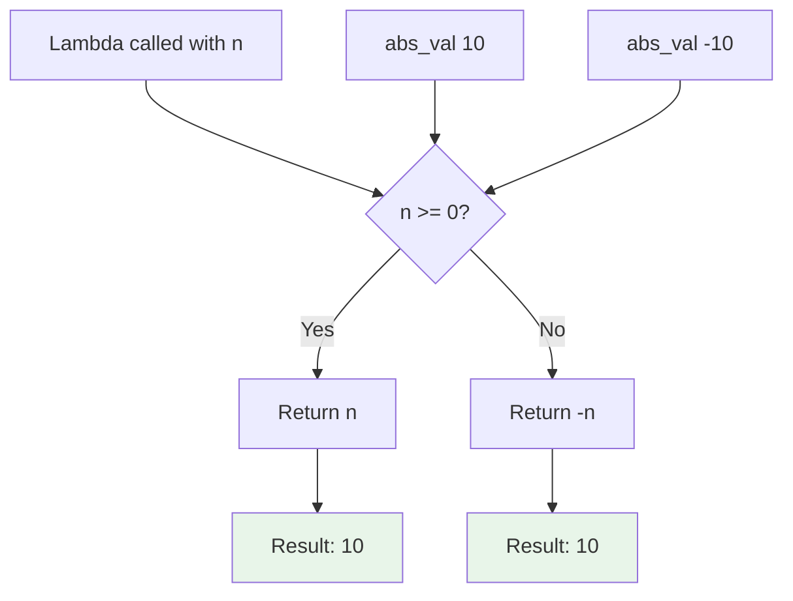

**Expressions in Jac - Ternary and Lambda**

Jac supports powerful inline expressions including ternary conditionals for value selection and lambda functions for anonymous callable definitions.

**Ternary Conditional Expressions**

Ternary expressions provide inline conditional value selection, allowing you to choose between two values based on a boolean condition.

**Basic Ternary Syntax (Lines 4-6)**

Line 5: `x = 1 if 5 / 2 == 1 else 2;`
- Format: `value_if_true if condition else value_if_false`
- Evaluates condition: `5 / 2 == 1` (false, since 5/2 = 2.5)
- Returns `else` branch value: 2
- Assigns 2 to x

Line 6: `status = "adult" if 20 >= 18 else "minor";`
- Condition: `20 >= 18` (true)
- Returns `if` branch: "adult"
- More concise than if-else statement for simple assignments

**Ternary Evaluation Flow**



**Nested Ternary Expressions (Line 7)**

Line 7: `grade = "A" if 85 >= 90 else ("B" if 85 >= 80 else "C");`
- Evaluates left-to-right
- First check: `85 >= 90` (false)
- Evaluates else branch: `"B" if 85 >= 80 else "C"`
- Second check: `85 >= 80` (true)
- Returns "B"

**Nested Ternary Flow**



**Lambda Expressions**

Lambda expressions create anonymous functions - callable objects without formal function definitions.

**Basic Lambda Syntax (Line 10)**

Line 10: `square = lambda x: int : x ** 2;`
- Format: `lambda params : return_type : expression`
- Parameter: `x: int` (typed parameter)
- Return type: implicit from expression (int ** 2 = int)
- Expression: `x ** 2`
- Call with: `square(5)` returns 25

**Lambda Components**

| Part | Example | Purpose |
|------|---------|---------|
| Keyword | `lambda` | Defines anonymous function |
| Parameters | `x: int, y: int` | Function inputs with types |
| Return type | `-> int` | Optional explicit return type |
| Expression | `x + y` | Single expression to evaluate |

**Multiple Parameters (Line 11)**

Line 11: `add = lambda a: int, b: int : a + b;`
- Two parameters: `a: int` and `b: int`
- Expression: `a + b`
- Call with: `add(3, 4)` returns 7

**Lambda with Explicit Return Type (Line 14)**

Line 14: `multiply = lambda x: int, y: int -> int : x * y;`
- Parameters: `x: int, y: int`
- Explicit return type: `-> int`
- Expression: `x * y`
- Full type annotation for clarity

**Lambda Without Parameters (Line 17)**

Line 17: `get_five = lambda : 5;`
- No parameters (empty parameter list)
- Returns constant value: 5
- Call with: `get_five()` returns 5
- Useful for deferred computation or callbacks

**Combining Ternary and Lambda (Line 20)**

Line 20: `abs_val = lambda n: int : (n if n >= 0 else -n);`
- Lambda parameter: `n: int`
- Expression is a ternary: `n if n >= 0 else -n`
- Implements absolute value function
- `abs_val(10)` returns 10
- `abs_val(-10)` returns 10

**Lambda with Ternary Flow**



**Expression Usage (Line 22)**

Line 22: `print(x, status, grade, square(5), add(3, 4), multiply(6, 7), get_five(), abs_val(-10));`
- Uses all defined expressions
- Ternary results: x=2, status="adult", grade="B"
- Lambda calls: square(5)=25, add(3,4)=7, multiply(6,7)=42, get_five()=5, abs_val(-10)=10
- Demonstrates inline evaluation

**Ternary vs If-Statement**

| Feature | Ternary | If-Statement |
|---------|---------|--------------|
| Syntax | `a if cond else b` | `if cond { a } else { b }` |
| Returns value | Yes | No (use assignment) |
| Multiple statements | No | Yes |
| Readability | Good for simple cases | Better for complex logic |
| Nesting | Harder to read | Clearer structure |

**Lambda vs Function**

| Feature | Lambda | Regular Function |
|---------|--------|------------------|
| Syntax | `lambda x: x + 1` | `def f(x) { return x + 1; }` |
| Name | Anonymous | Named |
| Scope | Local variable | Module/class scope |
| Complexity | Single expression | Multiple statements |
| Documentation | Limited | Full docstrings |
| Use case | Quick callbacks | Reusable logic |

**Common Ternary Patterns**

Default values:
```
value = user_input if user_input else default_value
```

Type conversion:
```
result = int(x) if x.isdigit() else 0
```

Boundary checking:
```
clamped = value if value <= max_val else max_val
```

Status strings:
```
msg = "success" if count > 0 else "no results"
```

**Common Lambda Patterns**

Sorting key:
```
sorted_items = sorted(items, key=lambda x: x.priority)
```

Filter predicate:
```
filtered = list(filter(lambda x: x > 0, numbers))
```

Map transformation:
```
doubled = list(map(lambda x: x * 2, values))
```

Callback:
```
button.on_click(lambda: print("Clicked!"))
```

**Best Practices**

**Ternary expressions**:
1. Keep conditions simple and readable
2. Avoid deep nesting (max 2 levels)
3. Use for value selection, not side effects
4. Parenthesize nested ternaries for clarity
5. Consider if-statement for complex logic

**Lambda expressions**:
1. Use for simple, single-expression functions
2. Keep lambdas short and focused
3. Prefer named functions for complex logic
4. Type annotate parameters for clarity
5. Good for callbacks and functional programming

**When to Use Ternary**

Use ternary when:
- Choosing between two values
- Assignment based on condition
- Inline default value selection
- Simple boolean-based selection

Avoid when:
- Multiple statements needed
- Complex nested conditions
- Side effects in branches
- Hurts readability

**When to Use Lambda**

Use lambda when:
- Single-use function needed
- Callback or event handler
- Functional programming (map, filter, sort)
- Expression can fit in one line

Avoid when:
- Function is complex
- Multiple statements needed
- Will be reused extensively
- Needs documentation

**Lazy Evaluation**

Both ternary and lambda support lazy evaluation:

**Ternary**:
```
result = expensive_a() if condition else expensive_b()
# Only one function is called
```

**Lambda**:
```
deferred = lambda: expensive_computation()
# Computation happens when called, not when defined
```

**Expression Composition**

Ternary in lambda:
```
clamp = lambda x, lo, hi: (lo if x < lo else (hi if x > hi else x))
```

Lambda in ternary:
```
func = (lambda x: x * 2) if use_double else (lambda x: x * 3)
```

**Type Safety**

Both expressions maintain type safety:

```
# Ternary with types
result: int = 10 if condition else 20

# Lambda with full type annotation
process: callable = lambda x: int, y: int -> int : x + y
```

**Performance Considerations**

**Ternary**:
- Faster than if-statement for simple cases
- No function call overhead
- Inline evaluation

**Lambda**:
- Slight overhead vs named functions
- Closure capture can use memory
- Good for readability trade-offs
