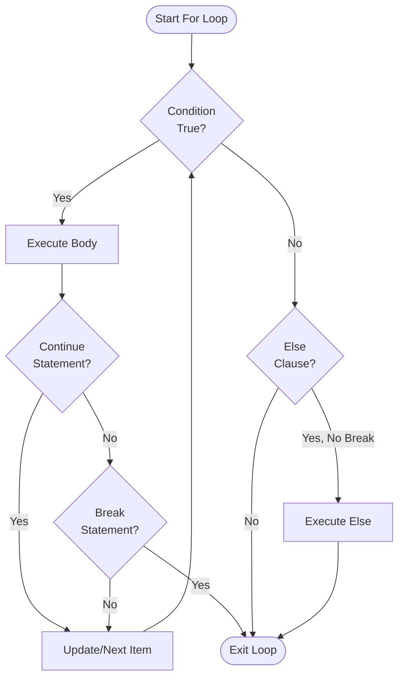

**For Statements in Jac**

For loops provide iteration over collections and sequences. Jac offers two distinct loop styles: the `for-in` pattern for iterating collections, and the `for-to-by` pattern for explicit counter control.

**Basic For-In Loop**

The simplest iteration pattern uses `for-in` to loop through collections (lines 5-7):

The loop variable `x` takes each value from the list in sequence. This works with any iterable: lists, tuples, sets, dictionaries, strings, and ranges.

**For-In with Range**

Lines 10-12 demonstrate using `range()` to generate numeric sequences:

This produces values 0 through 4. The `range()` function is lazy, generating values on demand rather than creating a full list in memory.

**For-To-By Loop (Jac's C-Style Loop)**

Lines 15-17 show Jac's unique three-part loop syntax:

This loop has three components:
- **Initialization** (`i=0`): Sets the starting value
- **Condition** (`to i<5`): Loop continues while true
- **Increment** (`by i+=1`): Executed after each iteration

This provides explicit control similar to C's `for(int i=0; i<5; i++)` but with more readable syntax.

**Counting Down**

Line 20-22 shows decrementing with `for-to-by`:

The loop starts at 10, continues while `i>0`, and decrements by 1 each iteration.

**Custom Step Values**

Lines 25-27 demonstrate non-unit steps:

This produces even numbers: 0, 2, 4, 6, 8.

**For-Else Clause**

Lines 30-34 introduce the `else` clause, which executes only if the loop completes normally (without `break`):

This pattern is useful for search operations: if you break when finding an item, the else clause indicates "not found."

**Breaking Out of Loops**

Lines 37-44 show how `break` exits the loop immediately and skips the else clause:

Output: 0, 1, 2 (the else block doesn't execute).

**Continue Statement**

Lines 47-52 demonstrate `continue`, which skips to the next iteration:

This prints only odd numbers: 1, 3.

**Nested Loops**

Lines 55-59 show loops within loops:

Both `for-in` and `for-to-by` loops can be nested and mixed freely.

**Iterating Strings**

Lines 62-64 demonstrate character iteration:

Strings are iterable sequences of characters.

**Dictionary Iteration**

Lines 67-70 show that iterating a dictionary yields its keys:

Use `.values()` for values or `.items()` for key-value pairs.

**Mixed Loop Types**

Lines 73-77 demonstrate combining different loop styles:

The outer loop uses `for-in` while the inner uses `for-to-by`.

**Loop Control Flow Summary**

| Statement | Effect | Else Clause Behavior |
|-----------|--------|---------------------|
| `break` | Exit loop immediately | Skipped |
| `continue` | Skip to next iteration | Not affected |
| Normal completion | Loop finishes naturally | Executes (if present) |

**For Loop Variations**

| Form | Syntax | Use Case |
|------|--------|----------|
| for-in | `for var in iterable` | Iterate collections |
| for-to-by | `for i=start to cond by step` | Explicit counter control |
| for-else | `for ... { } else { }` | Detect uninterrupted completion |

**Loop Flow Visualization**

**Common Patterns**

Filtering during iteration:

Aggregating values:

Finding with for-else:

**Key Differences from Python**

1. **Braces required**: Jac uses `{ }` for loop bodies, not indentation
2. **Semicolons required**: Each statement ends with `;`
3. **For-to-by syntax**: Unique to Jac, provides C-style explicit control
4. **Same else clause**: Works identically to Python
