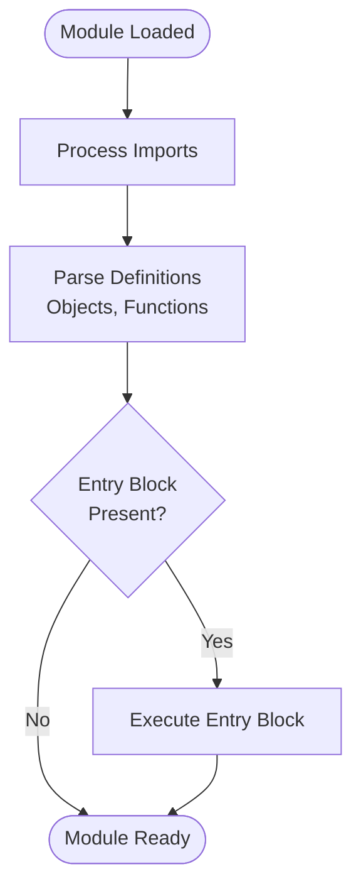

**Free Code and Entry Points**

Free code refers to executable code blocks at the module level, primarily using the `with entry` construct. This allows code to run when a module is loaded or executed directly.

**Module Organization**

A typical Jac module follows this structure (lines 3-21):
1. Import statements (line 3)
2. Object definitions (lines 5-10)
3. Function definitions (lines 12-14)
4. Entry blocks (lines 17-21)

This organization separates reusable definitions from executable logic.

**Import Statement**

Line 3 imports the `math` module to access mathematical constants and functions like `math.pi`.

**Object Definition**

Lines 5-10 define a `Circle` object with two members:
- `has radius: float` (line 6): Declares a typed member variable
- `def area -> float` (lines 7-9): A method that calculates the circle's area using `math.pi * self.radius ** 2`

The object uses `self.radius` to access its member variable.

**Function Definition**

Lines 12-14 define a standalone function `square` that returns `n ** 2`. This function exists at module level and can be called from anywhere in the module.

**Entry Block (Main Execution)**

Lines 17-21 demonstrate the `with entry` block, which executes when the module runs. Line 18: `print("Free code execution")` - Executes unconditionally

Line 19: `print(square(7))` - Calls the square function with 7, printing 49

Line 20: `print(int(Circle(radius=10).area()))` - Demonstrates chained operations:
1. Creates a Circle with radius 10
2. Calls the `.area()` method
3. Converts the float result to int with `int(...)`
4. Prints the value (approximately 314)

**Named Entry Points**

Lines 24-26 show a named entry point using `with entry:custom`:

Named entry points allow conditional or selective execution. The `:custom` label can be used to execute this block specifically.

**Entry Point Semantics**

| Entry Type | Syntax | When Executes |
|-----------|--------|---------------|
| Default entry | `with entry` | Module load/execution |
| Named entry | `with entry:name` | When specifically invoked |
| Main entry | `with entry:__main__` | Only when module is the main program |

**Execution Flow**

**Use Cases for Entry Blocks**

Entry blocks are useful for:
- **Main program logic**: Implementing the primary functionality in executable scripts
- **Module initialization**: Setting up module-level state
- **Testing and examples**: Demonstrating API usage
- **Quick scripts**: Writing small programs without defining main functions

**Access to Module Definitions**

The entry block has access to all module-level definitions (lines 18-20):
- Functions defined in the module (`square`)
- Objects defined in the module (`Circle`)
- Imported modules (`math` via the Circle definition)

**Key Points**

1. Entry blocks execute at module load time
2. They can access all module-level definitions
3. Named entries allow multiple execution contexts
4. The pattern separates definitions from executable code
5. Useful for both libraries (with limited entry code) and scripts (with extensive entry logic)
