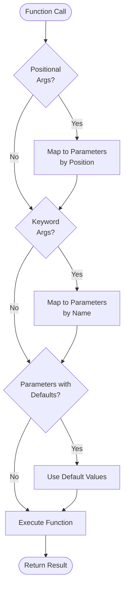

**Function Calls in Jac**

Jac supports flexible function calling with positional arguments, keyword arguments, default parameters, and variadic arguments (*args and **kwargs).

**Function Definitions**

Lines 3-5 define a function with three parameters, the last having a default value. The parameter `z` defaults to 10 if not provided. The function returns a tuple of two computed values.

Lines 7-9 define a variadic function accepting both *args and **kwargs:

**Positional Arguments**

Line 13 demonstrates the most basic calling pattern - positional arguments. Arguments are matched to parameters by position: `x=2`, `y=3`, `z=4`. The order matters.

**Keyword Arguments**

Line 16 shows calling with all keyword arguments. Each argument explicitly specifies which parameter it's for. This allows:
- Arguments in any order
- Clear intent for each value
- Better readability for complex calls

**Mixed Positional and Keyword Arguments**

Line 19 demonstrates combining both styles:

**Rules for mixing:**
1. Positional arguments must come first
2. Keyword arguments follow positionals
3. Once you use a keyword argument, all subsequent arguments must be keywords
4. The first positional (8) maps to `x`, then `y` and `z` are specified by name

**Default Parameter Usage**

Line 22 shows omitting parameters with default values. Only `x` and `y` are provided. The parameter `z` automatically uses its default value of 10.

**Variadic Arguments**

Line 25 demonstrates calling a function with *args and **kwargs. In this call:
- Positional arguments (1, 2, 3) are collected into `args` tuple
- Keyword arguments (a=4, b=5) are collected into `kwargs` dictionary
- The function sums all values: 1+2+3+4+5 = 15

**Argument Passing Patterns**

| Pattern | Example | Parameters Receive |
|---------|---------|-------------------|
| Positional only | `compute(2, 3, 4)` | x=2, y=3, z=4 |
| Keyword only | `compute(x=5, y=6, z=7)` | x=5, y=6, z=7 |
| Mixed | `compute(8, y=9, z=10)` | x=8, y=9, z=10 |
| Default usage | `compute(2, 3)` | x=2, y=3, z=10 (default) |
| Variadic | `variadic(1, 2, a=3)` | args=(1,2), kwargs={'a':3} |

**Function Call Flow**

**When to Use Each Style**

**Positional arguments** - Best for:
- Functions with few parameters (2-3)
- When parameter order is obvious
- Frequently called functions

**Keyword arguments** - Best for:
- Functions with many parameters
- When clarity is more important than brevity
- Parameters with non-obvious purposes
- Boolean flags and configuration options

**Mixed style** - Best for:
- Required parameters positionally
- Optional parameters by keyword
- Balancing clarity and conciseness

**Default parameters** - Best for:
- Optional configuration
- Backward compatibility
- Sensible fallback values

**Key Points**

1. Positional arguments must precede keyword arguments
2. Default parameters allow omitting arguments
3. Variadic functions collect excess arguments
4. *args captures positional, **kwargs captures keyword arguments
5. Keyword arguments improve readability at the cost of verbosity
