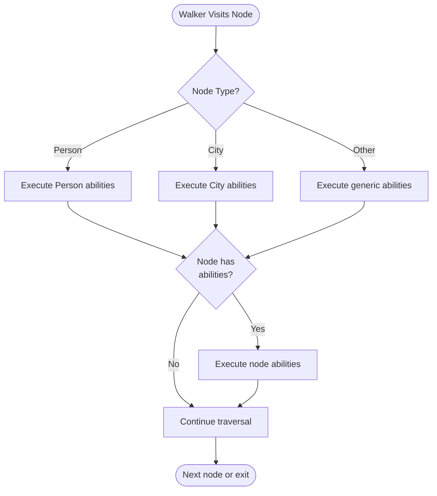

**Functions and Abilities in Jac**

Functions and abilities are the core computational units in Jac. Functions provide traditional callable operations, while abilities enable Object-Spatial Programming (OSP) through event-driven, type-specific dispatch during graph traversal.

**Basic Functions**

Lines 6-8 show a function with typed parameters and return type. Lines 11-13 demonstrate a function with only a return type (no parameters):

Lines 16-18 use the generic `object` type when flexible typing is needed:

**Static Functions**

Lines 26-28 define a static function that belongs to the class, not instances. Call static functions directly on the class: `Calculator.square(5)` (line 307).

**Access Modifiers**

Lines 31-43 show access control tags:

| Modifier | Example Line | Visibility |
|----------|--------------|------------|
| `:priv` | 31-33 | Private to module |
| `:pub` | 36-38 | Public, accessible anywhere |
| `:protect` | 41-43 | Protected, accessible to subclasses |

Access tags can be combined with `static`: `static def:priv internal_helper` (line 31).

**Abstract Methods**

Line 49 demonstrates abstract method declaration. The `abs` keyword marks it as abstract - subclasses must implement it. Lines 63-65 show implementation in `ConcreteCalculator`.

**Forward Declarations**

Lines 52, 55, 58 show forward declarations - signatures without bodies. Forward declarations allow separating interface from implementation, useful for circular dependencies.

**Implementation Blocks**

Lines 70-72 implement forward-declared methods using `impl`. The pattern: `impl ClassName.method_name(params) -> return_type { body }`

**Variadic Parameters**

Lines 86-88 show positional variadic (*args). Lines 91-93 show keyword variadic (**kwargs):

Lines 96-102 combine regular parameters, *args, and **kwargs:

**Parameter order must be: regular, *args, **kwargs**

**Async Functions**

Lines 106-108 show async function declaration. Async functions enable concurrent operations and must be awaited when called.

**Decorators**

Lines 128-130 show single decorator application. Lines 134-137 demonstrate multiple decorators (applied bottom-up):

Equivalent to: `double_decorated = logger(tracer(double_decorated))`

**Walker Abilities - Basic Events**

Lines 145-147 show an entry ability that triggers when a walker spawns. Lines 151-153 show an exit ability that triggers when the walker completes:

**Abilities use `can` instead of `def` and specify event clauses with `with`.**

**Walker Abilities with Typed Node Context**

Lines 172-175 show root-specific ability. Lines 178-182 show typed node ability (triggers only for Person nodes):

The `here` reference accesses the current node being visited.

**Execution Flow for TypedWalker (line 338)**

```mermaid
flowchart TD
    Start([Walker Spawns at Root]) --> RootAbility[start ability executes]
    RootAbility --> Visit1[visit [--&gt;] queues Alice, Bob]
    Visit1 --> AliceVisit[Visit Alice Person]
    AliceVisit --> AliceAbility[handle_person executes]
    AliceAbility --> Visit2[visit [--&gt;] queues NYC]
    Visit2 --> BobVisit[Visit Bob Person]
    BobVisit --> BobAbility[handle_person executes]
    BobAbility --> NYCVisit[Visit NYC City]
    NYCVisit --> NYCAbility[handle_city executes]
    NYCAbility --> ExitAbility[report exit ability]
    ExitAbility --> Done([Walker Complete])
```

**Multiple Abilities on Same Node Type**

Lines 201-212 demonstrate multiple abilities for the same node type:

**Both abilities execute sequentially in definition order.** Walker state persists across both.

**Node Abilities**

Lines 225-228 show abilities defined on nodes (not walkers). When a TypedWalker visits, both the walker's ability AND the node's ability execute. The `self` in node abilities refers to the node.

**Async Abilities**

Lines 237-240 show async walker and async abilities:

**Abstract Abilities**

Line 251 declares abstract ability. Lines 256-258 show implementation in subclass:

**Static Abilities**

Lines 266-268 show static abilities (rare but allowed). Static abilities belong to the walker class, not instances. Cannot access `self`.

**Ability Control Flow**

Lines 284-287 demonstrate `disengage` for early termination. The `disengage` statement immediately terminates walker execution.

**Ability Event Clauses**

| Event Clause | Triggers When | Example Line |
|--------------|---------------|--------------|
| `with entry` | Walker spawns or any node visit | 145 |
| `with exit` | Walker completes | 151 |
| `with \`root entry` | Visiting root node specifically | 172 |
| `with NodeType entry` | Visiting specific node type | 178, 185 |
| `with WalkerType entry` | Node ability for specific walker | 225, 231 |

**Execution Order When Walker Visits Node**

1. All matching walker abilities execute (in definition order)
2. All matching node abilities execute (in definition order)
3. Walker processes any `visit` statements to queue next nodes
4. Walker moves to next queued node or triggers `exit` abilities

**Function vs Ability Comparison**

| Feature | Function (`def`) | Ability (`can`) |
|---------|-----------------|-----------------|
| Keyword | `def` | `can` |
| Context | Objects, classes, walkers, global | Walkers, nodes |
| Invocation | Explicit call | Event-driven (automatic) |
| Event clause | None | Required (`with entry`, etc.) |
| OSP role | Traditional computation | Spatial computation |
| `here` reference | Not available | Available in spatial context |
| `visitor` reference | Not available | Available in node abilities |

**Type-Driven Dispatch Pattern**



**Practical Patterns**

**Search with disengage:**

**Multi-stage processing:**

**Node-walker interaction:**

**Polymorphic traversal:**

**Key Insights**

1. **Type-driven dispatch**: Walker abilities are selected based on node types, enabling polymorphic behavior
2. **Separation of concerns**: Multiple abilities on same node type allow separating processing stages
3. **Bidirectional interaction**: Walkers have node-specific behavior, nodes have walker-specific behavior
4. **Event-driven execution**: Abilities trigger automatically based on graph traversal events
5. **State preservation**: Walker attributes persist across all ability executions
6. **Implementation separation**: Forward declarations and impl blocks separate interface from implementation
7. **Rich type system**: Abstract methods, access modifiers, async support, and decorators provide full OOP features

Functions provide traditional OOP computation, while abilities enable the unique "computation flows to data" paradigm of Object-Spatial Programming through event-driven, type-specific dispatch during graph traversal.
