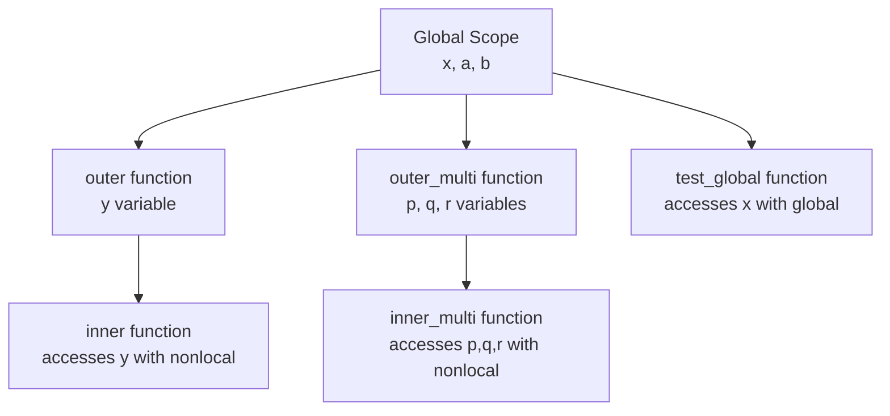

**Global and Nonlocal Statements**

The `global` and `nonlocal` statements control variable scope, allowing functions to modify variables from outer scopes rather than creating local shadows.

**Module-Level Global Variables**

Lines 3-4 declare module-level global variables:

```
glob x = "global x";
glob a = 1, b = 2;
```

These variables exist at module scope and are accessible throughout the module.

**Global Statement - Single Variable**

Lines 6-11 demonstrate the `global` statement:

```
def test_global {
    global x;
    x = "modified global x";
    print(x);
}
```

Line 8: `global x` declares that `x` refers to the module-level global variable (line 3). Without this statement, line 9's assignment would create a new local variable instead of modifying the global.

**Global Statement - Multiple Variables**

Lines 13-19 show declaring multiple global variables:

```
def test_multiple_globals {
    global a, b;
    a = 10;
    b = 20;
    print(f"{a} {b}");
}
```

Line 15: `global a, b` is more concise than separate `global` statements for each variable.

**Nonlocal Statement - Single Variable**

Lines 21-34 demonstrate the `nonlocal` statement for nested functions:

```
def outer {
    y = "outer y";

    def inner {
        nonlocal y;
        y = "modified by inner";
        print(y);
    }

    print(y);
    inner();
    print(y);
}
```

Line 26: `nonlocal y` declares that `y` refers to the enclosing function's variable (line 22), not a global or new local. Line 27's assignment modifies the outer function's `y`.

**Nonlocal Statement - Multiple Variables**

Lines 36-52 show declaring multiple nonlocal variables:

```
def outer_multi {
    p = 1;
    q = 2;
    r = 3;

    def inner_multi {
        nonlocal p, q, r;
        p = 10;
        q = 20;
        r = 30;
    }

    print(f"{p} {q} {r}");
    inner_multi();
    print(f"{p} {q} {r}");
}
```

Line 43: `nonlocal p, q, r` modifies all three variables from the enclosing scope.

**Scope Resolution Rules**

Without `global` or `nonlocal`, assignments create new local variables. These keywords alter this behavior:

| Keyword | Accesses | Scope Level | Use Case |
|---------|----------|-------------|----------|
| `global` | Module-level variables | Global | Modify module state from functions |
| `nonlocal` | Enclosing function variables | Enclosing | Closures, nested function state |

**Execution Flow**

Lines 54-65 demonstrate the execution and effects:

```
with entry {
    print(x);              # Prints: "global x"
    test_global();         # Modifies global x
    print(x);              # Prints: "modified global x"

    print(f"{a} {b}");     # Prints: "1 2"
    test_multiple_globals(); # Modifies a and b
    print(f"{a} {b}");     # Prints: "10 20"

    outer();               # Shows nonlocal modification
    outer_multi();         # Shows multiple nonlocal modifications
}
```

**Variable Modification Flow**


**Scope Levels Example**



**Common Patterns**

**Modifying module state:**
```
glob counter = 0;

def increment {
    global counter;
    counter += 1;
}
```

**Closure with state:**
```
def make_counter {
    count = 0;

    def increment {
        nonlocal count;
        count += 1;
        return count;
    }

    return increment;
}
```

**Multiple scope levels:**
```
glob config = {};

def outer {
    local_data = [];

    def inner {
        global config;
        nonlocal local_data;
        # Can modify both global and enclosing scope
    }
}
```

**Key Differences**

**Global vs Nonlocal:**
- `global` reaches to module level (skips all intermediate scopes)
- `nonlocal` reaches to the nearest enclosing function scope (not global)
- `global` can declare variables that don't exist yet
- `nonlocal` requires the variable to exist in an enclosing scope

**Important Rules**

1. **Without declaration**: Assignments create new local variables
2. **With global**: Assignments modify module-level variables
3. **With nonlocal**: Assignments modify enclosing function's variables
4. **Reading vs Writing**: You can read outer scope variables without declarations; declarations are needed for assignment
5. **Multiple names**: Both statements support comma-separated variable lists
