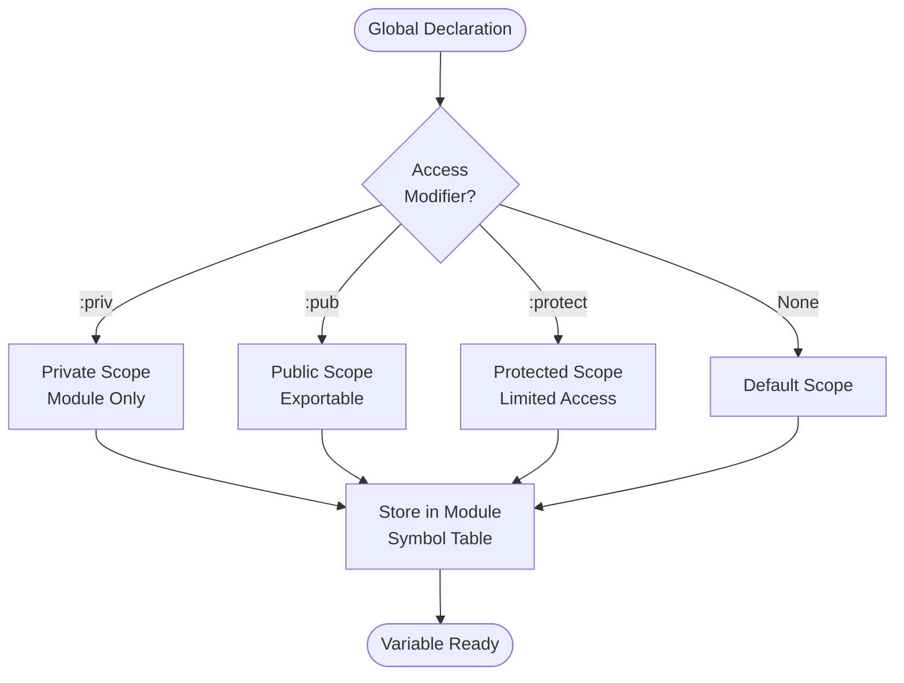

**Global Variables in Jac**

Global variables are module-level declarations that can have access control tags specifying visibility and mutability. Jac provides two keywords for global declarations: `let` and `glob`.

**Let with Access Modifiers**

Lines 4-5 demonstrate `let` declarations with access tags:

Line 4: `let:priv` creates a private module-level variable accessible only within the current module.
Line 5: `let:pub` creates a public module-level variable accessible from other modules.

**Glob with Access Modifiers**

Lines 8-9 show `glob` declarations with access control:

Line 8: `glob:protect` creates a protected variable with restricted access.
Line 9: `glob shared_var` creates a global variable with default visibility.

**Multiple Variable Declarations**

Line 12 demonstrates declaring multiple globals in one statement:

This comma-separated syntax declares three global variables simultaneously.

**Typed Global Variables**

Line 15 shows a typed global declaration:

The type annotation `: int` specifies that `counter` must be an integer.

**Access Control Tags**

| Access Tag | Visibility | Example Line |
|------------|------------|--------------|
| `:priv` | Private to module | 4 |
| `:pub` | Public, exportable | 5 |
| `:protect` | Protected access | 8 |
| (none) | Default visibility | 9 |

**Using Global Variables**

Lines 17-19 show accessing all declared globals in an entry block:

All module-level globals are accessible within the module's entry blocks and functions.

**Global Variable Declaration Patterns**

**Let vs Glob**

Both `let` and `glob` create module-level variables:

| Keyword | Purpose | Typical Use |
|---------|---------|-------------|
| `let` | Module-level variable | Immutable-like semantics (by convention) |
| `glob` | Explicit global variable | Clearly indicates global scope |

**Choice between them is often stylistic**, though `glob` more explicitly indicates module-wide scope and mutability.

**Access Control in Practice**

**Private variables** (`:priv`):
- Only accessible within the defining module
- Cannot be imported by other modules
- Useful for internal implementation details

**Public variables** (`:pub`):
- Accessible from other modules
- Part of the module's public API
- Can be imported and used externally

**Protected variables** (`:protect`):
- Accessible to subclasses and related code
- Limited visibility between private and public
- Used for semi-internal state

**Common Patterns**

**Configuration constants:**

**Module state:**

**Typed globals:**

**Multiple related globals:**

**Key Points**

1. Both `let` and `glob` create module-level variables
2. Access tags control visibility across module boundaries
3. Multiple variables can be declared in one statement
4. Type annotations are optional but recommended
5. Private variables encapsulate implementation details
6. Public variables form the module's API
7. Default visibility when no access tag is specified
