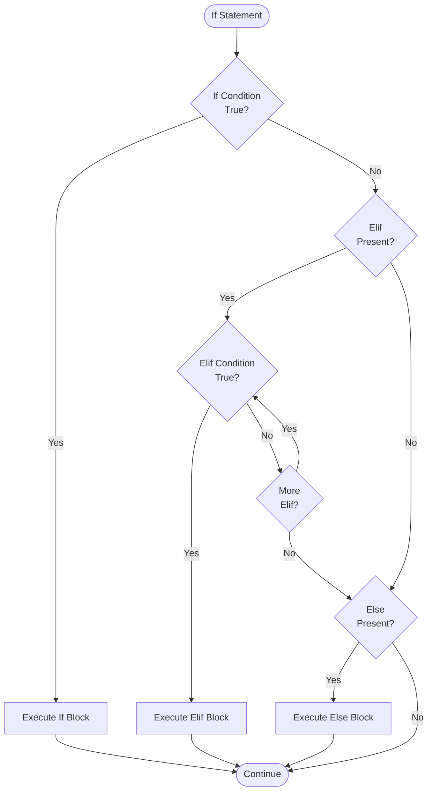

**If Statements in Jac**

If statements provide conditional control flow through `if`, `elif`, and `else` keywords. They allow code to execute different paths based on boolean conditions.

**Basic If Statement**

Lines 4-8 demonstrate the simplest conditional. When the condition `x > 5` evaluates to true, the block executes.

**If-Else Statement**

Lines 11-16 show binary choice logic. Exactly one block executes: the `if` block when true, otherwise the `else` block.

**If-Elif-Else Chain**

Lines 19-28 demonstrate multiple exclusive conditions. Evaluation is top-down. The first true condition executes, then the entire chain terminates.

**Multiple Elif Branches**

Lines 31-42 show extended conditional chains with many branches. Each `elif` provides an additional condition to check if previous conditions were false.

**Nested If Statements**

Lines 45-55 demonstrate if statements within if statements. Inner conditions only evaluate if outer conditions are true.

**Complex Boolean Expressions**

Lines 58-72 show combining conditions with logical operators:

**AND operator** (line 58-60):

Both conditions must be true.

**OR operator** (line 62-64):

At least one condition must be true.

**NOT operator** (line 66-68):

Negates the condition.

**Combined operators** (line 70-72):

Parentheses control precedence.

**Chained Comparisons**

Lines 75-78 demonstrate Python-style chained comparisons. Equivalent to `20 <= temp and temp <= 30`, but evaluates `temp` only once.

**Membership Tests**

Lines 81-88 show `in` and `not in` operators. Works with any iterable: lists, tuples, sets, dictionaries (checks keys), strings.

**Identity Tests**

Lines 91-100 demonstrate `is` and `is not` for identity checking. Use `is` for None checks, not `==`.

**Comparison Operators**

| Operator | Meaning | Example Line |
|----------|---------|--------------|
| `==` | Equal | Throughout |
| `!=` | Not equal | Implicit |
| `<` | Less than | 32 |
| `<=` | Less than or equal | 76 |
| `>` | Greater than | 6 |
| `>=` | Greater than or equal | 12, 20 |
| `is` | Identity | 92 |
| `is not` | Not identity | 96 |
| `in` | Membership | 82 |
| `not in` | Non-membership | 86 |

**Logical Operators**

| Operator | Meaning | Precedence |
|----------|---------|------------|
| `not` | Negation | Highest |
| `and` | Both must be true | Medium |
| `or` | At least one must be true | Lowest |

**Control Flow Diagram**

**Truthy and Falsy Values**

Jac follows Python's truthiness rules:

**Falsy values:**

- `False`
- `None`
- `0` (numeric zero)
- `""` (empty string)
- `[]` (empty list)
- `{}` (empty dict)

**Truthy values:**

- Everything else

Example:

**Common Patterns**

**Guard pattern (early return):**

**Range checking:**

**None checking:**

**Membership filtering:**

**Multi-condition validation:**

**Short-Circuit Evaluation**

`and` and `or` use short-circuit evaluation:

If `x != 0` is false, `y / x` doesn't execute (preventing division by zero).

**If Expression (Ternary)**

Jac supports if expressions for value selection:

**If expressions must have an else clause** and return a value.

**Block Syntax Rules**

1. **Braces required**: `{ }` delimit blocks, not indentation
2. **Semicolons required**: Each statement ends with `;`
3. **Single-line allowed**: `if x > 5 { print("yes"); }` is valid
4. **Multi-line preferred**: For readability

**If Statement vs If Expression**

| Feature | If Statement | If Expression |
|---------|--------------|---------------|
| Syntax | `if cond { ... } else { ... }` | `val1 if cond else val2` |
| Returns value | No | Yes |
| Multiple statements | Yes | No (expressions only) |
| Else required | No | Yes |
| Use case | Control flow | Value selection |

**Key Differences from Python**

1. **Braces required**: Jac uses `{ }`, not indentation
2. **Semicolons required**: Each statement ends with `;`
3. **Same truthiness**: Empty collections are falsy
4. **Same operators**: `and`, `or`, `not`, `in`, `is`
5. **Same chaining**: `a <= b <= c` works identically
