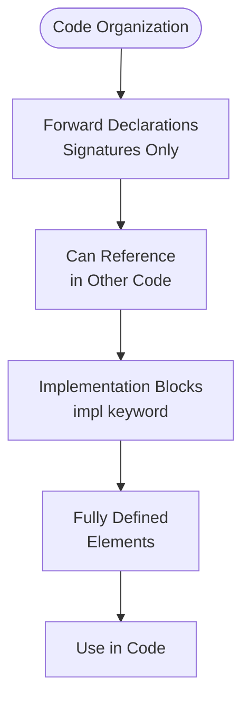
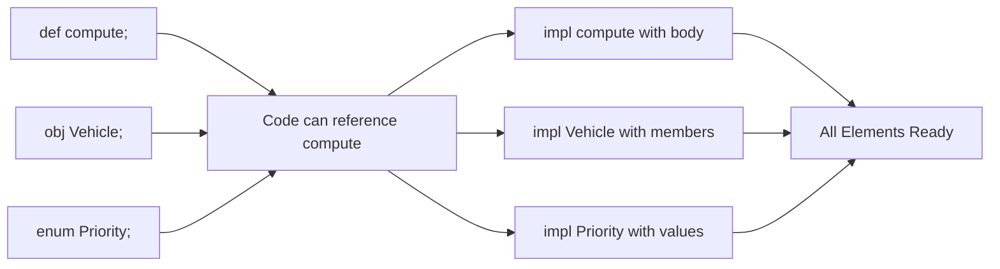

**Implementation Blocks in Jac**

Implementation blocks (`impl`) provide bodies for forward-declared elements, separating interface declarations from their implementations. This pattern enables modular code organization and resolves circular dependencies.

**Forward Declarations**

Lines 4-6 show forward declarations using semicolons to declare signatures without bodies. Line 4: Function signature without implementation
Line 5: Object declaration without members
Line 6: Enum declaration without values

Forward declarations establish names and interfaces early, allowing references before full implementation.

**Function Implementation**

Lines 9-11 implement the forward-declared function. The `impl` keyword introduces the implementation block. The signature must match the forward declaration exactly.

**Object Implementation**

Lines 14-18 implement the forward-declared object. The implementation adds the object's structure: member variables and methods.

**Enum Implementation**

Lines 21-25 implement the forward-declared enum. Enum implementations provide member names and their associated values.

**Using Implemented Elements**

Lines 27-35 demonstrate using the implemented elements. All elements work normally after implementation, as if they were defined in a single step.

**Forward Declaration and Implementation Pattern**



**Use Cases**

| Use Case | Benefit | Example |
|----------|---------|---------|
| Circular dependencies | Break dependency cycles | Two objects referencing each other |
| Interface/Implementation separation | Clear API boundaries | Public signatures, private implementations |
| Large codebases | Organize related code | Headers and implementations in different sections |
| Code generation | Stable interfaces | Generated signatures, manual implementations |

**Declaration vs Implementation Comparison**

| Aspect | Forward Declaration | Implementation Block |
|--------|---------------------|----------------------|
| Keyword | `def`, `obj`, `enum` | `impl` |
| Ends with | Semicolon (`;`) | Block (`{ }`) |
| Contains | Signature only | Full definition |
| Purpose | Establish interface | Provide functionality |
| Location | Typically at top | Later in file or separate file |

**Implementation Flow Example**



**Separating Implementations Across Files**

One of the most powerful uses of implementation blocks is organizing code across multiple files. This pattern keeps interface declarations in one file while placing implementations in separate files, similar to header/source file separation in C/C++.

=== "main.jac"
    ```jac
    obj Calculator {
        has total: float = 0.0;
        def add(value: float);
        def subtract(value: float);
        def multiply(value: float);
        def get_result -> float;
    }

    with entry {
        calc = Calculator();
        calc.add(10.5);
        calc.multiply(2.0);
        calc.subtract(5.0);
        print("Result:", calc.get_result());
    }
    ```

=== "main.impl.jac"
    ```jac
    impl Calculator.add(value: float) {
        self.total += value;
    }

    impl Calculator.subtract(value: float) {
        self.total -= value;
    }

    impl Calculator.multiply(value: float) {
        self.total *= value;
    }

    impl Calculator.get_result -> float {
        return self.total;
    }
    ```

**Running the program:**

```bash
jac run main.jac main.impl.jac
```

The Jac compiler automatically links declarations with their implementations across files. This pattern provides several benefits:

- **Clear API boundaries**: The main file shows the public interface without implementation details
- **Easier maintenance**: Related implementations can be grouped together
- **Better collaboration**: Different developers can work on interfaces and implementations separately
- **Reduced merge conflicts**: Interface changes and implementation changes are isolated

**Common Patterns**

**Separating interface from implementation:**

**Resolving circular dependencies:**

**Organizing complex types:**

**Key Points**

1. Forward declarations establish names without full definitions
2. Implementation blocks provide the actual functionality
3. Signatures must match exactly between declaration and implementation
4. Useful for circular dependencies and code organization
5. Similar to header/source separation in C/C++
6. Elements can be referenced after forward declaration, before implementation
7. All types (functions, objects, enums) support this pattern
