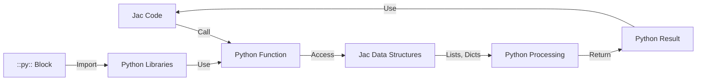
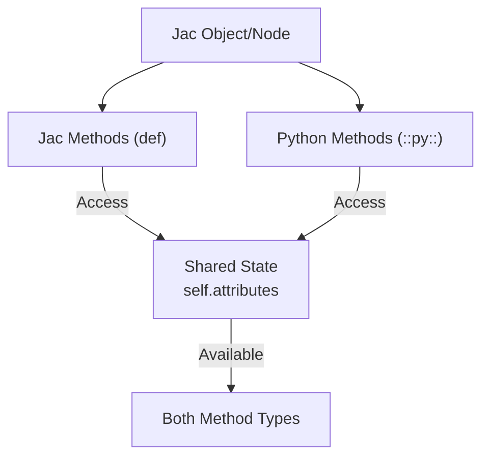

**Inline Python in Jac**

Jac supports embedding Python code blocks using the `::py::` delimiter syntax, enabling seamless integration with Python libraries and existing Python code.

**Basic Python Block**

Lines 4-10 demonstrate the simplest Python embedding. Python code is delimited by `::py::` markers at the beginning and end. Functions defined in Python blocks are directly callable from Jac code (lines 14-15).

**Python Block Syntax**

The `::py::` delimiter:

- Opens a Python code block (line 4)
- Closes the block with a matching `::py::` (line 10)
- Contains valid Python code using Python syntax (indentation-based, no semicolons)
- Can appear at module level or within archetype bodies

**Python Methods in Objects**

Lines 19-41 show Python methods within a Jac object. Python methods:

- Use `self` to access Jac member variables (line 25: `self.data`)
- Follow Python syntax and conventions
- Can use Python built-ins and comprehensions
- Are called like normal methods from Jac (lines 46, 49)

**Data Interoperability**

Lines 55-76 demonstrate Jac-Python data exchange. Data structures seamlessly pass between Jac and Python:

- Jac lists work as Python lists (line 70)
- Jac dicts work as Python dicts (line 74)
- Return values integrate naturally into Jac code

**Python Libraries Integration**

Lines 79-106 show importing and using Python libraries. Standard Python libraries and third-party packages are fully available within `::py::` blocks. Import statements work normally (lines 80-81).

**Python in Nodes**

Lines 109-135 demonstrate Python methods in node definitions. Python methods in nodes can:

- Access node state via `self.value` (line 117)
- Modify node attributes (line 118)
- Import libraries locally (line 116)
- Return computed results (line 124)

**Mixed Jac and Python Methods**

Lines 166-205 show combining Jac and Python methods in the same object. Objects can have both Jac methods (lines 170-173) and Python methods (lines 177-191). Both types:

- Access the same `self.history` attribute
- Are called the same way from Jac code (lines 198-200)
- Can modify shared state

**Usage Contexts for Python Blocks**

| Context | Example Line | Purpose |
|---------|--------------|---------|
| Global scope | 4-10 | Define utility functions |
| Object body | 22-40 | Add Python methods to objects |
| Node body | 113-125 | Add Python methods to nodes |
| Mixed with Jac | 169-191 | Combine Jac and Python methods |

**When to Use Inline Python**

**Use Python for:**

- Computationally intensive operations
- Leveraging existing Python libraries
- Complex numerical/statistical operations
- String processing with Python's rich ecosystem
- Integration with Python-only APIs

**Use Jac for:**

- Object-Spatial Programming features
- Graph operations and traversal
- Walker-node interactions
- OSP-specific patterns

**Data Flow Diagram**

**Method Access Patterns**

**Best Practices**

**Organize imports at the top of Python blocks:**

**Use Python for library integration:**

**Mix Python and Jac strategically:**

**Common Patterns**

**State modification from Python:**

**Using Python libraries:**

**Python comprehensions:**

**Key Points**

1. `::py::` delimiters mark Python code blocks
2. Python blocks can appear at global scope or in archetypes
3. Python code follows Python syntax (indentation, no semicolons)
4. Jac data structures (lists, dicts) work seamlessly in Python
5. Python methods access Jac state via `self`
6. Standard and third-party Python libraries are fully available
7. Objects can mix Jac and Python methods
8. Return values from Python integrate naturally into Jac
9. Use Python for computation, Jac for OSP features
