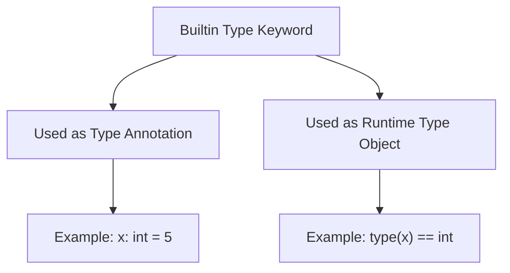

Builtin type keywords are special tokens in Jac that represent fundamental data types. These keywords are recognized by the lexer and can be used both as type annotations and as runtime type objects.

**What are Builtin Type Keywords?**

When you write code in Jac, the lexer (the part of the compiler that reads your code) recognizes certain words as special type keywords. These keywords represent the basic building blocks of data in your programs.

**The Eight Builtin Type Keywords**

Lines 7-14 demonstrate all eight builtin type keywords used as type annotations:

| Keyword | Type | Example Value | Line |
|---------|------|---------------|------|
| `str` | String (text) | `"string"` | 7 |
| `int` | Integer (whole number) | `42` | 8 |
| `float` | Floating-point (decimal) | `3.14` | 9 |
| `list` | List (ordered collection) | `[1, 2, 3]` | 10 |
| `tuple` | Tuple (immutable sequence) | `(1, 2)` | 11 |
| `set` | Set (unique values) | `{1, 2}` | 12 |
| `dict` | Dictionary (key-value pairs) | `{"key": "value"}` | 13 |
| `bool` | Boolean (true/false) | `True` | 14 |

**Type Annotation Syntax**

The pattern for declaring a variable with a type annotation is:

For example, line 7 shows `x: str = "string"`, which means:
- `x` is the variable name
- `str` is the type annotation (telling Jac this should be a string)
- `"string"` is the value being assigned

**How the Lexer Treats These Keywords**

Lines 17-18 explain an important detail: these keywords are "tokenized specially" by the lexer. This means the lexer gives them special treatment so they can serve two purposes:

**Purpose 1: Type Annotations**

Type annotations provide compile-time type information. They tell Jac (and developers reading the code) what type of data a variable should hold:

| Declaration | What It Means |
|-------------|---------------|
| `x: str` | x should hold string values |
| `y: int` | y should hold integer values |
| `z: float` | z should hold floating-point values |

**Purpose 2: Runtime Type Objects**

The same keywords can also be used at runtime as type objects. For example, you can use them with `type()` checks, type conversions, or as values in your code.

**Where These Keywords Appear**

These builtin type keywords can be used in several contexts:

| Context | Example | Lines |
|---------|---------|-------|
| Variable declarations | `x: str = "hello"` | 7-14 |
| Function parameters | `def greet(name: str) {...}` | - |
| Return type annotations | `def get_age() -> int {...}` | - |
| Class attributes | `has name: str` | - |

**Complete Example Breakdown**

Line 16 prints all the variables, demonstrating that:
- Each variable holds a value of its declared type
- The type annotations don't prevent the code from running
- All the builtin types work together in a single program

**Related Information**

Line 18 points to `builtin_types.jac` for more comprehensive examples of how to use these types. This file (`lexer_tokens.jac`) focuses specifically on showing that these are special keywords recognized by the lexer, not just regular identifiers.

**Why Special Tokenization Matters**

By tokenizing these keywords specially, Jac can:
1. Provide better error messages when types are misused
2. Enable type checking and inference
3. Allow these words to be used both as types and values
4. Reserve these words so they can't be used as variable names in most contexts
