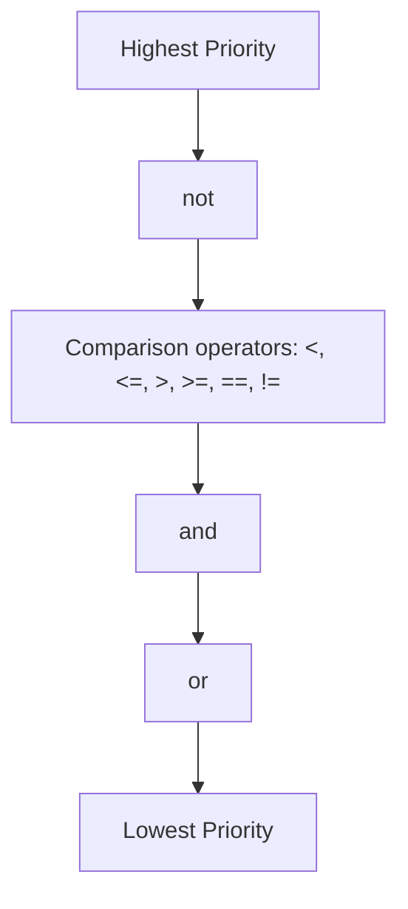

Jac provides a comprehensive set of operators for comparing values, checking object identity and membership, and combining boolean conditions to make decisions in your code.

**Comparison Operators**

Lines 5-10 demonstrate the six comparison operators that evaluate to boolean values (True or False):

| Operator | Meaning | Example (Line) | Result |
|----------|---------|----------------|--------|
| `>` | Greater than | `5 > 4` (line 5) | True |
| `>=` | Greater than or equal | `5 >= 5` (line 6) | True |
| `<` | Less than | `3 < 10` (line 7) | True |
| `<=` | Less than or equal | `3 <= 3` (line 8) | True |
| `==` | Equal to | `5 == 5` (line 9) | True |
| `!=` | Not equal to | `5 != 3` (line 10) | True |

These operators work with any comparable types, including numbers, strings, and custom objects that implement comparison methods.

**Identity Operators**

Lines 13-18 demonstrate identity operators, which check whether two variables refer to the same object in memory, not just whether they have equal values.

```mermaid
graph TD
    A[a = [1,2,3]] --> OBJ1[Object 1: [1,2,3]]
    B[b = [1,2,3]] --> OBJ2[Object 2: [1,2,3]]
    C[c = a] --> OBJ1
    D{a is b?} --> E[False - Different objects]
    F{a is c?} --> G[True - Same object]
```

| Operator | Meaning | Example (Line) | Result |
|----------|---------|----------------|--------|
| `is` | Same object identity | `a is b` (line 16) | False |
| `is` | Same object identity | `a is c` (line 17) | True |
| `is not` | Different object identity | `a is not b` (line 18) | True |

Even though lists `a` and `b` contain the same values, they are different objects. Variable `c` references the same object as `a`, so `a is c` returns True.

**Membership Operators**

Lines 21-23 showcase membership operators for testing whether a value exists within a collection:

| Operator | Meaning | Example (Line) | Result |
|----------|---------|----------------|--------|
| `in` | Value exists in collection | `3 in a` (line 21) | True |
| `in` | Value exists in collection | `5 in a` (line 22) | False |
| `not in` | Value doesn't exist | `5 not in a` (line 23) | True |

The `in` operator works with lists, tuples, sets, dictionaries (checks keys), and strings (checks substrings).

**Logical AND Operator**

Lines 26-28 demonstrate the `and` operator, which returns True only when both operands are True:

| Expression (Line) | Left | Right | Result |
|-------------------|------|-------|--------|
| `True and True` (26) | True | True | True |
| `True and False` (27) | True | False | False |
| `False and False` (28) | False | False | False |

The `and` operator uses short-circuit evaluation: if the left operand is False, the right operand is never evaluated.

**Logical OR Operator**

Lines 31-33 demonstrate the `or` operator, which returns True if at least one operand is True:

| Expression (Line) | Left | Right | Result |
|-------------------|------|-------|--------|
| `True or False` (31) | True | False | True |
| `False or False` (32) | False | False | False |
| `True or True` (33) | True | True | True |

The `or` operator also uses short-circuit evaluation: if the left operand is True, the right operand is never evaluated.

**Logical NOT Operator**

Lines 36-37 demonstrate the `not` operator, which inverts a boolean value:

| Expression (Line) | Operand | Result |
|-------------------|---------|--------|
| `not True` (36) | True | False |
| `not False` (37) | False | True |

**Chained Comparisons**

Lines 40-43 illustrate one of Jac's most powerful features: chained comparison operators. Instead of writing `10 < x and x < 20`, you can write `10 < x < 20`:

| Expression (Line) | Equivalent To | Result (x=15) |
|-------------------|---------------|---------------|
| `10 < x < 20` (41) | `10 < x and x < 20` | True |
| `0 <= x <= 100` (42) | `0 <= x and x <= 100` | True |

This creates more readable code and is more efficient because `x` is only evaluated once.

**Complex Boolean Expressions**

Lines 46-48 demonstrate combining multiple conditions with parentheses for clarity:

| Expression (Line) | Breakdown | Result |
|-------------------|-----------|--------|
| `(5 > 3) and (10 < 20)` (46) | True and True | True |
| `(5 > 10) or (3 < 7)` (47) | False or True | True |
| `not (5 > 10)` (48) | not False | True |

**Multiple Chained Comparisons**

Lines 51-52 show that you can chain more than two comparisons:

| Expression (Line) | How It Works | Result |
|-------------------|--------------|--------|
| `1 < 2 < 3 < 4` (51) | All pairs must be true: 1<2, 2<3, 3<4 | True |
| `10 >= 10 >= 10` (52) | All pairs must be true: 10≥10, 10≥10 | True |

**Combined Logical Operations**

Lines 55-57 show chaining multiple logical operators:

| Expression (Line) | Type | Result |
|-------------------|------|--------|
| `True and True and True` (55) | Multiple AND | True |
| `False or False or True` (56) | Multiple OR | True |
| `(True and False) or (False and True)` (57) | Mixed | False |

**Operator Precedence**

When combining operators, Jac follows this precedence order (highest to lowest):



Examples:

- `not False and True` is evaluated as `(not False) and True` = `True and True` = `True`
- `True or False and False` is evaluated as `True or (False and False)` = `True or False` = `True`

**Practical Usage Tips**

| Scenario | Best Practice | Example |
|----------|---------------|---------|
| Range checking | Use chained comparisons | `0 <= value <= 100` |
| Multiple conditions | Use `and`/`or` with parentheses | `(age >= 18) and (has_license)` |
| Identity checking | Use `is` for None, True, False | `if value is None:` |
| Value checking | Use `==` for other values | `if count == 0:` |
| Collection checking | Use `in` operator | `if item in my_list:` |

**Common Patterns**

Lines throughout the file demonstrate these common patterns:

| Pattern | Lines | Use Case |
|---------|-------|----------|
| Boundary checking | 41-42 | Validate input ranges |
| Boolean flags | 26-28, 31-33 | State management |
| Object identity | 16-18 | Check for None or singletons |
| Collection membership | 21-23 | Search operations |
| Complex conditions | 46-48 | Business logic |
