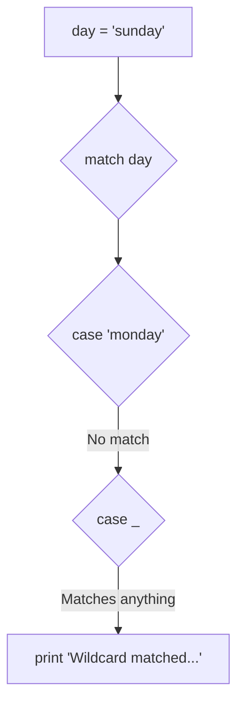
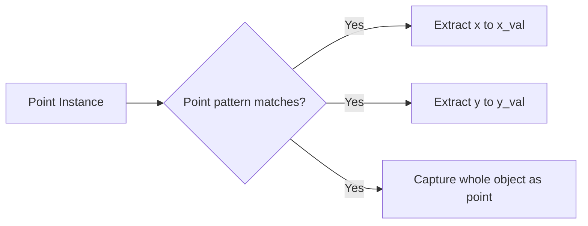
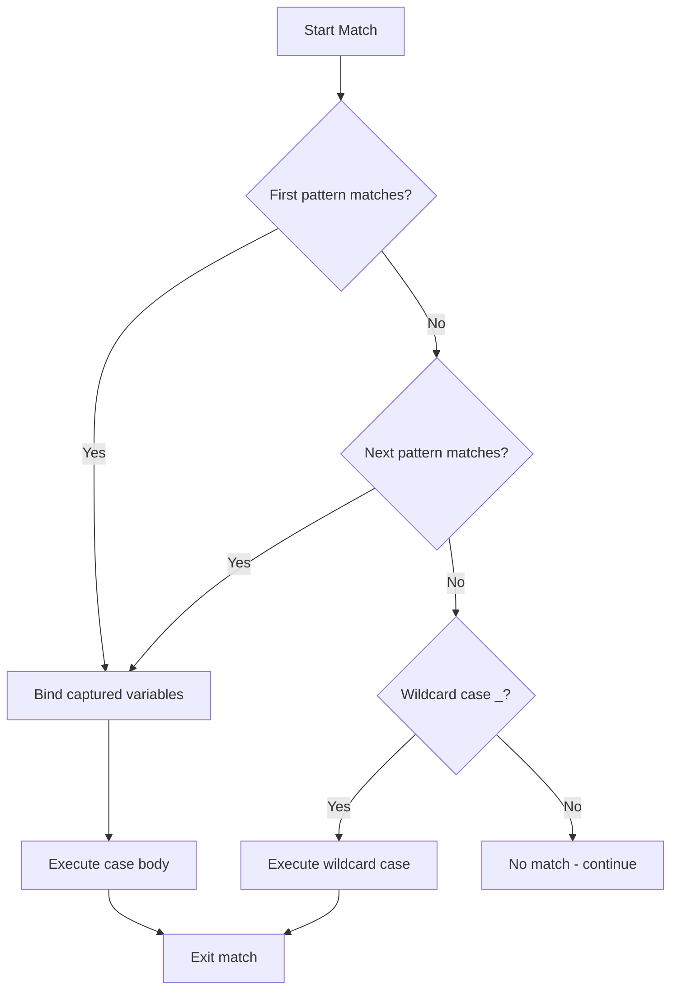

Capture patterns in Jac's match statements allow you to bind matched values to variables during pattern matching, making them available in the case body. This feature enables both pattern matching and value extraction in a single operation.

**The Wildcard Pattern**

Lines 5-11 demonstrate the wildcard capture pattern using `_`. This is the simplest capture pattern:

The underscore `_` is special because it:
- Matches any value without exception
- Does NOT bind the value to a variable
- Serves as a catch-all case when no other patterns match

| Feature | Wildcard `_` | Named Pattern |
|---------|--------------|---------------|
| Matches any value | Yes | Only specific patterns |
| Creates variable binding | No | Yes |
| Typical position | Last case | Any case |
| Use case | Default/fallback | Value extraction |

**The MatchAs Pattern - Basic Usage**

Lines 14-18 introduce the `as` keyword for capturing values. The pattern `case val as captured:` does two things:

1. Matches the pattern `val` (which matches anything since it's just a variable pattern)
2. Binds the matched value to the variable `captured`

Line 17 then uses `captured` to print the value. In this case, since `value = 42` (line 14), the variable `captured` will be `42`.

**MatchAs in Sequence Patterns**

Lines 21-25 show how `as` can capture elements within sequence patterns:

| Pattern Component | What It Does | Variable Created |
|-------------------|--------------|------------------|
| `first` | Matches first element | `first = 1` |
| `second as mid` | Matches second element AND captures it | `mid = 2` |
| `third` | Matches third element | `third = 3` |

The pattern `case [first, second as mid, third]:` on line 23 demonstrates that you can:
- Use regular variable patterns (`first`, `third`)
- Use `as` to create an additional binding with a different name (`second as mid`)

This is useful when you want to:
- Match against a specific pattern structure
- Give meaningful names to captured values
- Create multiple names for the same value

**MatchAs with Class Patterns**

Lines 28-36 demonstrate the most powerful use of `as`: capturing entire objects while also extracting their attributes.

First, lines 28-31 define a `Point` class with `x` and `y` attributes. Line 32 creates a Point instance.

Line 34 shows the complex pattern: `case Point(x=x_val, y=y_val) as point:`

This pattern:

| Binding | Value | Purpose |
|---------|-------|---------|
| `x_val` | `5.0` | Access just the x coordinate |
| `y_val` | `10.0` | Access just the y coordinate |
| `point` | `Point(x=5.0, y=10.0)` | Access the entire object |

This is incredibly useful because you can:
- Work with individual attributes (`x_val`, `y_val`)
- Work with the whole object (`point`)
- Pass the object to other functions
- Call methods on the object

**When to Use Each Capture Pattern**

| Pattern Type | Syntax | Use Case | Example Line |
|--------------|--------|----------|--------------|
| Wildcard `_` | `case _:` | Default case, ignore value | 9 |
| Simple `as` | `case x as name:` | Capture any value | 16 |
| Sequence `as` | `case [a, b as x, c]:` | Capture list element | 23 |
| Class `as` | `case Point(...) as p:` | Capture object + attributes | 34 |

**Pattern Matching Flow**

Here's how pattern matching with capture works:

**Practical Examples**

The examples in this file show progressively more complex capture patterns:

| Lines | Pattern Type | Complexity | What You Learn |
|-------|--------------|------------|----------------|
| 5-11 | Wildcard | Simple | Default case handling |
| 14-18 | Basic `as` | Simple | Value capture |
| 21-25 | Sequence `as` | Moderate | Partial sequence capture |
| 28-36 | Class `as` | Advanced | Object + attribute capture |

**Key Takeaways**

1. **Wildcard `_`** matches everything but creates no binding
2. **`as` keyword** captures matched values into variables
3. **Combine patterns** to match structure and capture values simultaneously
4. **Order matters**: patterns are checked top-to-bottom
5. **First match wins**: only one case executes per match statement
