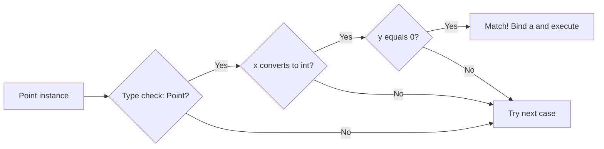
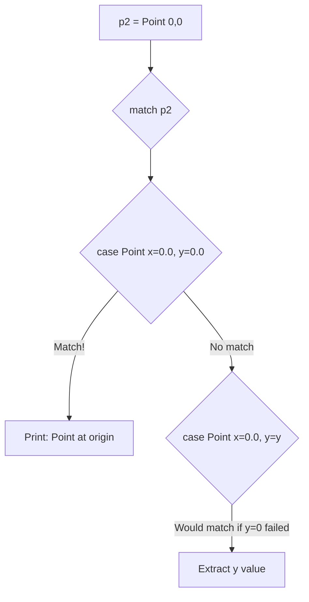
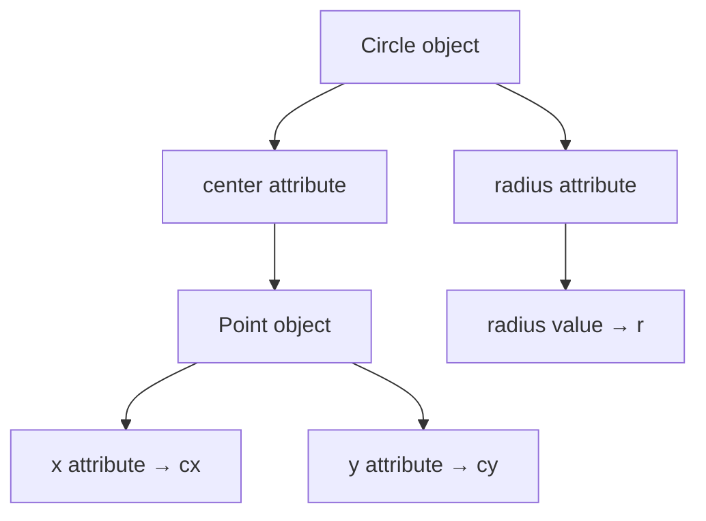

Class patterns enable powerful pattern matching against object instances, allowing you to check types, extract attributes, and validate object state all in a single pattern.

**Understanding Class Patterns**

Class patterns match objects of specific types while simultaneously extracting and validating their attributes. This combines type checking, attribute access, and conditional logic in one elegant syntax.

**Object Definitions**

Lines 3-11 define the classes used in the examples:

| Class | Attributes | Lines |
|-------|-----------|-------|
| `Point` | `x: float`, `y: float` | 3-6 |
| `Circle` | `center: Point`, `radius: float` | 8-11 |

These represent geometric objects, perfect for demonstrating pattern matching.

**Class Pattern Structure**

The general form of a class pattern is:

Line 17 shows a complete example: `case Point(int(a), y = 0):`

**Positional Pattern Matching**

Line 17 uses `int(a)` as a positional pattern. This:

1. Matches the first attribute of Point (which is `x` from line 4)
2. Attempts to convert it to an integer
3. Binds the converted value to variable `a`

| Given Object | Pattern | What Happens | Result |
|--------------|---------|--------------|--------|
| `Point(x=9, y=0)` | `int(a)` | `x=9` converts to `int(9)` | `a = 9` |
| `Point(x=9.7, y=0)` | `int(a)` | `x=9.7` converts to `int(9)` | `a = 9` |

**Keyword Pattern Matching**

Line 17 also uses `y = 0` as a keyword pattern. This:

1. Checks the `y` attribute
2. Verifies it equals exactly `0`
3. Does NOT create a variable binding (just validates)

| Object | Keyword Check | Match? |
|--------|---------------|--------|
| `Point(x=9, y=0)` | `y = 0` | Yes |
| `Point(x=9, y=5)` | `y = 0` | No |

**Extracting Attributes with Keyword Patterns**

Lines 24-28 show how to extract attribute values using keyword patterns with variable names:

| Pattern Syntax | What It Does | Variable Created |
|----------------|--------------|------------------|
| `x=x_val` (line 26) | Extracts x attribute | `x_val = 5.0` |
| `y=y_val` (line 26) | Extracts y attribute | `y_val = 10.0` |

The pattern `case Point(x=x_val, y=y_val):` on line 26:
- Checks the object is a Point
- Extracts x into variable `x_val`
- Extracts y into variable `y_val`
- Both variables are available in the case body (line 27)

**Checking Specific Values**

Lines 31-39 demonstrate matching against specific attribute values:

| Pattern | What It Checks | When It Matches |
|---------|----------------|-----------------|
| `Point(x=0.0, y=0.0)` (line 33) | Both x and y are 0.0 | Origin point only |
| `Point(x=0.0, y=y)` (line 35) | x is 0.0, extract y | Any point on y-axis |

Line 33 uses literal values (`0.0`) to check for exact matches, while line 35 uses a variable name (`y`) to extract the value.

**Nested Class Patterns**

Lines 42-46 demonstrate one of the most powerful features: nested class patterns for matching complex object structures.

Line 42 creates a Circle with a Point as its center. Line 44 shows the nested pattern:

This breaks down as:

| Pattern Component | Matches | Creates Variable |
|-------------------|---------|------------------|
| `Circle(...)` | Check object is Circle | - |
| `center=Point(...)` | Check center is Point | - |
| `x=cx` | Extract Point's x | `cx = 3.0` |
| `y=cy` | Extract Point's y | `cy = 4.0` |
| `radius=r` | Extract radius | `r = 5.0` |

**Pattern Matching Behavior**

Important things to understand:

| Concept | Explanation |
|---------|-------------|
| Type checking | Pattern first checks if object is the right type |
| Attribute order | Positional patterns match attributes in definition order |
| Partial matching | You don't need to match all attributes |
| First match wins | Only the first matching case executes |
| Variable scope | Extracted variables only exist in the case body |

**Combining Pattern Types**

You can mix different pattern elements:

| Pattern Element | Example | Purpose |
|-----------------|---------|---------|
| Type conversion | `int(a)` | Convert and bind |
| Literal match | `y = 0` | Check exact value |
| Variable binding | `x=val` | Extract to variable |
| Nested patterns | `Point(x=cx, y=cy)` | Match object structure |

**Practical Examples Summary**

| Lines | Pattern Type | Demonstrates |
|-------|--------------|-------------|
| 15-21 | Mixed positional/keyword | Type conversion + value check |
| 24-28 | Keyword extraction | Extracting multiple attributes |
| 31-39 | Specific value matching | Literal values vs extraction |
| 42-46 | Nested patterns | Complex object hierarchies |

**When to Use Class Patterns**

Use class patterns when you need to:

1. **Validate object types** - Ensure you're working with the right class
2. **Extract attributes** - Pull out specific values from objects
3. **Check object state** - Verify attributes have specific values
4. **Handle hierarchies** - Match nested object structures
5. **Branch on type** - Different behavior for different object types

**Common Use Cases**

| Use Case | Pattern Example |
|----------|-----------------|
| Extract all attributes | `case Point(x=x, y=y):` |
| Check origin point | `case Point(x=0.0, y=0.0):` |
| Points on x-axis | `case Point(x=x, y=0.0):` |
| Type-based routing | Multiple cases for different classes |
| Nested structures | `case Circle(center=Point(...)):` |
