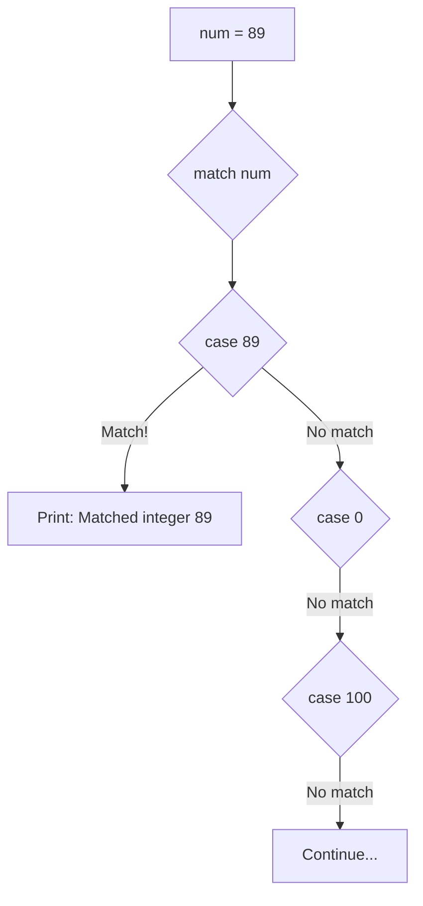
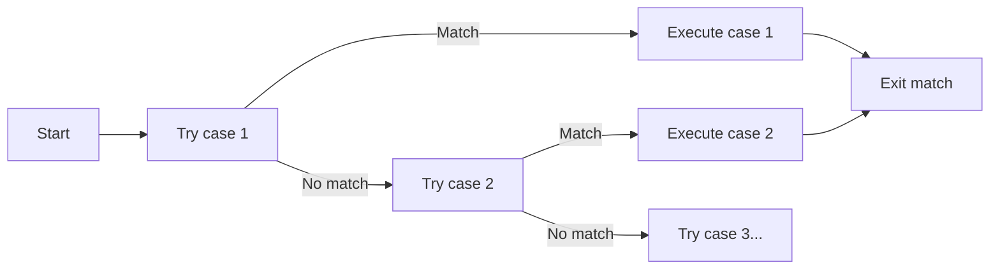

Literal patterns are the most straightforward type of pattern matching, allowing you to match against specific constant values like numbers, strings, and booleans.

**What are Literal Patterns?**

A literal pattern compares the matched value against a constant using value equality (similar to the `==` operator). If the values are equal, the pattern matches and the case body executes.

**Integer Literal Patterns**

Lines 5-13 demonstrate matching against integer literals:



| Line | Pattern | Matches When | Example |
|------|---------|--------------|---------|
| 7 | `case 89:` | num equals 89 | num = 89 ✓ |
| 9 | `case 0:` | num equals 0 | num = 0 ✓ |
| 11 | `case 100:` | num equals 100 | num = 100 ✓ |

Since `num = 89` (line 5), only the first case (line 7) matches.

**Float Literal Patterns**

Lines 16-22 show matching against floating-point literals:

| Line | Pattern | Matches When |
|------|---------|--------------|
| 18 | `case 3.14:` | pi equals 3.14 |
| 20 | `case 2.71:` | pi equals 2.71 |

Float matching uses value equality, so `3.14` matches `3.14` exactly. Be careful with floating-point precision - `3.14` might not match `3.140000001` depending on how the values are calculated.

**String Literal Patterns**

Lines 25-31 demonstrate string literal matching:

| Line | Pattern | Matches When |
|------|---------|--------------|
| 27 | `case "hello":` | text equals "hello" |
| 29 | `case "world":` | text equals "world" |

String matching is case-sensitive and requires an exact character-by-character match. `"hello"` will not match `"Hello"` or `"hello "` (with a space).

**Boolean Literal Patterns**

Lines 34-40 show boolean literal patterns. The comment on line 33 notes that while you CAN use literal patterns for booleans, singleton patterns are more idiomatic:

| Line | Pattern | Matches When |
|------|---------|--------------|
| 36 | `case True:` | flag equals True |
| 38 | `case False:` | flag equals False |

**None Literal Pattern**

Lines 43-47 demonstrate matching against None. Again, line 42 notes that singleton patterns are the preferred approach for None:

| Line | Pattern | Matches When |
|------|---------|--------------|
| 45 | `case None:` | val equals None |

**Match Evaluation Order**

Match statements evaluate cases sequentially from top to bottom:



Once a case matches, that case's body executes and the match statement completes. No further cases are checked.

**Supported Literal Types**

| Type | Example Pattern | When It Matches | Lines |
|------|----------------|-----------------|-------|
| Integer | `case 42:` | Value equals 42 | 5-13 |
| Float | `case 3.14:` | Value equals 3.14 | 16-22 |
| String | `case "hello":` | Value equals "hello" | 25-31 |
| Boolean | `case True:` | Value equals True | 34-40 |
| None | `case None:` | Value equals None | 43-47 |

**Equality vs Identity**

Literal patterns use value equality (`==`), not identity (`is`):

| Comparison Type | Operator | When True |
|----------------|----------|-----------|
| Value equality | `==` | Values are equal |
| Identity | `is` | Same object in memory |

For most literals, this doesn't matter. But for booleans and None, singleton patterns (which use identity) are preferred because:
- They're more efficient (identity check is faster)
- They're more semantically correct (True, False, and None are singletons)
- They're more idiomatic in Jac

**Pattern Matching vs If-Else**

These are equivalent:

**Using match with literals:**
```
match value {
    case 1:
        print("one");
    case 2:
        print("two");
    case _:
        print("other");
}
```

**Using if-elif-else:**
```
if value == 1 {
    print("one");
} elif value == 2 {
    print("two");
} else {
    print("other");
}
```

Match is more concise and clearer when you have many cases to check.

**Practical Usage**

| Scenario | Best Pattern Type |
|----------|------------------|
| Matching specific numbers | Literal patterns |
| Matching specific strings | Literal patterns |
| Matching True/False/None | Singleton patterns (not literals) |
| Matching any value | Wildcard pattern `_` |
| Extracting values | Capture patterns with `as` |
| Matching ranges | Use guards or if-elif |

**Important Notes**

1. **Order matters**: First match wins, so put specific cases before general ones
2. **Exact matching**: Literals must match exactly (case-sensitive for strings)
3. **Type matters**: `case 5:` won't match `"5"` (integer vs string)
4. **No variables**: Literal patterns use constant values, not variables
5. **Add wildcard**: Include `case _:` as the last case to handle unmatched values

**Examples in This File**

| Lines | Type | Demonstrates |
|-------|------|--------------|
| 5-13 | Integer | Matching specific numbers |
| 16-22 | Float | Matching decimal values |
| 25-31 | String | Matching text values |
| 34-40 | Boolean | Matching True/False (use singletons instead) |
| 43-47 | None | Matching None (use singletons instead) |
