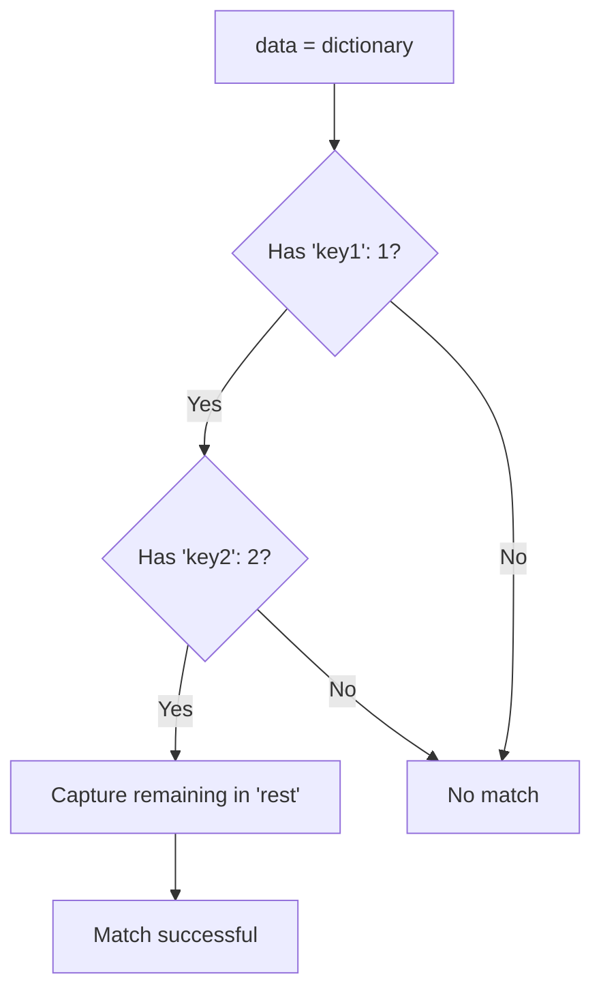
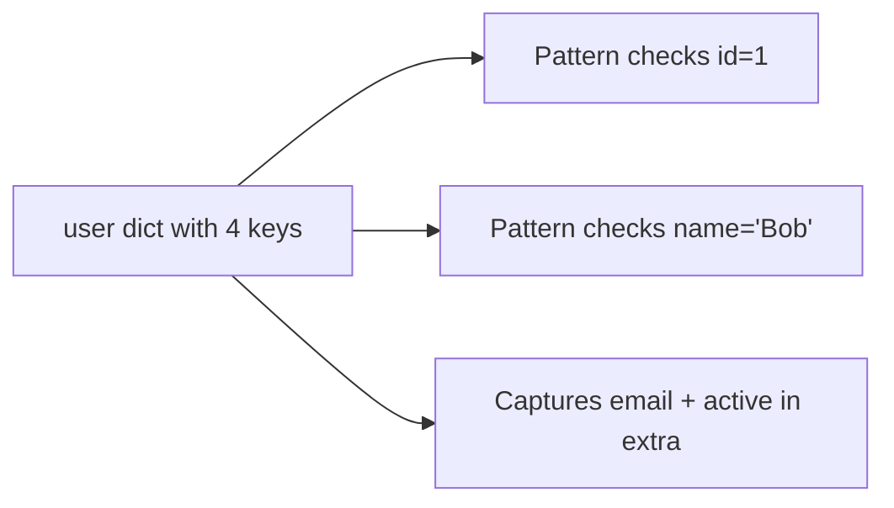
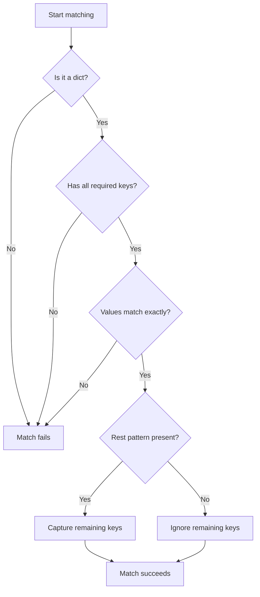

Mapping patterns enable pattern matching against dictionaries, allowing you to check for specific keys, validate their values, and capture remaining key-value pairs all in one operation.

**What are Mapping Patterns?**

Mapping patterns match dictionary-like objects. They let you specify which keys must be present, what values those keys should have, and optionally capture any remaining keys that weren't explicitly matched.

**Basic Mapping Pattern with Rest Capture**

Lines 5-9 demonstrate the fundamental mapping pattern structure:

Line 7 shows the pattern: `case {"key1" : 1, "key2" : 2, **rest}:`

| Component | Purpose | Example |
|-----------|---------|---------|
| `"key1" : 1` | Check key1 exists with value 1 | Required match |
| `"key2" : 2` | Check key2 exists with value 2 | Required match |
| `**rest` | Capture remaining keys | `rest = {"key3": 3}` |

**Understanding the Rest Pattern**

The `**rest` syntax (similar to Python's kwargs) captures all key-value pairs that weren't explicitly mentioned in the pattern:

| Original Dict (line 5) | Matched Keys | Captured in rest |
|----------------------|--------------|------------------|
| `{"key1": 1, "key2": 2, "key3": 3}` | key1, key2 | `{"key3": 3}` |

The rest pattern creates a new dictionary containing only the unmatched keys. Line 8 prints this captured dictionary.

**Partial Matching with Extra Keys**

Lines 12-16 demonstrate that mapping patterns perform partial matching - the dictionary can have more keys than specified in the pattern:

| Dictionary Keys (line 12) | Pattern Requirements (line 14) | Captured in extra |
|---------------------------|-------------------------------|-------------------|
| id, name, email, active | id=1, name="Bob" | `{"email": "bob@test.com", "active": True}` |

The pattern doesn't need to mention all keys - it only validates the ones it cares about.

**Mapping Without Rest Pattern**

Lines 19-25 show that the rest pattern is optional. You can match specific keys without capturing the extras:

| Line | Pattern | Behavior |
|------|---------|----------|
| 21 | `{"code": 200, "message": "OK"}` | Exact match required |
| 23 | `case _:` | Wildcard catches non-matches |

Without `**rest`, the pattern still matches dictionaries with extra keys, but those extras are simply ignored.

**Multiple Keys with Values**

Lines 28-32 demonstrate matching multiple specific key-value pairs:

Line 30 pattern: `case {"host": "localhost", "port": 8080, **rest}:`

| Dictionary (line 28) | Pattern Matches | Rest Captures |
|---------------------|-----------------|---------------|
| `{"host": "localhost", "port": 8080, "debug": True}` | host="localhost", port=8080 | `{"debug": True}` |

**Pattern Matching Rules**

Mapping patterns follow these rules:

| Rule | Explanation |
|------|-------------|
| **Partial matching** | Dict can have more keys than pattern specifies |
| **Exact values** | Specified keys must have exact matching values |
| **Order independent** | Key order doesn't matter in the pattern |
| **Type checking** | Matched value must be a dictionary |
| **Rest optional** | `**rest` is not required |

**How Matching Works**

**Pattern Variations**

| Pattern Type | Syntax | Use Case | Example Line |
|--------------|--------|----------|--------------|
| With rest capture | `{key: val, **rest}` | Need remaining keys | 7, 14, 30 |
| Without rest | `{key: val}` | Only care about specific keys | 21 |
| Literal values | `{key: literal}` | Check exact values | All examples |
| Variable binding | `{key: var}` | Extract to variable | (Not shown) |

**Practical Use Cases**

| Scenario | Pattern Example |
|----------|-----------------|
| API response validation | `case {"status": 200, "data": data}:` |
| Config checking | `case {"host": host, "port": port, **opts}:` |
| Required fields | `case {"id": id, "name": name}:` |
| Optional fields | `case {"required": val, **optional}:` |

**Important Behaviors**

1. **Missing keys fail**: If a required key is missing, the pattern doesn't match
2. **Wrong values fail**: If a key exists but has a wrong value, pattern doesn't match
3. **Extra keys allowed**: Dictionaries can have keys not in the pattern
4. **First match wins**: Like all match statements, first matching case executes
5. **Rest creates new dict**: The `**rest` pattern creates a new dictionary object

**Examples Summary**

| Lines | Demonstrates | Rest Pattern Used |
|-------|--------------|-------------------|
| 5-9 | Basic mapping with rest | Yes - captures key3 |
| 12-16 | Partial matching | Yes - captures email, active |
| 19-25 | Exact matching without rest | No |
| 28-32 | Multiple key matching | Yes - captures debug |

**Comparison with Other Patterns**

| Pattern Type | What It Matches | Example |
|--------------|----------------|---------|
| Mapping | Dictionaries | `case {"key": val}:` |
| Sequence | Lists/tuples | `case [a, b, c]:` |
| Class | Object instances | `case Point(x=x, y=y):` |
| Literal | Exact values | `case 42:` |

**Key Takeaways**

1. Mapping patterns match dictionaries and check key-value pairs
2. Use `**rest` to capture unmatched keys (optional)
3. Patterns perform partial matching - extra keys are allowed
4. All specified keys must exist with exact values for a match
5. Perfect for validating API responses, configs, and structured data
