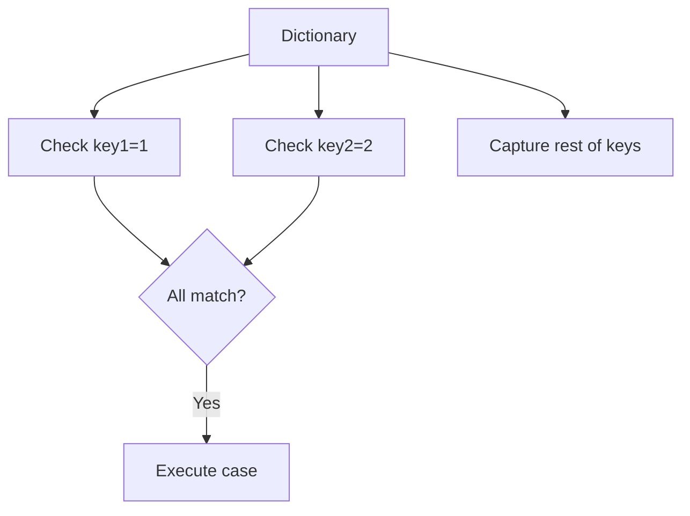
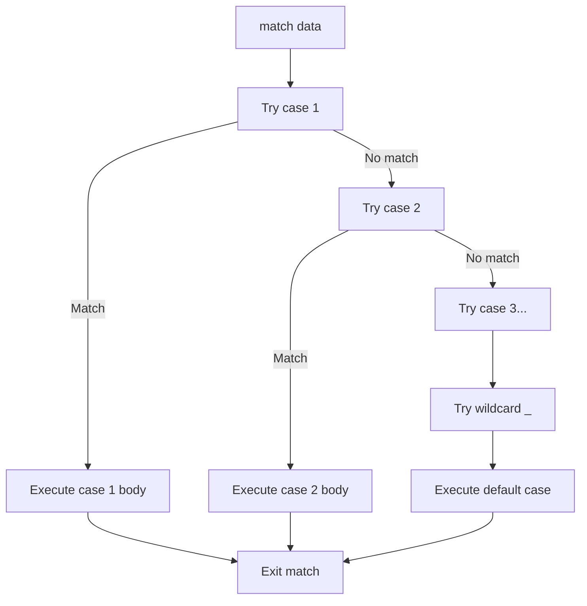

This comprehensive example demonstrates all the different pattern types available in Jac's match statements, providing a complete reference for pattern matching capabilities.

**Pattern Matching Overview**

Pattern matching allows you to check values against patterns and execute code based on which pattern matches. It's more powerful than simple if-else statements because it can simultaneously check types, extract values, and validate structure.

**Object Setup**

Lines 3-6 define a Point class used in the examples:

| Line | Element | Purpose |
|------|---------|---------|
| 3 | `obj Point` | Define Point class |
| 4-5 | `has x: float, y: float` | Two float attributes |

**The Match Example Function**

Lines 8-53 contain a single function `match_example` that demonstrates every pattern type. Each case shows a different pattern matching technique.

**1. MatchValue (Literal) Pattern**

Lines 11-12 show the simplest pattern - matching a literal value:

| Pattern | Matches When | Example |
|---------|--------------|---------|
| `case 42:` | data equals exactly 42 | `match_example(42)` |

This is equivalent to `if data == 42:` but integrates with the match statement.

**2. MatchSingleton Pattern**

Lines 15-18 demonstrate singleton patterns for special constant values:

| Pattern | Singleton | Matches | Lines |
|---------|-----------|---------|-------|
| `case True:` | Boolean True | Only True | 15-16 |
| `case None:` | None value | Only None | 17-18 |

These use identity checking (`is`) rather than equality (`==`), making them the correct way to match True, False, and None.

**3. MatchSequence Pattern**

Lines 21-22 show exact sequence matching:

```mermaid
graph LR
    A[Input: [1,2,3]] --> B{Matches [1,2,3]?}
    B -->|Yes| C[Execute line 22]
    B -->|No| D[Try next pattern]
```

| Pattern | Requirement | Example Match |
|---------|-------------|---------------|
| `case [1, 2, 3]:` | Exactly 3 elements: 1, 2, 3 | `[1, 2, 3]` |

**4. MatchStar Pattern**

Lines 25-28 demonstrate the star pattern for variable-length sequences:

Pattern: `case [1, *rest, 3]:`

| Component | Matches | Example |
|-----------|---------|---------|
| `1` | First element is 1 | Required |
| `*rest` | Zero or more middle elements | Captured in `rest` |
| `3` | Last element is 3 | Required |

If data is `[1, 2, 2, 3]`, then `rest` would be `[2, 2]`.

**5. MatchMapping Pattern**

Lines 31-34 show dictionary pattern matching:

Pattern: `case {"key1" : 1, "key2" : 2, **rest}:`



| Element | Purpose | Result |
|---------|---------|--------|
| `"key1" : 1` | Require key1 with value 1 | Validation |
| `"key2" : 2` | Require key2 with value 2 | Validation |
| `**rest` | Capture remaining keys | Variable binding |

**6. MatchClass Pattern**

Lines 37-38 demonstrate class pattern matching with type conversion:

Pattern: `case Point(int(a), y = 0):`

| Component | Action | Purpose |
|-----------|--------|---------|
| `Point` | Check type is Point | Type validation |
| `int(a)` | Convert x to int, bind to a | Conversion + binding |
| `y = 0` | Check y equals 0 | Value validation |

This combines three operations: type checking, type conversion, and value validation.

**7. MatchAs Pattern**

Lines 41-44 show capture patterns with the `as` keyword:

Pattern: `case [1, 2, rest_val as value]:`

| Element | What It Does |
|---------|-------------|
| `[1, 2, rest_val]` | Match sequence starting with 1, 2 |
| `as value` | Also bind third element to `value` |

The `as` keyword creates an additional binding, useful when you need the same value under different names or want to capture a sub-pattern.

**8. MatchOr Pattern**

Lines 47-48 demonstrate the OR pattern using `|`:

Pattern: `case [1, 2] | [3, 4]:`

```mermaid
graph LR
    A[Input data] --> B{Matches [1,2]?}
    B -->|Yes| C[Execute case]
    B -->|No| D{Matches [3,4]?}
    D -->|Yes| C
    D -->|No| E[Try next pattern]
```

The pattern matches if EITHER the left OR right pattern matches.

**9. Wildcard Pattern**

Lines 50-51 show the catch-all wildcard:

| Pattern | Behavior |
|---------|----------|
| `case _:` | Matches anything, creates no binding |

This is typically the last case to handle any values that didn't match previous patterns.

**Pattern Type Summary**

| Pattern Type | Syntax Example | Use Case | Lines |
|--------------|---------------|----------|-------|
| MatchValue | `case 42:` | Match literal values | 11-12 |
| MatchSingleton | `case True:` | Match True/False/None | 15-18 |
| MatchSequence | `case [1, 2, 3]:` | Match exact sequences | 21-22 |
| MatchStar | `case [1, *rest, 3]:` | Variable-length sequences | 25-28 |
| MatchMapping | `case {"key": val, **rest}:` | Match dictionaries | 31-34 |
| MatchClass | `case Point(x=x, y=y):` | Match object types | 37-38 |
| MatchAs | `case x as name:` | Capture matched values | 41-44 |
| MatchOr | `case [1, 2] | [3, 4]:` | Match multiple patterns | 47-48 |
| Wildcard | `case _:` | Catch-all default | 50-51 |

**Pattern Composition**

Patterns can be nested and combined:

| Combination | Example | What It Does |
|-------------|---------|--------------|
| Class + Star | `case Point(*coords):` | Match Point, capture all attributes |
| Mapping + Or | `case {"type": "a"} | {"type": "b"}:` | Match either dict structure |
| Sequence + As | `case [x, y] as point:` | Match sequence, capture whole thing |
| Class + Mapping | `case Config(**opts):` | Extract object as dictionary |

**Execution Flow**



**Practical Example**

Line 56 shows calling the function: `match_example(Point(x=9, y=0))`

This will match the MatchClass pattern on line 37 because:
1. The data is a Point instance ✓
2. The x value (9) can convert to int ✓
3. The y value equals 0 ✓

So `a` would be `9` and line 38 executes.

**When to Use Each Pattern**

| Scenario | Pattern Type | Example |
|----------|--------------|---------|
| Check specific value | MatchValue | `case 200:` for HTTP OK |
| Check None | MatchSingleton | `case None:` |
| Destructure list | MatchSequence | `case [r, g, b]:` for RGB |
| Variable-length lists | MatchStar | `case [first, *rest]:` |
| Validate dict structure | MatchMapping | API response validation |
| Type-based routing | MatchClass | Different handlers per type |
| Need value name | MatchAs | `case x as value:` |
| Multiple alternatives | MatchOr | `case "yes" | "y" | "Y":` |
| Default case | Wildcard | `case _:` |

**Key Concepts**

1. **First match wins**: Only one case executes, even if multiple could match
2. **Top to bottom**: Cases are tried in order from first to last
3. **Bindings scoped**: Variables created in patterns only exist in that case body
4. **Exhaustive optional**: You don't need to handle all cases (but wildcard helps)
5. **Composable**: Patterns can be nested arbitrarily deep

**Complete Pattern Reference**

This file serves as a complete reference showing:
- All 9 pattern types Jac supports
- How each pattern works
- What values they match
- What variables they create
- How to combine them

For detailed information on specific pattern types, see their dedicated example files:
- `match_literal_patterns.jac` - MatchValue patterns
- `match_singleton_patterns.jac` - True/False/None
- `match_sequence_patterns.jac` - List/tuple matching
- `match_mapping_patterns.jac` - Dictionary patterns
- `match_class_patterns.jac` - Object patterns
- `match_capture_patterns.jac` - Using `as` and `_`
