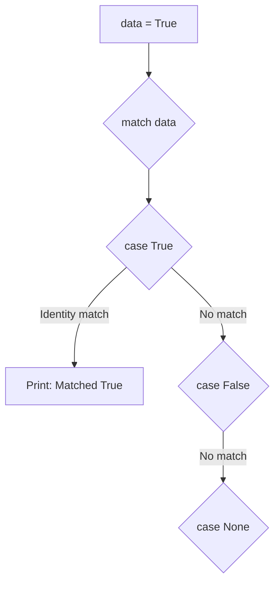
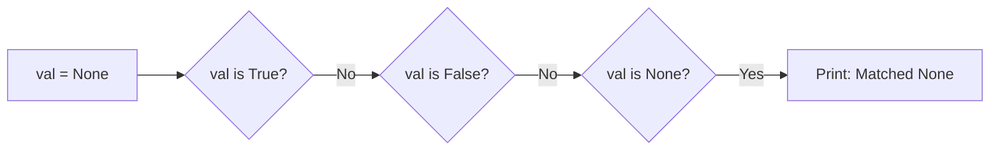
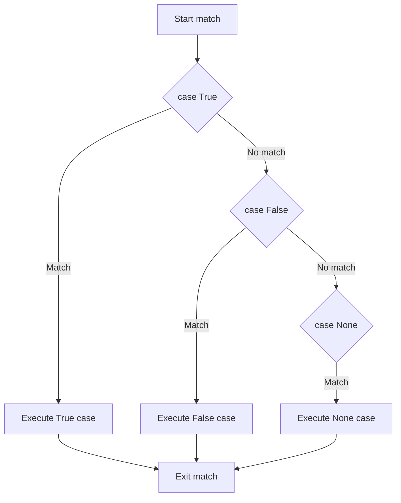

Singleton patterns match against special constant values that have unique identities in Jac: `True`, `False`, and `None`. Unlike literal patterns, singleton patterns use identity checking for more efficient and semantically correct matching.

**What are Singleton Patterns?**

Singletons are special values that exist as single instances in memory. When you use `True`, `False`, or `None` anywhere in your program, you're always referring to the same object. Singleton patterns leverage this to match these values using identity (`is`) rather than equality (`==`).

**The Three Singletons**

Jac recognizes exactly three singleton values:

| Singleton | Type | Represents | Use Case |
|-----------|------|------------|----------|
| `True` | bool | Boolean true | Success, enabled, yes |
| `False` | bool | Boolean false | Failure, disabled, no |
| `None` | NoneType | Absence of value | Missing, unset, null |

**Matching True**

Lines 5-13 demonstrate matching the `True` singleton:

| Line | Pattern | Matches | Why |
|------|---------|---------|-----|
| 7 | `case True:` | data is True | Identity check succeeds |
| 9 | `case False:` | data is False | Would match if data were False |
| 11 | `case None:` | data is None | Would match if data were None |

Since `data = True` (line 5), only the first case matches and line 8 executes.

**Matching False**

Lines 16-24 show matching the `False` singleton:

| Line | Pattern | Result with flag=False |
|------|---------|------------------------|
| 18 | `case True:` | No match |
| 20 | `case False:` | Match! Executes line 21 |
| 22 | `case None:` | Skipped (already matched) |

The pattern checks identity: `flag is False` evaluates to `True`, so line 20's pattern matches.

**Matching None**

Lines 27-35 demonstrate matching the `None` singleton:

| Line | Check | Result |
|------|-------|--------|
| 29 | `val is True` | False - skip |
| 31 | `val is False` | False - skip |
| 33 | `val is None` | True - match! |

**Identity vs Equality**

This is crucial to understand about singleton patterns:

| Comparison | Operator | What It Checks | Example |
|------------|----------|----------------|---------|
| Identity | `is` | Same object in memory | `True is True` → `True` |
| Equality | `==` | Equal values | `True == 1` → `True` |

Singleton patterns use identity (`is`), which means:

**Why Use Singleton Patterns?**

| Reason | Explanation |
|--------|-------------|
| **Performance** | Identity check (`is`) is faster than equality (`==`) |
| **Semantic correctness** | Checking if something IS None, not if it equals None |
| **Type safety** | Won't accidentally match other values |
| **Python convention** | Follows established patterns (PEP 8) |

**Singleton vs Literal Patterns**

Both work for True/False/None, but singletons are preferred:

| Approach | Pattern Type | How It Works |
|----------|--------------|--------------|
| Singleton (preferred) | `case True:` | Uses identity (`is`) |
| Literal (works but not ideal) | `case True:` | Uses equality (`==`) |

In practice, both look identical in code, but the compiler treats them differently. Use singleton patterns for `True`, `False`, and `None`.

**Common Pattern Combinations**

Singleton patterns are often used with other patterns:

| Pattern | Use Case | Example |
|---------|----------|---------|
| `case None:` | Check for missing values | Optional parameters |
| `case True:` | Boolean flag enabled | Feature toggles |
| `case False:` | Boolean flag disabled | Validation failed |
| `case None | False:` | Falsy singletons | (Using OR pattern) |

**Practical Examples**

| Lines | Singleton | What It Demonstrates |
|-------|-----------|---------------------|
| 5-13 | `True` | Matching boolean true |
| 16-24 | `False` | Matching boolean false |
| 27-35 | `None` | Matching None/null |

**Real-World Use Cases**

| Scenario | Pattern | Purpose |
|----------|---------|---------|
| Optional parameters | `case None:` | Handle missing values |
| Boolean states | `case True:` / `case False:` | State machine logic |
| Validation results | Match result code | Success/failure handling |
| API responses | `case None:` | Handle null responses |

**Truthy vs Singleton**

Important distinction - these are NOT the same:

| Value | Is Truthy? | Matches `case True:`? |
|-------|------------|----------------------|
| `True` | Yes | Yes ✓ |
| `1` | Yes | No |
| `"hello"` | Yes | No |
| `[1, 2, 3]` | Yes | No |

| Value | Is Falsy? | Matches `case False:`? |
|-------|-----------|----------------------|
| `False` | Yes | Yes ✓ |
| `0` | Yes | No |
| `""` | Yes | No |
| `[]` | Yes | No |
| `None` | Yes | No (matches `case None:`) |

**Match Evaluation Order**

All three examples follow the same evaluation pattern:

Only the first matching case executes, then the match statement exits.

**Best Practices**

| Practice | Why |
|----------|-----|
| Always use singleton patterns for None | Semantic correctness |
| Use for True/False in match statements | Clearer intent |
| Combine with wildcard for completeness | `case _:` handles other values |
| Order specific before general | Put singleton cases before wildcards |

**Complete Example Breakdown**

This file shows three parallel examples, each testing a different singleton:

1. **Lines 5-13**: When data is `True`, match on line 7
2. **Lines 16-24**: When flag is `False`, match on line 20
3. **Lines 27-35**: When val is `None`, match on line 33

Each demonstrates the same pattern structure applied to different singletons.

**Key Takeaways**

1. **Three singletons**: Only `True`, `False`, and `None`
2. **Identity checking**: Uses `is`, not `==`
3. **Performance**: Faster than equality checks
4. **Type safety**: Won't match other truthy/falsy values
5. **Preferred approach**: Use singleton patterns for these three values in match statements
