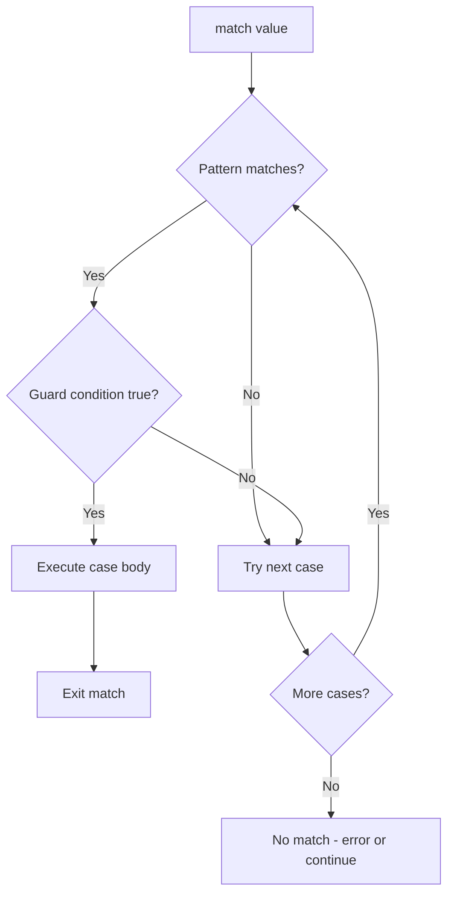

Match statements provide a powerful pattern matching construct for handling different data structures and values in a declarative way. They offer a more expressive alternative to chains of if-elif-else statements.

**What is Pattern Matching?**

Pattern matching allows you to compare a value against different patterns and execute code based on which pattern matches. Think of it like a more powerful switch statement that can destructure data and apply conditions.

**Basic Match Structure**

The fundamental structure is shown in lines 6-13:
- Line 6: `match x` starts the match statement with the value to check
- Lines 7-12: Each `case` clause defines a pattern and code to execute
- Line 11: The wildcard `_` matches any value (like a default case)

| Component | Purpose | Example (Line) |
|-----------|---------|----------------|
| `match` keyword | Start pattern matching | Line 6 |
| Expression | Value to match against | `x` on line 6 |
| `case` clauses | Patterns to check | Lines 7, 9, 11 |
| Case body | Code to execute on match | Lines 8, 10, 12 |
| Wildcard `_` | Default/catch-all pattern | Line 11 |

When a match executes, it evaluates the expression once, then checks each case pattern in order. The first matching pattern executes its body, then control exits the match statement.

**Literal Pattern Matching**

Lines 6-13 demonstrate matching against literal values. Since `x` equals 8, the pattern on line 9 matches and executes line 10, printing "eight". The other patterns don't match.

Lines 54-65 show string pattern matching, where line 55 sets `cmd = "start"`, and line 57-58 match that value.

Lines 67-78 demonstrate integer pattern matching for status codes, where different code values trigger different messages.

**Guard Clauses for Conditional Matching**

Lines 16-24 show how to add conditions using guard clauses:
- Line 18: `case x if x < 10:` binds the value to `x`, then checks if `x < 10`
- Line 20: `case x if x < 20:` provides an additional range check
- The guard (the `if` part) only evaluates if the pattern matches first

Since `value` is 15 on line 16, the guard on line 18 fails (15 is not less than 10), but the guard on line 20 succeeds (15 is less than 20), so line 21 executes.

**Multiple Statements in Case Bodies**

Lines 27-39 demonstrate that each case can contain multiple statements:
- Lines 29-32: Three statements execute when matching "success"
- No `break` statement is needed - execution automatically exits after a case body completes
- Each case block is independent

This is different from C-style switch statements that require explicit break statements.

**Sequence Pattern Matching**

Lines 42-52 show destructuring lists by their structure:
- Line 44: `case [x]:` matches a single-element list, binding the element to `x`
- Line 46: `case [x, y]:` matches a two-element list
- Line 48: `case [x, y, z]:` matches a three-element list

| Pattern | Matches | Binds Variables |
|---------|---------|-----------------|
| `[x]` | Single element list | `x` = element |
| `[x, y]` | Two element list | `x` = first, `y` = second |
| `[x, y, z]` | Three element list | `x`, `y`, `z` = all three |
| `_` | Any list | None |

Since `data` is `[1, 2, 3]` on line 42, the pattern on line 48 matches, binding x=1, y=2, z=3, and line 49 executes.

**How Match Statements Work**

The execution model follows these rules:

1. **Sequential Evaluation**: Patterns are checked from top to bottom in order
2. **First Match Wins**: Only the first matching case executes
3. **Automatic Exit**: After executing a case body, control flows out of the match
4. **Wildcard Default**: The `_` pattern matches anything and is typically last
5. **Variable Binding**: Variables in patterns are only available within that case body
6. **Guard Filtering**: Guard clauses provide boolean filtering after pattern matching

**When to Use Match Statements**

Match statements are ideal when you need to:
- Handle different data structures or types differently
- Destructure collections and extract values
- Apply conditional logic based on value ranges
- Write cleaner code than nested if-elif-else chains
- Make your intent clear about which patterns you're handling

**Pattern Matching vs If-Else**

Compare these equivalent approaches:

Using if-else (more verbose):

Using match (more declarative):

The match version makes the structure clearer and allows for more complex patterns like list destructuring that would be awkward with if-else.
