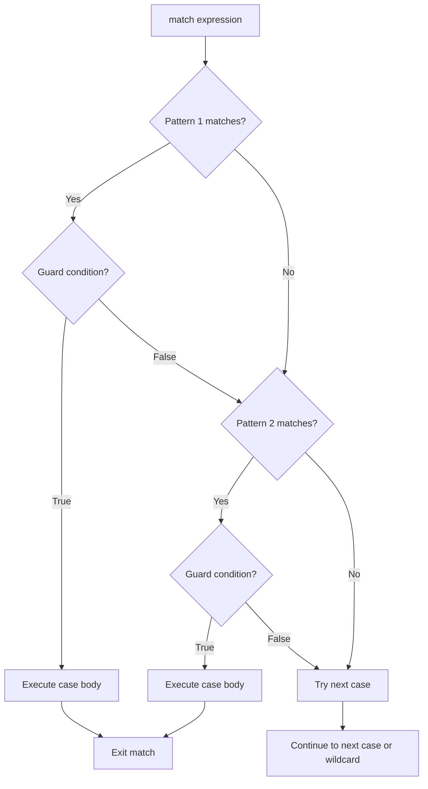

**Match Statements: Comprehensive Pattern Matching**

Match statements provide a powerful pattern matching construct for handling different data structures and values in a declarative way. They offer a more expressive alternative to chains of if-elif-else statements, supporting multiple pattern types including literals, singletons, captures, sequences, mappings, and class patterns.

**What is Pattern Matching?**

Pattern matching compares a value against different patterns and executes code based on which pattern matches. This construct resembles an enhanced switch statement that can destructure data, match complex structures, and apply conditions.

**Basic Match Structure**

The fundamental structure consists of:

- `match` keyword followed by an expression to evaluate
- One or more `case` clauses defining patterns
- Optional guard clauses using `if` for additional conditions
- Case bodies containing statements to execute on match



**Execution Model**

Match statements follow these rules:

1. **Sequential Evaluation**: Patterns are checked from top to bottom
2. **First Match Wins**: Only the first matching case executes
3. **Automatic Exit**: After executing a case body, control exits the match
4. **Variable Binding**: Variables in patterns are scoped to that case body
5. **Guard Filtering**: Guards provide boolean filtering after pattern matching

**Pattern Types Overview**

| Pattern Type | Syntax Example | Matches | Lines |
|--------------|---------------|---------|-------|
| Literal | `case 200:` | Exact int/float/string values | 27-35, 39-47, 51-59 |
| Singleton | `case True:`, `case None:` | Boolean constants and None | 67-72, 76-81 |
| Capture | `case x:` | Any value, binds to variable | 89-92, 96-101, 105-108 |
| Wildcard | `case _:` | Any value, no binding | 34, 59, 81 |
| AS Pattern | `case x as name:` | Capture with explicit naming | 106-108 |
| Sequence | `case [x, y]:` | Lists/tuples with destructuring | 116-121, 125-128, 132-146, 150-153 |
| Star Pattern | `case [first, *rest]:` | Variable-length sequences | 133-137, 142-153 |
| Mapping | `case {"key": val}:` | Dictionaries with key matching | 162-166, 170-173, 177-181, 184-187 |
| Double-Star | `case {**rest}:` | Remaining dict items | 178-181 |
| Class | `case Point(x=a, y=b):` | Object types with field matching | 196-198, 202-211, 215-218, 222-225 |
| OR Pattern | `case 200 \| 201:` | Multiple alternatives | 234-242 |
| Guard Clause | `case x if x < 10:` | Pattern with condition | 250-257, 261-272 |

---

## LITERAL PATTERNS

Literal patterns match exact values - integers, floats, or strings.

**Integer Literals (lines 25-35)**

The most basic pattern type. Line 25 sets `status_code = 200`, which matches the pattern on line 27, executing line 28 to print "OK". Each case tests for a specific integer value.

**Float Literals (lines 37-47)**

Line 38 sets `pi = 3.14`. The match on line 39 compares this against float literals, matching line 40 and printing "Matched pi".

**String Literals (lines 49-59)**

Line 50 sets `command = "start"`. String matching on lines 51-59 tests against different command strings, matching line 52 and executing line 53.

**Key Points**:

- Literals match using equality comparison
- Type must match exactly (no automatic conversion)
- The wildcard `_` (lines 34, 46, 59) catches unmatched cases

---

## SINGLETON PATTERNS

Singleton patterns match the special values `True`, `False`, and `None`.

**Boolean Singletons (lines 66-72)**

Line 66 sets `flag = True`. The match on line 67 tests against boolean singletons. Since `flag` is `True`, line 68 matches and executes line 69.

Booleans are singletons - there's only one `True` object and one `False` object in the runtime, making identity checking possible.

**None Singleton (lines 75-81)**

Line 75 sets `optional_value = None`. The match on line 76 uses the singleton pattern on line 77 to detect the absence of a value, executing line 78.

**Usage**:

- Use for optional values and nullable types
- Common in error handling and default value checks
- `None` checks are more reliable than equality checks

---

## CAPTURE PATTERNS

Capture patterns bind the matched value to a variable name for use in the case body.

**Basic Capture (lines 88-92)**

Line 88 sets `value = 42`. Line 90 uses `case x:` which matches any value and binds it to `x`. Line 91 then prints this captured value.

**Wildcard Pattern `_` (lines 95-101)**

Line 95 sets `day = "sunday"`. The wildcard on line 99 matches anything but doesn't bind a value - useful when you need a default case but don't need the value itself.

The difference:

- `case x:` - matches and binds to variable `x`
- `case _:` - matches but doesn't bind (you can't reference `_`)

**AS Pattern - Explicit Naming (lines 104-108)**

Line 104 sets `number = 100`. Line 106 uses `case x as captured_num:` which first matches the pattern `x` (capturing to `x`), then additionally binds the entire match to `captured_num`. This is useful for nested patterns where you want both the whole and parts.

---

## SEQUENCE PATTERNS

Sequence patterns destructure lists and tuples, extracting individual elements or subsequences.

**Exact Match (lines 115-121)**

Line 115 sets `coords = [1, 2, 3]`. Line 117 uses `case [1, 2, 3]:` to match the exact sequence. Since it matches, line 118 executes.

**Variable Binding (lines 124-128)**

Line 124 sets `point = [10, 20]`. Line 126 uses `case [x, y]:` which matches a two-element list and binds `x=10, y=20`. Line 127 uses these captured values.

**Star Patterns - Rest Capture (lines 131-137)**

Lines 131-137 demonstrate the `*` operator for capturing variable-length subsequences:

Line 131: `numbers = [1, 2, 3, 4, 5]`
Line 133: `case [first, *middle, last]:`

- Binds `first=1`
- Binds `middle=[2, 3, 4]` (all middle elements)
- Binds `last=5`

This is similar to Python's unpacking but in pattern context.

**Star at Different Positions (lines 140-146)**

Line 140: `data = [100, 200, 300, 400]`

Line 142: `case [*start, 400]:` captures everything except the last element

- `start = [100, 200, 300]`

Line 144: `case [100, *rest]:` captures everything after the first element

- `rest = [200, 300, 400]`

**Nested Sequences (lines 149-153)**

Line 149: `matrix = [[1, 2], [3, 4]]`
Line 151: `case [[a, b], [c, d]]:` matches a 2x2 nested structure

- Binds `a=1, b=2, c=3, d=4`

This demonstrates pattern matching on arbitrarily nested data structures.

---

## MAPPING PATTERNS

Mapping patterns match dictionaries, allowing key-based destructuring and partial matching.

**Exact Key Match (lines 160-166)**

Line 160: `user = {"name": "Alice", "age": 30}`
Line 162: `case {"name": "Alice", "age": 30}:` matches when both keys exist with exact values.

Unlike sequence patterns, mapping patterns support **partial matching** - the dict can have extra keys.

**Value Capture (lines 169-173)**

Line 169: `person = {"id": 123, "role": "admin"}`
Line 171: `case {"id": user_id, "role": user_role}:`

- Matches if keys exist
- Binds `user_id=123` and `user_role="admin"`

**Double-Star Rest Capture (lines 176-181)**

Line 176: `config = {"host": "localhost", "port": 8080, "debug": True, "timeout": 30}`
Line 178: `case {"host": h, "port": p, **rest}:`

- Binds `h="localhost"`, `p=8080`
- Captures remaining items in `rest = {"debug": True, "timeout": 30}`

The `**rest` pattern is similar to `**kwargs` in function parameters.

**Nested Mappings (lines 184-187)**

Line 184: `response = {"status": 200, "data": {"name": "Bob", "score": 95}}`
Line 186: `case {"status": 200, "data": {"name": n, "score": s}}:`

Demonstrates matching nested dictionary structures and extracting deeply-nested values.

---

## CLASS PATTERNS

Class patterns match object instances and destructure their fields.

**Basic Class Pattern (lines 194-198)**

Lines 4-7 define the `Point` class.
Line 194: `p1 = Point(x=5.0, y=10.0)`
Line 196: `case Point(x=x_val, y=y_val):`

- Checks that `p1` is a `Point` instance
- Binds `x_val=5.0`, `y_val=10.0`

**Value Matching with Classes (lines 201-211)**

Line 201: `origin = Point(x=0.0, y=0.0)`

Multiple cases test for different conditions:

- Line 203: Matches origin exactly
- Line 205: Matches any point on y-axis (x must be 0.0, y is captured)
- Line 207: Matches any point on x-axis (x is captured, y must be 0.0)
- Line 209: Wildcard for other points

This demonstrates mixing literal values with capture variables in class patterns.

**Nested Class Patterns (lines 214-218)**

Lines 8-11 define the `Circle` class with a `Point` field.
Line 214: `circle = Circle(center=Point(x=3.0, y=4.0), radius=5.0)`
Line 216: `case Circle(center=Point(x=cx, y=cy), radius=r):`

This pattern:

1. Checks `circle` is a `Circle` instance
2. Extracts the `center` field, checking it's a `Point`
3. Extracts `x` and `y` from that nested `Point`
4. Extracts `radius` from the `Circle`

**Class Pattern with AS (lines 221-225)**

Line 221: `rect = Rectangle(width=10.0, height=20.0)`
Line 223: `case Rectangle(width=w, height=h) as captured_rect:`

- Binds field values `w=10.0`, `h=20.0`
- Binds entire object to `captured_rect`

Useful when you need both the object and its fields.

---

## OR PATTERNS

OR patterns allow multiple alternative patterns using the `|` operator.

**Multiple Alternatives (lines 232-242)**

Line 232: `code = 404`
Line 234: `case 200 | 201 | 204:` matches any success status code
Line 236: `case 400 | 401 | 403 | 404:` matches client errors

The `|` operator creates an OR pattern - if any alternative matches, the case executes. Since `code` is 404, line 236 matches and line 237 executes.

**Usage**:

- Group related values into categories
- Reduce duplication in case clauses
- Can be used with any pattern type, not just literals

---

## GUARD CLAUSES

Guards add boolean conditions to patterns using the `if` keyword.

**Range Checking (lines 249-257)**

Line 249: `age = 25`
Line 251: `case x if x < 18:` - pattern `x` captures the value, then checks if `x < 18`

Since `age` is 25:

- Line 251 matches pattern but fails guard (25 >= 18)
- Line 253 matches pattern and passes guard (25 < 65)
- Line 254 executes

**Grading Example (lines 260-272)**

Line 260: `score = 85`

The match implements a grading scale using guards:

- Line 262: `case s if s >= 90:` for grade A
- Line 264: `case s if s >= 80:` for grade B (matches since 85 >= 80)
- Subsequent cases handle lower grades

Guards are evaluated **after** pattern matching succeeds, providing fine-grained filtering.

---

## COMBINED PATTERNS

Complex real-world scenarios often combine multiple pattern types.

**Nested Pattern Combination (lines 279-287)**

Line 279: `shape_data = {"type": "circle", "center": [0, 0], "radius": 10}`
Line 281: `case {"type": "circle", "center": [x, y], "radius": r}:`

This single pattern combines:

1. **Mapping pattern**: Matches dictionary structure
2. **Literal pattern**: Checks `"type"` is `"circle"`
3. **Sequence pattern**: Destructures `"center"` as `[x, y]`
4. **Capture pattern**: Binds `x`, `y`, and `r` to variables

**Multiple Statements (lines 290-303)**

Lines 292-295 show that case bodies can contain multiple statements. After matching "success":

1. Prints success message
2. Sets status variable
3. Prints status code

No `break` needed - execution automatically exits after the case body.

---

## WHEN TO USE MATCH STATEMENTS

Match statements excel when you need to:

- **Handle different data types or structures**: Distinguish between different object types or data shapes
- **Destructure collections**: Extract values from nested lists, tuples, or dictionaries
- **Apply conditional logic**: Use guards for range checks and complex conditions
- **Write cleaner code**: Replace verbose if-elif-else chains with declarative patterns
- **Make intent clear**: Show which patterns you're handling explicitly

**Pattern Matching vs If-Else**

Compare these approaches for handling HTTP status codes:

```jac
// Using if-else (imperative)
if code == 200 or code == 201 or code == 204:
    print("Success");
elif code == 400 or code == 401 or code == 403 or code == 404:
    print("Client error");
elif code == 500 or code == 502 or code == 503:
    print("Server error");
else:
    print("Other code");

// Using match (declarative)
match code {
    case 200 | 201 | 204:
        print("Success");
    case 400 | 401 | 403 | 404:
        print("Client error");
    case 500 | 502 | 503:
        print("Server error");
    case _:
        print("Other code");
}
```

The match version is more declarative, making the structure and intent clearer.

---

## PATTERN MATCHING BEST PRACTICES

1. **Order matters**: Place more specific patterns before general ones
2. **Use wildcards**: Always include a `case _:` as the last case for safety
3. **Combine patterns**: Use OR patterns to group related cases
4. **Guard sparingly**: Prefer specific patterns over guards when possible
5. **Name captures clearly**: Use descriptive variable names in patterns
6. **Keep cases simple**: If a case body is complex, extract to a function
7. **Document complex patterns**: Add comments for nested or intricate patterns

**Example of pattern ordering**:

```jac
match point {
    case Point(x=0.0, y=0.0):  // Most specific - origin
        print("Origin");
    case Point(x=0.0, y=y):     // Specific - y-axis
        print(f"Y-axis at {y}");
    case Point(x=x, y=y):       // General - any point
        print(f"Point at ({x}, {y})");
}
```

If the order were reversed, the general pattern would always match first, and the specific cases would never execute.
