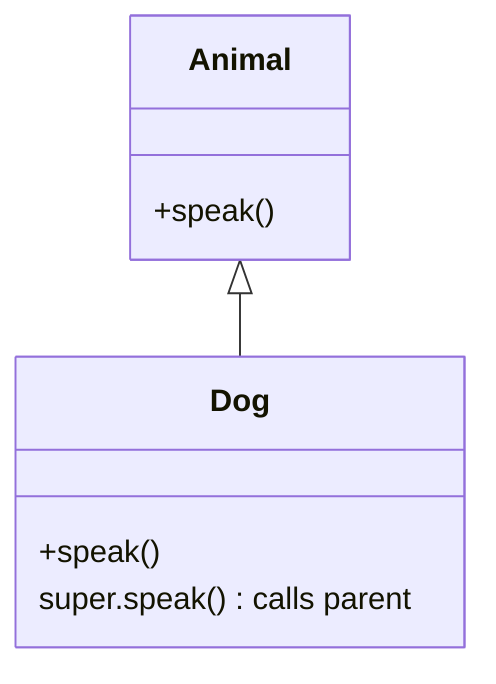
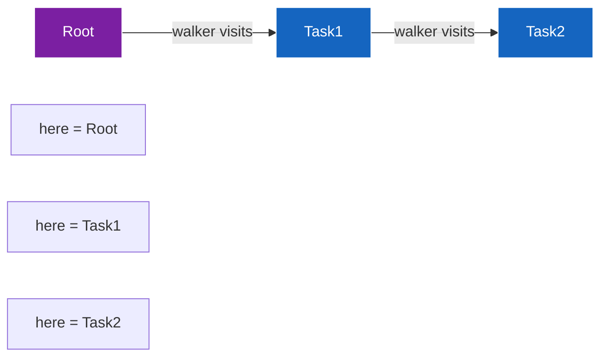
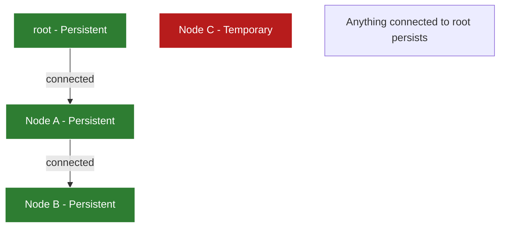

Jac provides special reference keywords that are automatically available in specific contexts, allowing access to important runtime objects and enabling key Object-Spatial Programming patterns.

**What are Special References?**

Special references are keywords that Jac makes available automatically in certain contexts. They provide access to important objects like the current instance, parent class, current node, visiting walker, and root node. Understanding when each reference is available is crucial for effective Jac programming.

**Reference Availability Table**

| Reference | Object Methods | Walker Abilities | Node Abilities | What It Refers To |
|-----------|---------------|------------------|----------------|-------------------|
| `self` | ✓ | ✓ | ✓ | Current instance (object/walker/node) |
| `super` | ✓ | ✓ | ✓ | Parent class for inheritance |
| `here` | ✗ | ✓ | ✓ | Current node being visited |
| `visitor` | ✗ | ✗ | ✓ | Current walker (only in node abilities) |
| `root` | ✗ | ✓ | ✓ | Root node (persistence anchor) |

**self - The Instance Reference**

Lines 4-11 demonstrate `self` in an object. Line 8 shows `self.count += 1`, which accesses the instance's `count` attribute. Line 9 uses `self.count` to print the current value.

When you create an instance (line 79) and call its methods (lines 80-81), `self` refers to that specific instance. Each instance has its own `self` that refers to itself.

Think of `self` as the answer to "who am I?" - it always points to the current instance, whether that's an object, a walker, or a node.

**super - The Parent Reference**

Lines 14-25 demonstrate inheritance with `super`. The `Dog` object inherits from `Animal` (line 20). Line 22 shows `super.speak()`, which calls the parent class's `speak` method before adding the dog's own behavior.

When `d.speak()` executes on line 85:
1. Line 22: `super.speak()` calls Animal's speak (line 15-16)
2. Line 23: Dog adds its own behavior

This allows you to extend parent behavior without replacing it entirely.

**here - The Current Node Reference**

Lines 28-37 show `here` used in a walker. Line 34 demonstrates `here.name`, accessing the current node's attributes.

When a walker visits different nodes:
- At root: `here` refers to the root node
- At Task node: `here` refers to that specific Task node
- Line 35: `visit [-->]` moves to the next node, updating what `here` points to

Think of `here` as "where am I right now?" - it automatically updates as the walker moves through the graph.

**visitor - The Walker Reference (in Node Abilities)**

Lines 40-47 demonstrate `visitor` in a node ability. Line 44 shows `visitor.__class__.__name__`, accessing the walker's type from within a node's ability.

This creates bidirectional communication:
- Walker abilities: Define what the walker does when visiting a node
- Node abilities (with `visitor`): Define what the node does when visited by a walker

The node can inspect the walker using `visitor` to customize its behavior based on which walker is visiting.

**root - The Global Root Reference**

Lines 50-60 show `root` being accessed from different contexts. Line 52 demonstrates printing `root`, and line 53 checks `here is root` to see if the current position is the root node.

The `root` reference is central to Jac's persistence model:

Key insights about `root`:
- **Automatic Persistence**: Anything connected to root (via edges) persists automatically
- **Per-User Isolation**: Each user gets their own distinct root node
- **Global Accessibility**: Available anywhere in spatial contexts (walkers, node abilities)
- **No Explicit Save**: Just connect to root - persistence happens automatically

**init and postinit - Constructor Hooks**

Lines 63-75 demonstrate the initialization lifecycle. Line 67 shows `def init(value: int)`, which is the constructor. Line 69 calls `self.postinit()`, which executes after initialization.

The initialization flow:
1. Object is created: `Configured(value=10)` on line 98
2. `init` method executes (lines 67-69), setting `self.value`
3. `postinit` method executes (lines 72-73), computing derived values

This two-phase initialization lets you:
- `init`: Set up basic attributes with parameters
- `postinit`: Compute derived values that depend on those attributes

**Context Matters: When References Are Available**

In walker abilities (lines 12-14, 17-21):
- ✓ `self` - the walker instance
- ✓ `here` - the current node being visited
- ✓ `root` - the root node
- ✗ `visitor` - NOT available (the walker IS the visitor)

In node abilities (lines 43-46):
- ✓ `self` - the node instance (same as `here`)
- ✓ `here` - also the node instance
- ✓ `visitor` - the walker that's visiting
- ✓ `root` - the root node

In regular object methods (lines 7-10):
- ✓ `self` - the object instance
- ✓ `super` - parent class
- ✗ Spatial references (`here`, `visitor`, `root`) - NOT available

**Common Patterns**

**Pattern 1: Walker state accumulation** (lines 88-92)

**Pattern 2: Node responding to walker** (lines 43-46)

**Pattern 3: Persistence via root** (lines 88-92)

**Pattern 4: Parent method delegation** (lines 21-24)

**Understanding the Execution Model**

When `root spawn TaskWalker()` executes on line 92:

1. Walker is created and spawned at root
2. Walker's root entry ability executes with:
   - `self` = the TaskWalker instance
   - `here` = root node
   - `root` = root node (so `here is root` is True)
3. `visit [-->]` queues nodes to visit
4. Walker visits task node with:
   - `self` = still the same TaskWalker instance
   - `here` = now the task node (changed!)
   - `root` = still the root node
5. Node's ability executes (if defined) with:
   - `self` = the task node
   - `here` = the task node (same as self)
   - `visitor` = the TaskWalker instance
   - `root` = the root node

**Why These References Matter**

Special references enable Object-Spatial Programming's key features:

- **self**: Track instance state as computation moves
- **here**: Access data where computation currently is
- **visitor**: Let data respond to different computations differently
- **root**: Anchor persistence without databases or explicit saves
- **super**: Build on existing behavior through inheritance

Understanding when each reference is available and what it refers to is essential for writing effective Jac programs. The references work together to create a programming model where computation flows to data, rather than data flowing to computation.
