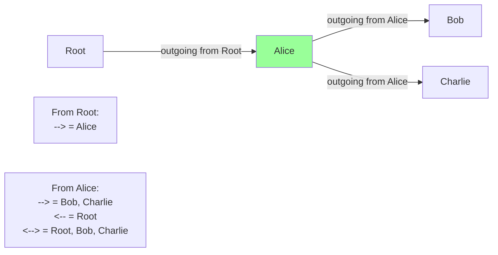
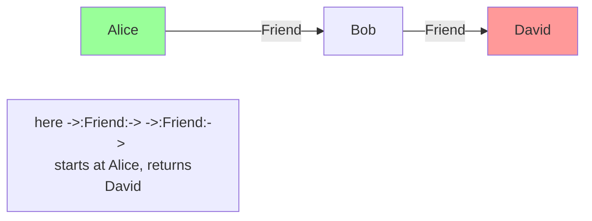

Edge reference expressions are the fundamental mechanism for querying and traversing graph structures in Jac. Unlike connect operators that CREATE edges, edge references QUERY existing edges to retrieve connected nodes or edge objects.

**What are Edge References?**

Edge references let you ask questions like "which nodes are connected to this one?" or "what edges of type Friend exist?". They're enclosed in square brackets and return lists of nodes or edges.

Think of edge references as the "SELECT" statement of graph databases - they let you query the graph structure without modifying it.

**Basic Directional Forms**

Lines 32-59 demonstrate the three fundamental directions:

| Syntax | Direction | Returns | Example Line |
|--------|-----------|---------|--------------|
| `[-->]` | Outgoing | Nodes connected via outgoing edges | 32 |
| `[<--]` | Incoming | Nodes with edges pointing to here | 54 |
| `[<-->]` | Bidirectional | Nodes connected in either direction | 58 |

Line 32 shows `out_from_root = [-->]`, which retrieves all nodes connected via outgoing edges from root. Since line 26 connected Alice to root, the result includes Alice.

Lines 47-59 show all three directions from Alice's perspective:
- Outgoing (line 47): Bob and Charlie (Alice connects to them)
- Incoming (line 54): Root (root connects to Alice)
- Bidirectional (line 58): All three (root, Bob, Charlie)

**Typed Edge References**

Lines 64-74 show filtering by edge type:

The syntax `[->:Type:->]` traverses only edges of the specified type. Line 27 creates a Friend edge to Bob, and line 28 creates a Colleague edge to Charlie. Line 64 finds only Bob (Friend connections), while line 70 finds only Charlie (Colleague connections).

| Pattern | Matches | Example |
|---------|---------|---------|
| `[->:Friend:->]` | Outgoing Friend edges | Line 64 |
| `[<-:Friend:<-]` | Incoming Friend edges | - |
| `[<-:Friend:->]` | Friend edges in either direction | - |

The type name between colons filters which edges to traverse.

**Filtered Edge References**

Lines 79-87 demonstrate filtering on edge attributes:

The syntax `[->:Type:condition:->]` filters edges based on their attributes:
- Line 79: Only Friend edges where the `since` attribute is less than 2018
- Line 82: Only Colleague edges where `years` attribute is greater than 2
- Line 86: Multiple conditions combined with AND logic (years between 1 and 5)

The filters apply to EDGE attributes, not node attributes. Line 27 creates `Friend(since=2015)`, so the filter on line 79 matches because 2015 < 2018.

**Edge vs Node Retrieval**

Lines 92-97 show retrieving edge objects instead of nodes:

| Keyword | Returns | Use When |
|---------|---------|----------|
| `[edge -->]` | Edge objects | Need to access edge attributes |
| `[node -->]` | Node objects | Need to access node attributes (default) |
| `[-->]` | Node objects | Default behavior, same as `[node -->]` |

Line 92 returns edge objects that have attributes like `since` (Friend edges) or `years` (Colleague edges). This is useful when you need to examine or modify edge properties.

**Chained Edge References for Multi-Hop Traversal**

Lines 114-120 demonstrate chaining to traverse multiple hops:

Chaining syntax: `[start ->:Type1:-> ->:Type2:->]`

Line 114 performs a two-hop traversal:
1. Start at `here` (Alice)
2. Follow Friend edges to reach Bob
3. From Bob, follow Friend edges to reach David
4. Returns David (2 hops away)

Line 119 shows mixed-type chaining - Friend edges then Colleague edges. You can chain as many hops as needed: `[node ->:T1:-> ->:T2:-> ->:T3:->]`.

**Edge References in Different Contexts**

Lines 128-144 show edge references used in various ways:

| Context | Syntax | Purpose | Example Line |
|---------|--------|---------|--------------|
| Assignment | `targets = [-->]` | Store results | 128 |
| Conditional | `if [-->] { ... }` | Check if edges exist | 132 |
| For loop | `for n in [-->] { ... }` | Iterate nodes | 138 |
| Visit statement | `visit [->:Friend:->]` | Walker traversal | 143 |

Line 132 shows using an edge reference as a boolean condition - non-empty lists are truthy, so this checks "do any outgoing edges exist?".

Lines 138-140 show iteration, which is very common for processing all neighbors.

**Evaluation Context**

Edge references are evaluated relative to a spatial context:

**Implicit context** (inside walker abilities):
- Line 47: `outgoing = [-->]` evaluates from `here` (current node)
- Most common usage in walkers

**Explicit context**:
- Lines 108, 114, 119: `[here ->:Type:->]` explicitly specifies starting node
- Can use any node variable: `[root -->]`, `[alice -->]`, `[some_node -->]`

When no starting node is specified in walker abilities, `here` is the implicit starting point.

**Edge References vs Connect Operators**

Understanding the difference is crucial:

| Feature | Edge Reference | Connect Operator |
|---------|---------------|------------------|
| Purpose | Query existing edges | Create new edges |
| Syntax | `[-->]` | `++>` |
| Returns | List of nodes/edges | Target node |
| Modifies graph | No | Yes |
| Example line | 32, 47, 64 | 26, 27, 28 |

Lines 26-28 use connect operators (`++>`, `+>:Type:+>`) to CREATE the graph structure. Lines 32-144 use edge references to QUERY that structure.

The workflow: First connect to build the graph, then reference to traverse it.

**Common Edge Reference Patterns**

**Pattern 1: Neighbor Query** (line 47)

**Pattern 2: Typed Relationship Query** (line 64)

**Pattern 3: Filtered Relationship Query** (line 79)

**Pattern 4: Multi-Hop Query** (line 114)

**Pattern 5: Existence Check** (line 132)

**Pattern 6: Edge Inspection** (line 92)

**Complete Syntax Reference**

The example's summary walker (lines 152-185) provides a comprehensive syntax reference:

**Basic forms**:
- `[-->]` - All outgoing edges
- `[<--]` - All incoming edges
- `[<-->]` - Bidirectional (both ways)

**Typed forms**:
- `[->:Type:->]` - Outgoing of specific type
- `[<-:Type:<-]` - Incoming of specific type
- `[<-:Type:->]` - Bidirectional of specific type

**Filtered forms**:
- `[->:Type:attr > val:->]` - Filter on edge attribute
- `[->:Type:a > x, b < y:->]` - Multiple conditions (AND)

**Special forms**:
- `[edge -->]` - Get edge objects
- `[node -->]` - Get node objects (explicit)
- `[node ->:T1:-> ->:T2:->]` - Chained (multi-hop)

**Common Usage Patterns**

**In visit statements** (most common):

**In for loops**:

**In conditionals**:

**In assignments**:

**Understanding Return Values**

All edge references return lists (collections):

- `[-->]` returns a list of nodes (or empty list `[]` if no matches)
- `[edge -->]` returns a list of edge objects
- Can check length: `len([-->])`
- Can use in boolean context: `if [-->]` (empty = false, non-empty = true)

**Common Mistakes to Avoid**

1. **Filtering on wrong attributes**:
   - ✗ Wrong: `[->:Friend:->](?since < 2020)` - this is comprehension syntax
   - ✓ Right: `[->:Friend:since < 2020:->]` - edge attribute filter

2. **Incorrect chaining**:
   - ✗ Wrong: `[-->][-->]` - can't concatenate brackets
   - ✓ Right: `[here --> -->]` or `[here ->:T1:-> ->:T2:->]` - chain within brackets

3. **Context confusion**:
   - Edge reference `[-->]` in walker evaluates from `here`, not spawn point
   - Use explicit node if needed: `[root -->]`

4. **Confusing reference and connect**:
   - `[-->]` queries edges (read-only)
   - `++>` creates edges (write)

**Practical Applications**

Edge references enable key graph operations:

1. **Graph queries**: "Find all nodes of type X connected via relationship Y"
2. **Path exploration**: "What's 3 hops away via Friend edges?"
3. **Relationship inspection**: "What edges exist from this node?"
4. **Filtered traversal**: "Only follow edges where attribute > threshold"
5. **Reverse lookup**: "Who points to me?" (incoming edges)
6. **Pattern matching**: "Find nodes matching this graph pattern"

Edge references are the query language for Jac's graph model, providing declarative, concise syntax for navigating spatial structures. Combined with visit statements and walkers, they form the foundation of Object-Spatial Programming's data-to-computation paradigm.
