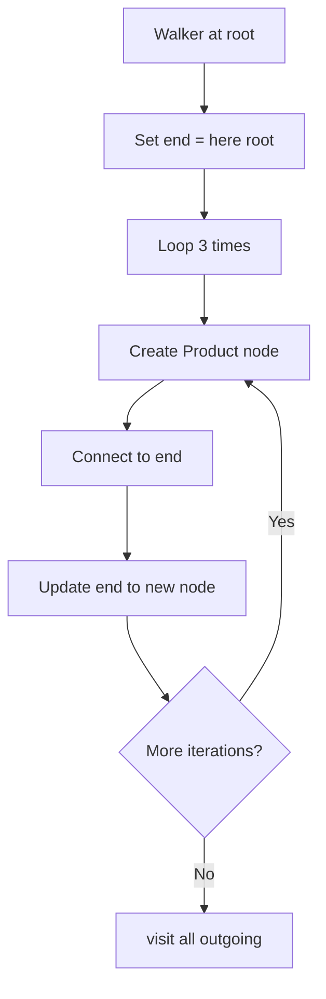
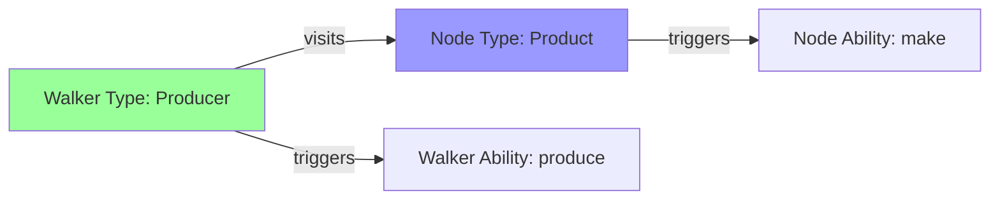

Object spatial typed context blocks demonstrate how walkers and nodes interact through ability implementations in Jac's spatial programming model. The "typed context" refers to the ability system where behavior is determined by the types of both the walker and the node.

**What are Typed Context Blocks?**

Typed context blocks are ability implementations that execute based on matching types. When a walker visits a node, the runtime looks for matching abilities based on:
- The walker's type (e.g., `Producer`)
- The node's type (e.g., `Product`)
- The interaction type (e.g., `entry` for when walker enters the node)

This creates a dispatch system where the right code runs automatically based on the types involved.

**Walker Definition with Entry Ability**

Lines 3-5 define the walker:
- Line 3: `walker Producer` declares the walker type
- Line 4: `can produce with root entry;` declares an ability named `produce`
- The `with root entry` clause means this ability triggers when the walker is at a root node

The backtick syntax `\`root` specifies this is an entry ability for root nodes - it executes automatically when the walker spawns on or visits the root.

**Node Definition with Entry Ability**

Lines 7-11 define the node:
- Line 7: `node Product` declares the node type
- Line 8: `has number: int;` defines a number attribute
- Line 10: `can make with Producer entry;` declares an ability named `make`
- The `with Producer entry` clause means this ability triggers when a Producer walker visits

**Ability Matching Table**

| Ability | Defined On | Triggers When | Implementation Lines |
|---------|-----------|---------------|----------------------|
| `produce` | Producer walker | Walker at root node | 13-19 |
| `make` | Product node | Producer visits Product | 21-24 |

The runtime automatically calls the right ability based on these type matches.

**Walker Ability Implementation**

Lines 13-19 implement the walker's `produce` ability:



Line 14 initializes `end` to `here` (the current node, which is root initially).

Lines 15-17 loop three times (i=0, 1, 2):
- Line 16: `end ++> (end := Product(number=i + 1))` does two things:
  1. Creates a new Product node: `Product(number=i + 1)`
  2. Connects `end` to the new node: `end ++>`
  3. Assigns the new node back to `end`: `end :=`

This creates a chain: root -> Product(1) -> Product(2) -> Product(3)

Line 18: `visit [-->]` queues all outgoing nodes for visiting, so the walker will visit each Product in the chain.

**Node Ability Implementation**

Lines 21-24 implement the node's `make` ability:
- Line 22: Prints a message including `self` (the current node instance)
- Line 23: Calls `visit [-->]` to continue traversal to any outgoing nodes

When the Producer walker visits a Product node, this ability executes automatically because the types match (Producer visiting Product).

**The Execution Flow**

When `root spawn Producer()` executes on line 27:

1. **Walker spawns**: Producer walker created and starts at root
2. **Walker's root entry**: `produce` ability executes (lines 13-19)
3. **Graph construction**: Chain of 3 Product nodes created
4. **Visit queue**: All outgoing nodes (the Product chain) queued
5. **Visit Product(1)**: Walker visits first Product
6. **Node's entry**: `make` ability executes (lines 21-24), prints message
7. **Continue chain**: `visit [-->]` queues Product(2)
8. **Visit Product(2)**: `make` executes, prints message, queues Product(3)
9. **Visit Product(3)**: `make` executes, prints message
10. **Complete**: No more nodes in queue, walker completes

**Why "Typed Context" Matters**

The ability system creates typed contexts:



The context is "typed" because:
- `produce` only runs when Producer is at root (walker type + node type)
- `make` only runs when Producer visits Product (walker type + node type)

If you had a different walker type (e.g., `Consumer`), the `make` ability wouldn't trigger unless it was also declared `with Consumer entry`.

**Multiple Entry Abilities**

You can have multiple abilities for different type combinations:

```
node Product {
    can make with Producer entry;      # Runs when Producer visits
    can inspect with Inspector entry;  # Runs when Inspector visits
    can analyze with Analyzer entry;   # Runs when Analyzer visits
}
```

Each ability executes only when the matching walker type visits.

**Entry vs Exit Abilities**

While this example only shows `entry` abilities, you can also define `exit` abilities:

| Ability Type | When It Executes | Example |
|--------------|------------------|---------|
| `entry` | When walker enters node | `with Producer entry` |
| `exit` | When walker leaves node | `with Producer exit` |

Entry abilities (like lines 4, 10) run when visiting begins. Exit abilities run when the walker finishes processing that node.

**Polymorphic Spatial Programming**

The typed context system enables polymorphic behavior:

```
walker Inspector;
walker Producer;

node Product {
    can make with Producer entry {
        # Production-specific logic
    }

    can inspect with Inspector entry {
        # Inspection-specific logic
    }
}
```

The same node type can respond differently to different walker types, creating flexible, extensible systems.

**Key Insights**

1. **Type-based dispatch**: Abilities execute based on matching walker and node types
2. **Automatic invocation**: No manual method calls needed - the runtime handles it
3. **Bidirectional behavior**: Both walkers and nodes can have abilities
4. **Decoupled logic**: Walker logic and node logic are separate but coordinate through abilities
5. **Extensible**: Add new walker types or node types without modifying existing code

**Relationship to Other Concepts**

Typed context blocks work together with:
- **Special references**: `self`, `here`, `visitor` are available in abilities
- **Visit statements**: `visit [-->]` controls which nodes the walker processes next
- **Spawn expressions**: `root spawn Producer()` starts the type matching process
- **Edge references**: `[-->]` finds nodes to visit

The typed context system is central to Object-Spatial Programming - it lets you define what happens when computation (walkers) meets data (nodes) based on their types.
