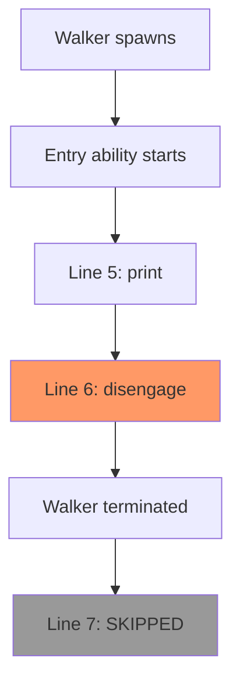

This example demonstrates the `disengage` statement, which is a control flow statement unique to walkers that immediately terminates walker execution.

**What is disengage?**

The `disengage` statement stops a walker in its tracks. When executed, it:
- Immediately terminates the walker's execution
- Destroys the walker instance
- Prevents any code after it from running
- Empties the walker's visit queue

Think of it like a `return` statement, but specifically for walkers and more forceful - it completely halts all walker activity.

**Walker Definition with Entry Ability**

Lines 3-9 define a walker with an entry ability:
- Line 3: `walker Visitor` declares the walker type
- Line 4: `can self_destruct with root entry` declares an ability that triggers when at root
- The backtick syntax `\`root entry` marks this as the entry point for the walker

**The disengage Statement in Action**

Lines 5-7 show the execution flow:

| Line | Code | Executes? | Why |
|------|------|-----------|-----|
| 5 | `print("get's here");` | ✓ Yes | Before disengage |
| 6 | `disengage;` | ✓ Yes | Terminates walker |
| 7 | `print("but not here");` | ✗ No | After disengage |

Line 5 executes first, printing "get's here".

Line 6 executes the `disengage` statement, which immediately terminates the walker. At this point, the walker stops executing.

Line 7 never executes because the walker was destroyed on line 6. The code after `disengage` is unreachable.



**How Spawning Triggers the Ability**

Line 12 shows `root spawn Visitor()`, which:
1. Creates a new `Visitor` walker instance
2. Spawns it at the root node
3. Automatically invokes the matching entry ability (`self_destruct`)
4. The ability runs and encounters `disengage`
5. Walker terminates before completing the ability

**When to Use disengage**

The `disengage` statement is useful when you want to:

1. **Stop searching after finding a target**:
```
walker Searcher {
    has target: str;
    has found: bool = False;

    can search with Node entry {
        if here.id == self.target {
            self.found = True;
            disengage;  # Stop searching
        }
        visit [-->];
    }
}
```

2. **Exit early on error conditions**:
```
walker Validator {
    can validate with DataNode entry {
        if not here.is_valid {
            print("Invalid data found!");
            disengage;  # Stop processing
        }
        visit [-->];
    }
}
```

3. **Limit traversal depth or count**:
```
walker LimitedWalker {
    has max_visits: int = 10;
    has visit_count: int = 0;

    can process with Node entry {
        self.visit_count += 1;
        if self.visit_count >= self.max_visits {
            disengage;  # Stop after max visits
        }
        visit [-->];
    }
}
```

**disengage vs Other Control Flow**

| Statement | Scope | Effect |
|-----------|-------|--------|
| `disengage` | Walker | Terminates entire walker execution |
| `return` | Function/ability | Returns from current function/ability only |
| `break` | Loop | Exits current loop only |
| `continue` | Loop | Skips to next loop iteration |

`disengage` is the most drastic - it ends all walker activity, including any remaining nodes in the visit queue.

**What Happens to the Visit Queue?**

When `disengage` executes:
- Any nodes queued via `visit` statements are discarded
- The walker will not visit any more nodes
- The walker's execution is completely finished

For example:
```
can process with Node entry {
    visit [-->];  # Queues all outgoing nodes
    disengage;    # Those queued nodes never get visited
}
```

The queued nodes are abandoned when `disengage` runs.

**Return Values After disengage**

Even though the walker terminates early, you can still access its state:

```
walker Counter {
    has count: int = 0;

    can process with Node entry {
        self.count += 1;
        if self.count >= 5 {
            disengage;
        }
        visit [-->];
    }
}

result = root spawn Counter();
print(result.count);  # Can still access walker's state
```

The walker instance persists after `disengage`, so you can read its attributes.

**Common Pattern: Search and Stop**

A very common pattern combines `disengage` with a search:

```
walker FindUser {
    has target_name: str;
    has result: User? = None;

    can search with User entry {
        if here.name == self.target_name {
            self.result = here;
            disengage;  # Found it, stop searching
        }
        visit [-->];
    }
}

finder = root spawn FindUser(target_name="Alice");
if finder.result {
    print(f"Found user: {finder.result}");
}
```

This searches the graph until finding the target, then stops immediately rather than continuing to traverse.

**Execution Model**

Understanding the full execution model:

1. **Walker spawns**: Instance created at starting node
2. **Entry ability executes**: Matching ability runs
3. **Disengage encountered**: Walker terminates immediately
4. **Queue discarded**: Any queued visits are abandoned
5. **Walker completes**: Instance still accessible but inactive

**Key Takeaways**

- `disengage` immediately terminates walker execution
- Code after `disengage` in the same block never executes
- The visit queue is discarded when `disengage` runs
- Walker state remains accessible after termination
- Use `disengage` to implement early-exit patterns like searching
- Only available in walker contexts (not in regular functions or objects)

The `disengage` statement is a powerful tool for controlling walker lifetime, enabling efficient graph traversal that stops as soon as the desired condition is met.
