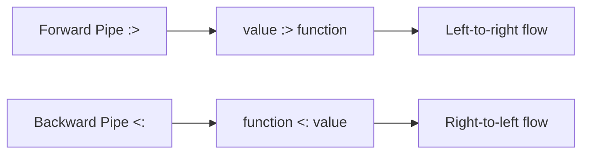
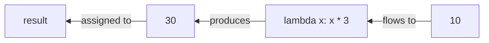
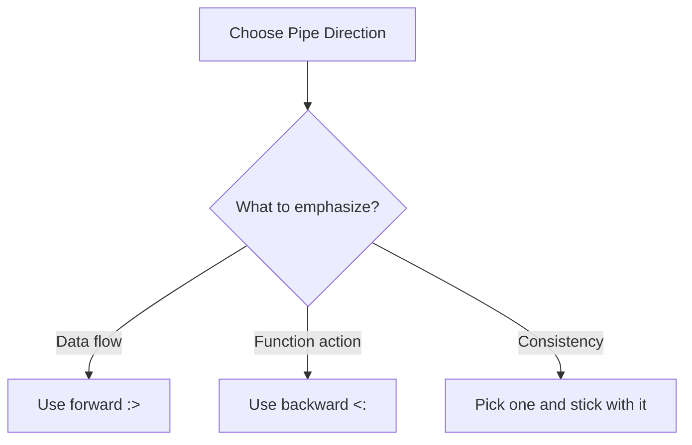

**Pipe Back Atomic Expressions**

The atomic backward pipe operator `<:` provides right-to-left data flow, offering an alternative perspective for function application.

**Basic Backward Pipe Syntax**

Line 5 introduces the atomic backward pipe operator. This takes the value on the right ("Hello") and pipes it backward to the function on the left (print). It's equivalent to `print("Hello")`, but with reversed syntax.

While the forward pipe `:>` reads as "send this value to that function," the backward pipe `<:` reads as "this function receives that value."

**Comparison with Forward Pipes**

The choice between operators is often stylistic:
- Forward `value :> function` - emphasizes data transformation
- Backward `function <: value` - emphasizes function receiving data

**Mixing Pipe Directions**

Lines 8-10 demonstrate combining both pipe operators in a single expression. Let's trace the evaluation:

| Step | Operation | Result |
|------|-----------|--------|
| 1 | `a + b` | `[2, 4, 5, 6, 7, 8]` (concatenated list) |
| 2 | `:> len` | `6` (length of concatenated list) |
| 3 | `len <:` | Applies len to the value 6 |

However, step 3 would cause an error because `len()` expects a sequence, not an integer. This example demonstrates the syntax rather than producing correct semantics - it shows you can mix directions, but you still need to ensure the types match.

**Backward Pipe with Lambda**

Lines 13-14 show using the backward pipe with a lambda expression. The value `10` on the right flows backward to the lambda function on the left:

The lambda receives 10 as its argument `x`, multiplies it by 3, and returns 30. This is equivalent to `(lambda x: int : x * 3)(10)` or simply `10 * 3`.

**When to Use Backward Pipes**

The backward pipe can feel more natural when:
- The function is the focus of the statement
- You're used to reading right-to-left in certain contexts
- You want to emphasize what's being done rather than what's being transformed

For example, `print <: result` emphasizes "print the result," while `result :> print` emphasizes "result goes to print."

**Pipe Operator Precedence**

Both `:>` and `<:` are atomic pipe operators with the same precedence level. They have higher precedence than the non-atomic pipes `|>` and `<|`, which means atomic pipes bind more tightly in expressions.

When operators have the same precedence, evaluation follows associativity rules and the order in which operators appear.

**Choosing Your Style**

Most code tends to use forward pipes for consistency and readability, since left-to-right matches the flow of reading in most languages. However, backward pipes are available when they better express your intent.

**Practical Advice**

- Use forward pipes `:>` for transformation pipelines
- Use backward pipes `<:` sparingly, when they improve clarity
- Avoid mixing both directions in the same expression unless there's a clear benefit
- Consistency within a codebase is more important than which direction you choose

The backward pipe is a tool in your toolkit - use it when it makes your code clearer, not just because you can.
