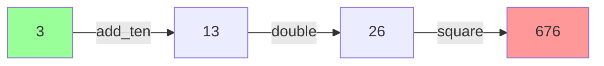

Pipe expressions use the `|>` operator to pass values into functions from left to right, creating a natural data flow syntax that emphasizes transformation pipelines.

**What is the Forward Pipe Operator?**

The forward pipe operator `|>` takes a value on its left and passes it to a function on its right. Think of it as making data flow visible:

- Traditional: `square(5)` - function wraps the value
- Forward pipe: `5 |> square` - value flows into function

The key advantage is readability, especially when chaining multiple operations.

**Basic Forward Pipe Syntax**

Line 9 demonstrates the basic form:

```
result1 = 5 |> square;
```

This breaks down as:
- `5` is the value on the left
- `|>` is the forward pipe operator
- `square` is the function on the right
- Result: `5 ** 2 = 25`

| Traditional Call | Forward Pipe | Result | Line |
|------------------|--------------|--------|------|
| `square(5)` | `5 \|> square` | 25 | 9 |

The expression reads naturally left-to-right: "5, pipe to square" or "5 flows into square".

**Function Definitions**

Lines 3-5 define transformation functions:

| Function | Operation | Example | Line |
|----------|-----------|---------|------|
| `square(x)` | Raise to power 2 | `square(5) = 25` | 3 |
| `double(x)` | Multiply by 2 | `double(5) = 10` | 4 |
| `add_ten(x)` | Add 10 | `add_ten(5) = 15` | 5 |

These demonstrate how pipe works with different operations.

**Chained Forward Pipes**

Line 12 demonstrates the real power - chaining multiple operations:

```
result2 = 3 |> add_ten |> double |> square;
```

This creates a transformation pipeline that evaluates left to right:



Step-by-step execution:
1. Start with `3`
2. `3 |> add_ten` = `13` (3 + 10)
3. `13 |> double` = `26` (13 * 2)
4. `26 |> square` = `676` (26 ** 2)

Each operation feeds its result to the next, creating a clean left-to-right flow.

**Traditional vs Piped Syntax**

Compare the readability:

**Traditional (nested calls)**:
```
result = square(double(add_ten(3)));
```
Reads inside-out (confusing): "square of double of add_ten of 3"

**Forward pipe (chained)**:
```
result = 3 |> add_ten |> double |> square;
```
Reads left-to-right (natural): "3, add ten, double, square"

The piped version eliminates nested parentheses and makes the data flow explicit.

**Pipe with Built-in Functions**

Line 15 shows using pipe with built-in functions:

```
total = [1, 2, 3, 4, 5] |> sum;
```

This pipes a list into the `sum` function, producing 15. The pipe operator works with:
- User-defined functions (lines 3-5)
- Built-in functions (line 15)
- Lambda expressions (line 18)
- Any callable object

**Pipe to Lambda Expressions**

Line 18 demonstrates piping to inline lambda functions:

```
result3 = 10 |> (lambda n: int : n * 3);
```

This breaks down as:
- `10` is the input value
- `|>` pipes it to the lambda
- `(lambda n: int : n * 3)` multiplies by 3
- Result: `10 * 3 = 30`

The lambda must be wrapped in parentheses when used with pipe. This pattern is useful for one-off transformations in the middle of a pipeline:

```
value |> process |> (lambda x: int : x * 2) |> validate;
```

**Forward Pipe vs Pipe Back**

Understanding the relationship between the two pipe operators:

| Operator | Direction | Syntax | Reading Style | Example Line |
|----------|-----------|--------|---------------|--------------|
| `\|>` (forward) | Left to right | `value \|> function` | Data-first | 9, 12 |
| `<\|` (backward) | Right to left | `function <\| value` | Function-first | - |

**Forward pipe** (this example):
```
result = 5 |> square;  # Reads: "5, pipe to square"
```

**Pipe back** (covered in pipe_back_expressions.md):
```
result = square <| 5;  # Reads: "square, taking 5"
```

Both produce the same result, but emphasize different aspects:
- Forward pipe emphasizes the data and its transformation journey
- Pipe back emphasizes the function being applied

**When to Use Forward Pipe**

Forward pipe is particularly useful when:

1. **Chaining transformations**:
```
data |> clean |> validate |> process |> save;
```

2. **Making data flow visible**:
```
user_input |> parse |> normalize |> store;
```

3. **Avoiding nested calls**:
```
# Instead of: save(process(validate(clean(data))))
data |> clean |> validate |> process |> save;
```

4. **Step-by-step transformations**:
```
price
    |> apply_discount
    |> add_tax
    |> round_to_cents;
```

**Practical Examples**

**Example 1: Data processing pipeline**
```
result = raw_data
    |> remove_nulls
    |> normalize_values
    |> calculate_statistics;
```

**Example 2: String manipulation**
```
formatted = user_input
    |> trim
    |> lowercase
    |> validate_format;
```

**Example 3: Numerical computation**
```
final_score = base_score
    |> apply_multiplier
    |> add_bonus
    |> clamp_to_max;
```

**Example 4: Mixing functions and lambdas**
```
result = value
    |> process
    |> (lambda x: int : x * 2)
    |> validate
    |> (lambda x: int : x + 100);
```

**Advantages of Forward Pipe**

The pipe operator offers several benefits:

1. **Improved readability**: Data transformations read left-to-right
2. **Eliminates nesting**: No deeply nested function calls
3. **Explicit flow**: Makes the order of operations obvious
4. **Reduces variables**: No need for intermediate temporary variables
5. **Natural composition**: Easily add or remove transformation steps

**Comparison Table**

| Style | Syntax | Pros | Cons |
|-------|--------|------|------|
| Traditional | `f(g(h(x)))` | Familiar | Nested, inside-out reading |
| Forward pipe | `x \|> h \|> g \|> f` | Left-to-right, clear flow | Less familiar to some |
| Variables | `a=h(x); b=g(a); f(b)` | Step-by-step | Verbose, many variables |

**Output Demonstration**

Line 20 prints all results:
- `result1 = 25` (square of 5)
- `result2 = 676` (3 |> add_ten |> double |> square)
- `total = 15` (sum of [1,2,3,4,5])
- `result3 = 30` (10 piped to lambda that triples)

**Relationship to Functional Programming**

The forward pipe operator comes from functional programming languages:
- **F#**: `|>` operator (direct inspiration)
- **Elixir**: `|>` operator for pipelines
- **Unix shells**: `|` for piping command output

Jac brings this pattern to graph-based programming, making data transformations more readable.

**Key Takeaways**

- `|>` passes values from left to right into functions
- Syntax: `value |> function`
- Chains naturally: `value |> f1 |> f2 |> f3`
- Works with user functions, built-ins, and lambdas
- Emphasizes data flow and transformation pipeline
- Eliminates nested function calls
- Makes code more readable and maintainable
- Complements pipe back (`<|`) which emphasizes functions

The forward pipe operator is a powerful tool for writing clear, maintainable transformation pipelines that read naturally from left to right.
