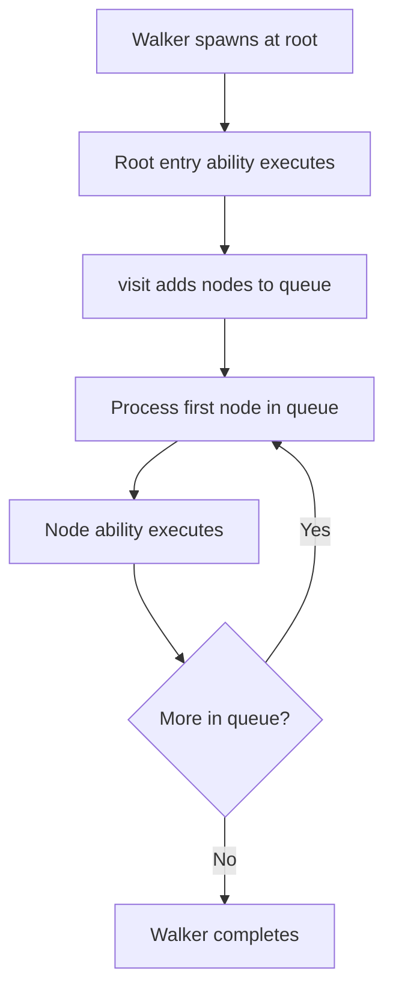
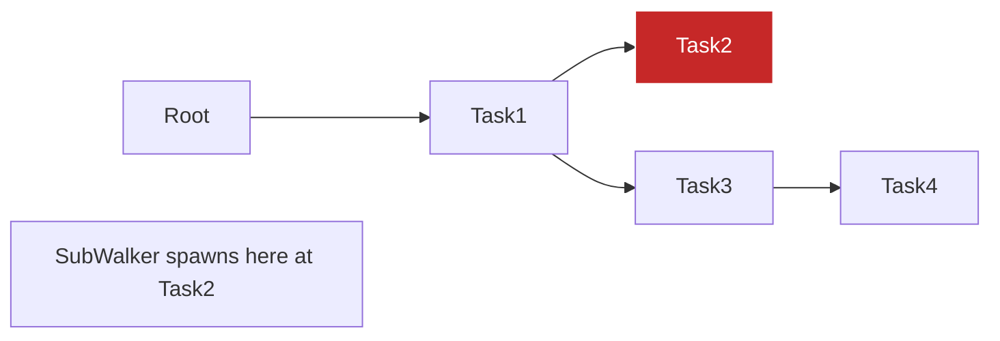
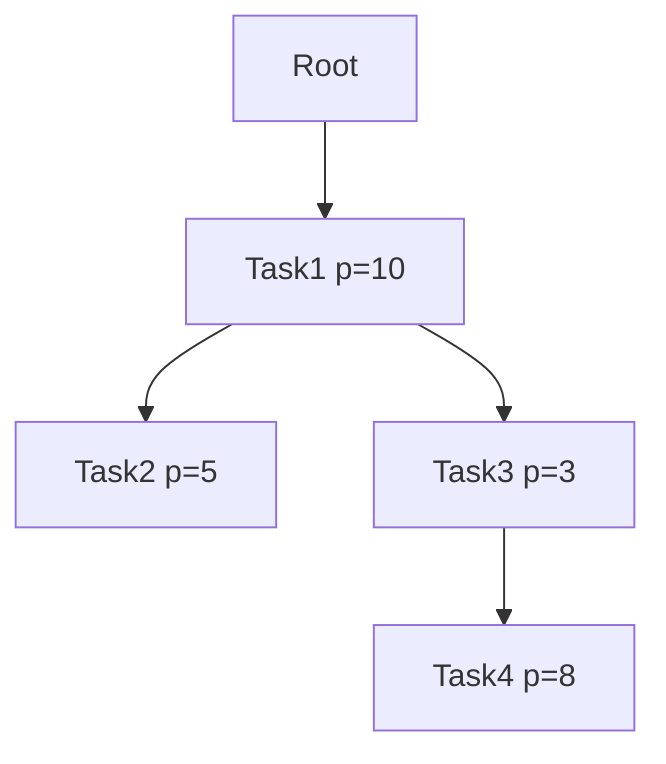

Object spatial calls are the mechanisms for spawning and executing walkers on graph nodes. The `spawn` operator creates walker instances and launches them at specified nodes, enabling the "computation flows to data" paradigm.

**What is Walker Spawning?**

Spawning a walker means creating a walker instance and starting its execution at a specific node in the graph. Think of it like deploying an agent that will traverse your data structure, performing operations at each location it visits.

**Basic spawn Syntax**

The most common form is shown on line 204: `root spawn BasicSpawn()`.

This breaks down as:
- `root` - the starting node (where the walker begins)
- `spawn` - the operator that launches the walker
- `BasicSpawn()` - creates a new walker instance

When this executes:
1. A new `BasicSpawn` walker is created
2. The walker starts at the root node
3. The walker's matching entry ability executes (lines 26-28)
4. The walker processes its visit queue until empty

**Understanding the Visit Queue**

Walkers maintain a FIFO (first-in-first-out) queue of nodes to visit. This is fundamental to understanding how walkers traverse graphs:

The visit queue always processes nodes in FIFO order - first queued, first visited. Lines 17-21 show this pattern: `visit [-->]` adds all outgoing nodes to the queue, and they're processed in the order they were added.

**How visit Statements Control Traversal**

Lines 14, 20, 28, 33 all use `visit [-->]` to queue nodes. The visit statement determines which nodes get added to the queue:

| Visit Expression | What Gets Queued | Example Line |
|------------------|------------------|--------------|
| `visit [-->];` | All outgoing nodes | 14, 20, 28 |
| `visit [->:Type:->];` | Outgoing nodes via Type edges | - |
| `visit [<--];` | All incoming nodes | - |
| `visit node_list;` | Specific nodes | - |

Once nodes are in the queue, they're always processed FIFO regardless of how they were added.

**Walker Return Values**

Lines 219-221 demonstrate accessing walker state after execution. The spawn operator returns the walker instance, allowing you to:
- Access accumulated data (lines 71-72: `collected` and `sum` attributes)
- Check walker state after traversal completes
- Use walkers as data collectors or analyzers

Lines 70-83 define `DataCollector`, which accumulates data during traversal (lines 79-80). After spawning (line 219), the walker's attributes remain accessible.

**Spawn Syntax Variations**

Lines 240-255 demonstrate all valid spawn syntaxes:

| Syntax | Description | Example Line |
|--------|-------------|--------------|
| `node spawn Walker()` | Most common form | 242 |
| `node spawn :> Walker` | With `:>` operator, walker type | 245 |
| `node spawn |> Walker` | With `|>` operator, walker type | 248 |
| `Walker() spawn node` | Walker-first syntax | 251 |
| Pre-constructed | Create walker, then spawn | 254-255 |

**Important**: The `:>` and `|>` operators take the walker TYPE, not a constructed instance. Use `root spawn :> Walker`, NOT `root spawn :> Walker()`.

**Walker Spawned from Nodes**

Lines 85-112 show walkers spawning other walkers. Line 96 demonstrates: `here spawn SubWalker()`.

The execution flow:
1. `NodeSpawner` visits Task2 (line 92)
2. Line 96: A new `SubWalker` spawns at the current node (`here`)
3. The `SubWalker` starts its own traversal from Task2
4. Both walkers can run independently

This enables hierarchical processing where parent walkers spawn child walkers at interesting nodes.

**Walker Construction with Arguments**

Lines 114-136 show parameterized walkers. Line 229 demonstrates: `root spawn ConstructedWalker(label="Alpha", max_visits=2)`.

The walker is initialized with:
- `label="Alpha"` sets the walker's label (line 116)
- `max_visits=2` limits how many nodes it visits (line 117)

Lines 125-135 show the walker using these parameters to control its behavior, stopping after reaching `max_visits` via `disengage` (line 131).

**Multiple Walkers on Same Graph**

Lines 232-238 demonstrate running different walkers on the same graph structure. Each walker traverses independently:
- `Counter` (lines 139-150) counts total tasks
- `Analyzer` (lines 152-168) categorizes by priority

This demonstrates separation of data and computation - the graph structure is static, but different walkers extract different information.

**Building Graph Structures for Traversal**

Lines 179-200 build a test graph structure:

Lines 194-197 create the edges using the `++>` operator:
- Line 194: `root ++> task1` connects root to Task1
- Line 195: `task1 ++> task2` connects Task1 to Task2
- Lines 196-197: Create the remaining connections

This structure is then traversed by various walkers throughout the example.

**Comparing Traversal Approaches**

Lines 257-281 demonstrate how different visit patterns affect traversal order. The key insight: traversal order is controlled by HOW you structure your visit statements, not by the spawn operator used.

Both depth-first and breadth-first styles process the queue FIFO, but they add nodes to the queue differently:
- Depth-first effect: Add child nodes to front of queue
- Breadth-first effect: Add child nodes to end of queue (default)

**Spawn Points and Starting Context**

Walkers can spawn from different locations:

| Spawn Point | Usage | Example Line |
|-------------|-------|--------------|
| `root spawn W()` | Start at root node | 204, 214, 219 |
| `here spawn W()` | Start at current node | 96 |
| `node_var spawn W()` | Start at specific node | - |

The spawn point becomes the walker's initial `here` reference, and the matching entry ability executes for that node type.

**The Walker Execution Model**

When a walker spawns, this sequence occurs:

1. **Initialization**: Walker instance created (if using `Walker()` syntax)
2. **Entry ability**: Matching entry ability for spawn node type executes
3. **Visit queue**: Empty FIFO queue created
4. **Queue population**: `visit` statements add nodes to queue
5. **FIFO processing**: Walker processes queued nodes in order
6. **Node abilities**: For each visited node:
   - Walker's matching entry abilities execute
   - Node's abilities (if any) execute
   - More nodes may be queued via `visit` statements
7. **Completion**: When queue empties, exit abilities execute
8. **Return**: Walker instance returned to spawn caller

**Practical Patterns**

**Pattern 1: Data Collection** (lines 70-83, 219-221)

**Pattern 2: Graph Search** (stopping early with disengage)

**Pattern 3: Multi-Walker Analysis** (lines 232-238)

**Pattern 4: Hierarchical Processing** (lines 85-112)

**Common Mistakes to Avoid**

1. **Wrong operator syntax**:
   - ✗ Wrong: `root spawn :> Walker()`
   - ✓ Right: `root spawn :> Walker`

2. **Assuming operators control traversal**:
   - ✗ Wrong assumption: `:>` does depth-first automatically
   - ✓ Reality: Queue is FIFO; control traversal with visit logic

3. **Forgetting visit statements**:
   - Without `visit [-->]`, walker only executes on spawn node
   - No visits = no traversal

4. **Not capturing return value**:
   - ✗ `root spawn Collector();` loses walker state
   - ✓ `result = root spawn Collector();` can access collected data

**The Computation-to-Data Paradigm**

Object spatial calls invert traditional programming:

Traditional approach (data comes to computation):

OSP approach (computation goes to data):

This inversion enables:
- **Locality**: Computation executes where data resides
- **Persistence**: Graph structure persists via root connectivity
- **Distribution**: Walkers can traverse distributed graphs
- **Decoupling**: Walker logic independent of graph structure
- **Reusability**: Same walker works on different graph topologies

Object spatial calls are the fundamental execution primitive of Jac's Object-Spatial Programming model, enabling mobile computation that flows through persistent graph structures.
