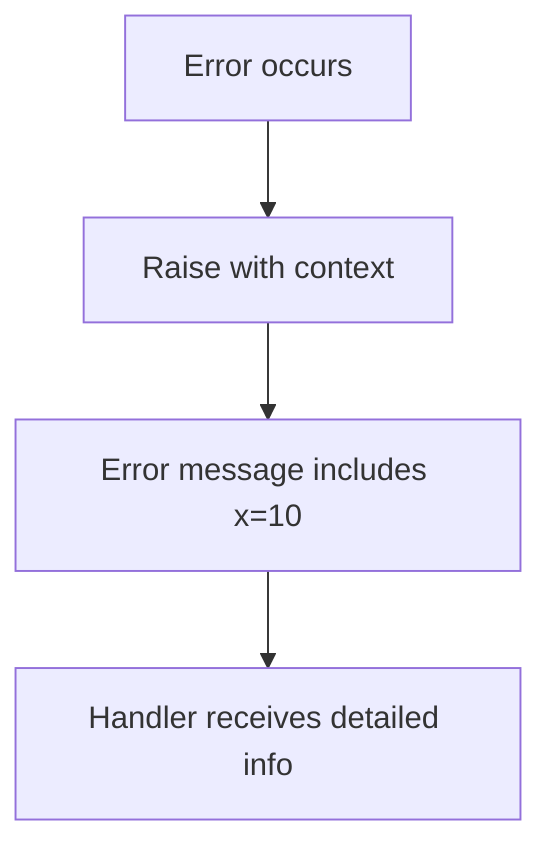
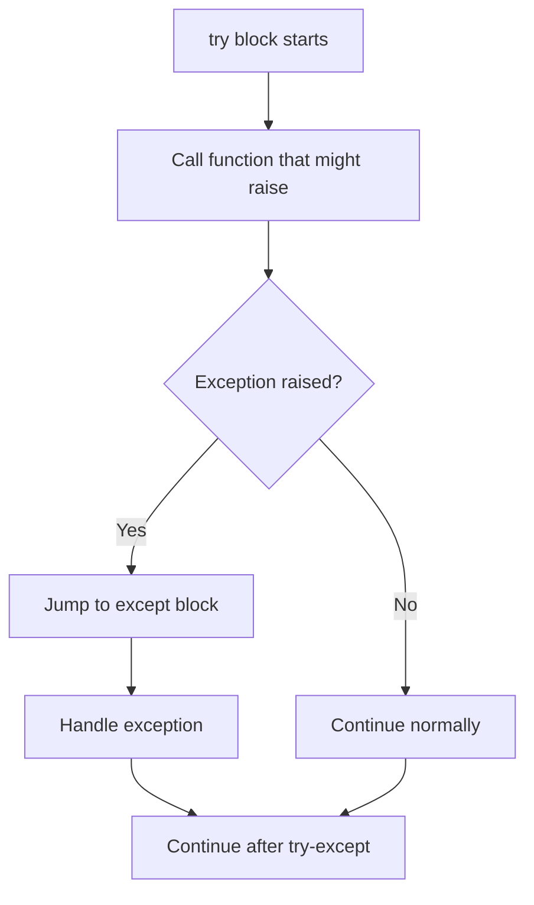

Raise statements are used to explicitly throw exceptions, signaling error conditions or exceptional situations that need to be handled by calling code.

**What are Raise Statements?**

The `raise` statement creates and throws an exception, immediately interrupting normal program flow. When raised, the exception propagates up the call stack until it finds a matching exception handler (an `except` clause) or terminates the program.

Think of exceptions as a way to say "something went wrong" and jump directly to error-handling code, skipping everything in between.

**Basic Raise Syntax**

Lines 3-5 demonstrate the simplest form. Line 4 breaks down as:
- `raise` - the keyword that throws an exception
- `ValueError` - the exception type/class
- `"error message"` - descriptive message about what went wrong

When line 41 calls this function, the exception is raised and caught by the handler on lines 42-43.

**Exception Types**

The example uses several standard exception types:

| Exception Type | Used For | Example Line |
|----------------|----------|--------------|
| `ValueError` | Invalid value for expected type | 4, 31, 34 |
| `RuntimeError` | General runtime error | 9, 16 |
| `ZeroDivisionError` | Division by zero | 15 (caught) |

Choose the exception type that best describes the error condition.

**Raise with Expressions**

Lines 7-10 show using expressions in the error message. Line 9 uses an f-string to include the value of `x` in the error message. This makes debugging easier by providing context about the error:

When caught on lines 48-50, the error message will be "value is 10", helping identify the problem.

**Exception Chaining with raise...from**

Lines 12-18 demonstrate exception chaining. Line 16 uses `raise ... from` to chain exceptions:
- A `ZeroDivisionError` occurs on line 14 (division by zero)
- Line 16 catches it and raises a new `RuntimeError`
- The `from e` part links the new exception to the original

This creates an exception chain showing both:
1. The original low-level error (ZeroDivisionError)
2. The higher-level context (RuntimeError: "division failed")

**Why chain exceptions?**

| Without Chaining | With Chaining |
|------------------|---------------|
| Lose original error details | Preserve full error history |
| Hard to debug root cause | Can trace back to source |
| Only see latest error | See entire error chain |

**Bare Raise (Re-raising)**

Lines 20-27 demonstrate re-raising an exception. Line 25 shows `raise;` without any arguments - this is a "bare raise". It can only be used inside an `except` clause and re-raises the currently active exception.

**Bare raise is useful when you want to:**
1. Log or inspect an exception
2. Perform cleanup actions
3. Then let the exception continue propagating

Lines 61-64 show this in action:
1. Line 62 calls `bare_raise()`
2. Line 24 prints "caught, re-raising"
3. Line 25 re-raises the exception
4. Line 63 catches the re-raised exception

**Conditional Raise for Validation**

Lines 29-36 demonstrate using `raise` for input validation. This pattern validates input and raises exceptions for invalid values:
- Line 30-31: Checks if value is negative
- Line 33-34: Checks if value exceeds maximum

Lines 68-72 test the validation:
- `conditional_raise(-5)` raises ValueError (negative)
- `conditional_raise(150)` raises ValueError (too large)
- `conditional_raise(50)` doesn't raise (valid)

**The Try-Except Pattern**

All raise examples are tested with try-except blocks:

The pattern:
1. **try** block (lines 40-41): Code that might raise exceptions
2. **except** clause (lines 42-43): Handles specific exception type
3. **as e** (line 42): Captures exception object for inspection

**Exception Handling Flow**

When an exception is raised:

1. **Normal execution stops** at the raise statement
2. **Stack unwinding begins** - runtime searches for handler
3. **First matching except found** - that handler executes
4. **Exception object accessible** via the `as` variable
5. **Continue after try-except** - normal flow resumes

If no handler is found, the exception propagates up until:
- A handler catches it, or
- The program terminates with an error message

**Testing Different Scenarios**

The example tests various scenarios:

| Test | Lines | What Happens |
|------|-------|--------------|
| Basic raise | 40-43 | ValueError raised and caught |
| Raise with expression | 47-50 | RuntimeError with context raised |
| Exception chaining | 54-57 | Chained RuntimeError raised |
| Bare raise | 61-64 | Exception re-raised |
| Validation failure (negative) | 68-71 | ValueError for negative input |
| Validation failure (too large) | 74-77 | ValueError for excessive input |
| Validation success | 81-86 | No exception raised |

**Common Patterns**

**Pattern 1: Input validation** (lines 29-36)

**Pattern 2: Error context** (lines 7-10)

**Pattern 3: Exception wrapping** (lines 12-18)

**Pattern 4: Logging and re-raising** (lines 20-27)

**Best Practices**

1. **Use specific exception types** - ValueError, TypeError, etc. (not generic Exception)
2. **Provide descriptive messages** - Include context about what went wrong
3. **Chain exceptions** - Use `from` to preserve error history
4. **Validate early** - Check inputs at function boundaries
5. **Re-raise when appropriate** - Use bare `raise` to propagate after logging

**Exception Types Guide**

| Exception | When to Use | Example |
|-----------|-------------|---------|
| `ValueError` | Invalid value for correct type | Negative number where positive expected |
| `TypeError` | Wrong type entirely | String where int expected |
| `RuntimeError` | General runtime errors | Configuration error, state error |
| `KeyError` | Missing dictionary key | Accessing non-existent key |
| `IndexError` | Invalid sequence index | List index out of range |
| `AttributeError` | Missing attribute | Accessing undefined attribute |

**Key Takeaways**

- `raise ExceptionType("message")` throws an exception
- Exceptions interrupt normal flow and jump to handlers
- Use specific exception types that describe the error
- Include descriptive messages with context
- Chain exceptions with `from` to preserve error history
- Bare `raise` re-raises the current exception (only in except blocks)
- Use raise for input validation and error signaling
- Always handle or document exceptions your code can raise

Raise statements are essential for robust error handling, enabling your code to signal problems clearly and allowing calling code to handle errors appropriately.
