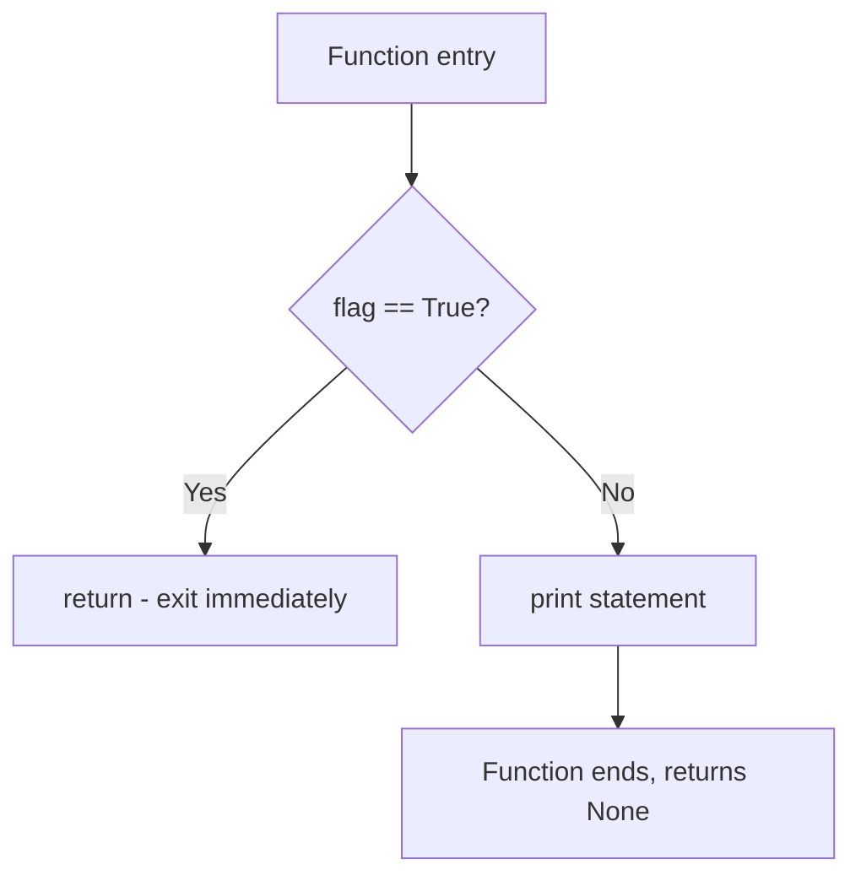

**Return Statements**

Return statements exit a function or method and send a value back to the caller. They are fundamental to function-based programming and control flow in Jac.

**Returning a Value**

Line 4 demonstrates the simplest form: `return 42;`. This exits the `return_value` function immediately and sends the integer 42 back to the caller. The function signature on line 3 includes `-> int`, indicating the function returns an integer type. Line 49 calls this function and prints the returned value.

**Returning an Expression**

Lines 7-10 show returning a computed value. Line 9 evaluates `x * 2` (which is 10 * 2 = 20) and returns the result. The expression is evaluated before the function exits, and the calculated value is sent to the caller. Line 50 demonstrates calling this function.

**Return without a Value**

Lines 12-15 demonstrate `return;` with no expression. Line 14 shows the bare return statement, which exits the function and implicitly returns `None`. This is useful for early exits when you don't need to provide a return value. Line 51 calls this function, which returns None.

**Implicit None Return**

Lines 17-19 show a function without any return statement. Line 18 executes print, then the function ends, implicitly returning `None`. Functions without explicit return statements automatically return None when they reach the end. Line 52 demonstrates this behavior.

**Conditional Returns**

Lines 21-27 show return statements in different conditional branches:

| Condition | Line | Return Value |
|-----------|------|--------------|
| `x > 0` (true) | 23 | Returns x |
| `x > 0` (false) | 25 | Returns 0 |

Line 53 calls with argument 5 (positive), taking the first branch and returning 5. Line 54 calls with -3 (negative), taking the else branch and returning 0. This pattern ensures all code paths return a value.

**Early Return Pattern**

Lines 29-34 demonstrate using return for early exit. When `flag` is True, line 31 executes `return;` and the function exits immediately, never reaching line 33. When `flag` is False, the early return is skipped and line 33 executes. Lines 55-56 demonstrate both cases.

This pattern is valuable for:
- Guard clauses validating inputs
- Handling special cases before main logic
- Avoiding deep nesting in conditionals
- Simplifying complex control flow

**Multiple Return Paths**

Lines 36-46 show a function with multiple return statements across different branches:

| Input | Line | Returns |
|-------|------|---------|
| "high" | 38 | 100 |
| "medium" | 40 | 50 |
| "low" | 42 | 10 |
| Other | 44 | 0 |

Lines 57-59 demonstrate calling with different arguments, each taking a different return path through the function.

**Return Statement Execution**

Key behaviors to understand:
- Execution stops immediately at the return statement
- No code after the return in that code path will execute
- The expression is evaluated before exiting
- Return values should match the function's type annotation
- Functions without explicit returns implicitly return None
- Unlike `report`, return can only execute once per function call

**Return Type Annotations**

The examples show different return type patterns:

| Line | Function | Return Type | Meaning |
|------|----------|-------------|---------|
| 3 | `return_value` | `-> int` | Returns an integer |
| 7 | `return_expression` | `-> int` | Returns an integer |
| 12 | `return_none` | (none) | No type specified, returns None |
| 17 | `no_return` | (none) | No type specified, implicitly returns None |
| 21 | `conditional_return` | `-> int` | Returns integer from either branch |
| 29 | `early_return` | (none) | Returns None |
| 36 | `multiple_returns` | `-> int` | Returns integer from any branch |

**Common Patterns**

Return statements enable several important programming patterns demonstrated in this example:

1. **Value computation** (lines 3-5): Calculate and return a result
2. **Early exit** (lines 29-34): Return early from guard clauses
3. **Branching logic** (lines 21-27): Return different values based on conditions
4. **Multiple exit points** (lines 36-46): Handle different cases with appropriate returns
5. **Explicit None** (lines 12-15): Use bare `return;` to exit without a value

**Complete Example Flow**

Lines 48-60 in the entry block call all the example functions in sequence, demonstrating each return pattern:
- Simple value return
- Expression evaluation return
- Explicit None return
- Implicit None return
- Conditional returns with different arguments
- Early return with different flags
- Multiple return paths with different inputs
