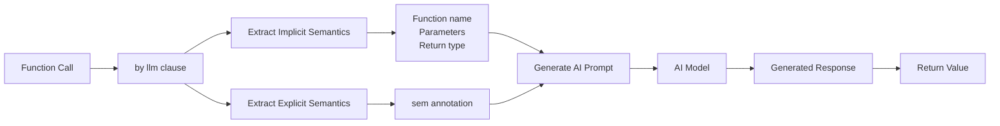

**Semstrings - Semantic String Definitions**

Semstrings (semantic strings) provide explicit semantic context for AI models in Jac's meaning-typed programming system. The `sem` keyword allows developers to enrich what AI models understand beyond just code structure.

**LLM Model Setup**

Line 3 imports the `Model` class from the `byllm` module. Line 5 creates a global LLM instance using `glob llm = Model(...)`, configuring it with:
- Model name: `"mockllm"` (for testing; production uses real LLM services)
- Mock outputs: `["SecureP@ss1"]` (predefined response for testing)

**Delegating Function Implementation to AI**

Line 8 demonstrates delegating a function's implementation to an LLM:

`def generate_password() -> str by llm();`

Breaking down this declaration:
- `def generate_password()` - Function name provides semantic intent
- `-> str` - Return type tells AI to produce a string
- `by llm()` - Delegates implementation to the AI model

The `by` keyword handles delegation to the AI. Jac automatically extracts meaning from the function's name, parameters, and return type to generate appropriate prompts.

**Semantic String Definition**

Lines 11-14 use the `sem` keyword to provide additional semantic context:

```
sem generate_password = """
Password is at least 8 characters, has one uppercase letter,
one lowercase letter, one digit, and one special character.
""";
```

The syntax pattern is `sem function_name = """description""";` where:
- `sem` - Keyword indicating a semantic annotation
- `generate_password` - Matches the function name from line 8
- Triple-quoted string - Contains explicit requirements and constraints

**Semantic Requirements**

The semantic string specifies detailed password requirements:
- Minimum 8 characters
- Contains uppercase letters
- Contains lowercase letters
- Contains digits
- Contains special characters

These requirements supplement what the AI can infer from just the function name and type.

**How Semantic Annotations Work**



When `generate_password()` is called on line 17:
1. The `by llm()` clause delegates to the AI model
2. Jac generates a prompt using implicit semantics (function structure)
3. The `sem` annotation provides explicit semantic context
4. The AI uses both to generate appropriate output
5. The response is returned as the function's result

**Execution**

Line 17 calls the AI-implemented function like any normal function: `pwd = generate_password();`. The caller doesn't need to know the function is implemented by an AI rather than traditional code. Line 18 prints the generated password.

**Use Cases for Semantic Annotations**

| Use Case | Example | Benefit |
|----------|---------|---------|
| Requirements specification | Password rules (lines 11-14) | AI understands constraints |
| Domain terminology | `sem Person.yod = "Year of Death"` | Clarifies abbreviations |
| Behavioral context | Expected output format | Guides AI generation |
| Tool usage documentation | External function integration | Helps AI use tools correctly |
| Few-shot examples | Sample inputs/outputs | Provides learning data |

**Advantages of Semantic Annotations**

The `sem` keyword approach provides several benefits:
- **Context-rich**: Enriches AI understanding beyond code structure alone
- **Explicit semantics**: Unlike comments, becomes part of execution context
- **Maintainable**: Natural language works alongside type annotations
- **Flexible**: Works with `by` keyword and as standalone documentation
- **Type-safe**: Complements rather than replaces the type system

**Implicit vs Explicit Semantics**

| Source | Type | Information |
|--------|------|-------------|
| Function name | Implicit | Intent from naming (generate_password) |
| Parameters | Implicit | Expected inputs and their types |
| Return type | Implicit | Output format (-> str) |
| sem annotation | Explicit | Detailed requirements and constraints |

Both implicit and explicit semantics work together to give the AI complete context for generating appropriate outputs.

**Implementation Note**

In this example, `mockllm` (line 5) is configured with predefined outputs for testing. In production applications, you would configure an actual LLM model (GPT, Claude, etc.) to interpret the semantic strings and generate appropriate outputs dynamically.
