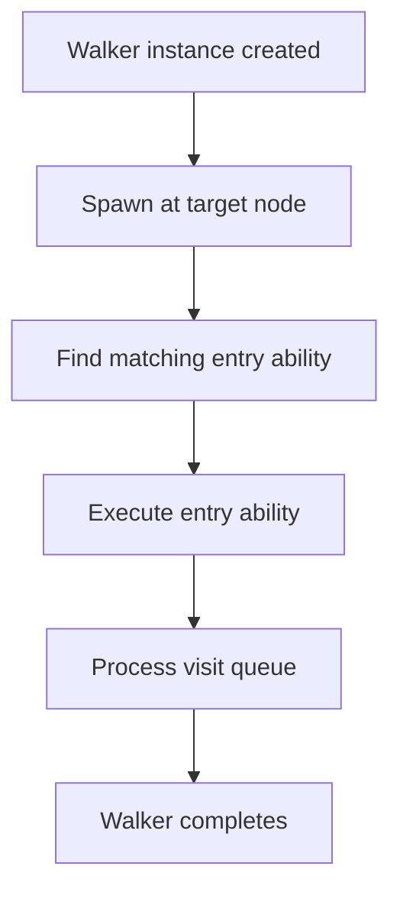

**Spawn Expressions (OSP)**

Spawn expressions provide an alternative syntax for spawning walkers, with the walker instance specified before the spawn keyword rather than after.

**What are Spawn Expressions?**

Spawn expressions let you launch walkers on nodes using two equivalent syntaxes:
- Node-first: `root spawn Walker()` (more common)
- Walker-first: `Walker() spawn root` (demonstrated in this example)

Both forms do exactly the same thing - they create a walker instance and start its execution at a specified node.

**The Two Spawn Syntaxes**

Lines 24 and 27 demonstrate both forms:

| Syntax | Form | Example Line |
|--------|------|--------------|
| `Counter() spawn root` | Walker-first | 24 |
| `root spawn Counter()` | Node-first | 27 |

Line 24 shows `Counter() spawn root`, which:
1. Creates a new `Counter` walker instance: `Counter()`
2. Uses the `spawn` operator to launch it
3. Starts execution at `root`

Line 27 shows `root spawn Counter()`, which does the same thing but in reverse order.

**When to Use Walker-First Syntax**

The walker-first form (line 24) can be more readable when:
- The walker construction is complex with many parameters
- You want to emphasize the walker being created
- You're chaining operations on the walker

For example:

This makes it clear what's being created before showing where it's being spawned.

**How Walker Execution Works**

When either form executes, the same sequence occurs:

Line 3-5 define the walker with a `can count with root entry` ability. When spawned (lines 24 or 27), this ability executes automatically because the walker starts at root and the ability is marked for root entry.

**Walker and Node Definitions**

Lines 3-5 define a `Counter` walker:
- Line 4: `can count with root entry;` declares an ability that triggers when visiting root
- The backtick syntax `\`root` specifies this ability executes at root nodes

Lines 7-10 define a `NumberNode` node:
- Line 8: `has value: int = 0;` defines a value attribute
- Line 9: `can process with Counter entry;` declares an ability that triggers when a Counter walker visits

**Ability Implementations**

Lines 12-16 implement the walker's `count` ability:
- Lines 13-14: Create two NumberNode instances and connect them to `here` (which is root)
- Line 15: `visit [-->]` queues all outgoing nodes for visiting

Lines 18-20 implement the node's `process` ability:
- Line 19: Prints the node's value when visited by a Counter walker

**The Execution Flow**

When `Counter() spawn root` executes on line 24:

1. Counter walker created
2. Walker spawns at root
3. `count` ability executes (matches `\`root entry`)
4. Lines 13-14: Two NumberNode instances created and connected to root
5. Line 15: Both nodes queued for visiting
6. Walker visits NumberNode(value=10)
7. Node's `process` ability executes, printing "Processing node with value: 10"
8. Walker visits NumberNode(value=20)
9. Node's `process` ability executes, printing "Processing node with value: 20"
10. Visit queue empty, walker completes

**Spawn Expression Components**

The spawn expression has three parts:

| Component | Description | Example |
|-----------|-------------|---------|
| Walker instance | Creates the walker | `Counter()` |
| `spawn` operator | Launches the walker | `spawn` |
| Starting node | Where execution begins | `root` |

The order can be reversed, but the components remain the same.

**When Both Syntaxes Are Equivalent**

Both forms produce identical behavior:
- Same walker instance created
- Same starting node
- Same execution sequence
- Same results

Choose the form that makes your code most readable for the specific situation.

**Practical Usage**

The walker-first syntax shines when:

The node-first syntax is better for simple cases:

**Key Takeaways**

- Both `Walker() spawn node` and `node spawn Walker()` are valid
- They produce identical execution behavior
- Walker-first emphasizes what's being created
- Node-first emphasizes where execution starts
- Choose the form that makes your intent clearest
- The spawn expression creates and immediately executes the walker at the specified node
