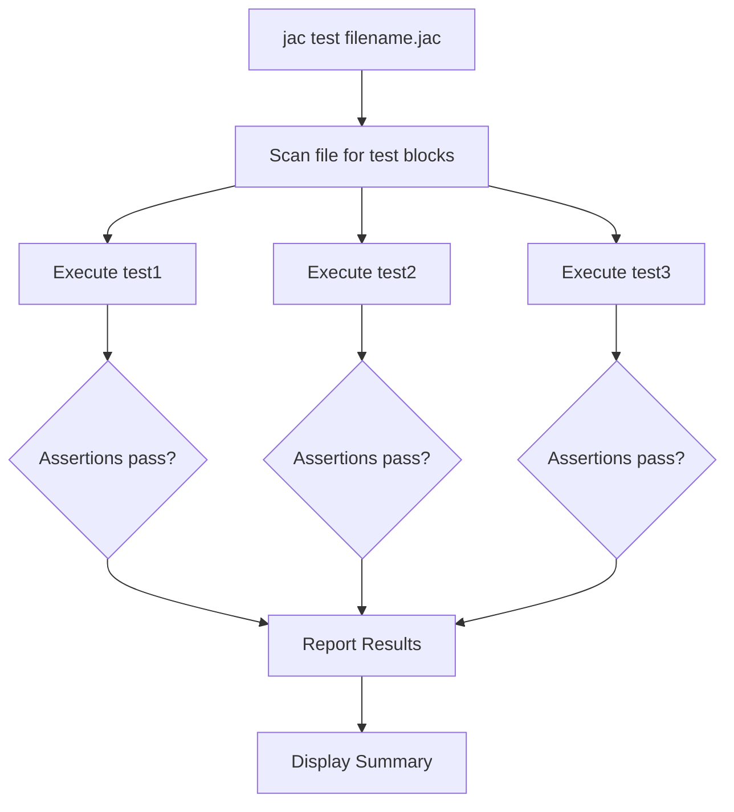

**Tests - Unit Testing with Test Blocks**

Jac provides built-in support for unit testing through test blocks, allowing you to write tests directly in source files alongside the code being tested.

**Test Block Syntax**

The general form is: `test test_name { assertions and test code }`

Components:
- `test` - Keyword that begins a test block
- `test_name` - Identifier for the test
- Curly braces - Contain test code and assertions

**Test Examples**

Lines 4-6 define `test1`:

This test uses `almostEqual()` to check if two floating-point numbers are approximately equal. This function is useful for comparing floats where exact equality might fail due to precision issues.

Lines 9-11 define `test2`:

This uses a simple equality assertion to verify that 5 equals itself.

Lines 14-16 define `test3`:

This uses a membership assertion to verify that the character "e" exists in the string "qwerty".

**Assertion Behavior**

| Condition Result | Behavior |
|------------------|----------|
| True | Test continues, eventually passes |
| False | AssertionError raised, test fails |

Assertions are the primary mechanism for verifying expected behavior. Each test can contain multiple assertions.

**Running Tests**

Lines 18-26 show programmatic test execution:

Line 18 uses `with entry:__main__` to ensure code only runs when the file is executed directly (not imported).

Lines 21-24 use `subprocess.run()` to execute the Jac test runner:
- `["jac", "test", f"{__file__}"]` - Command to test current file
- `stdout=subprocess.PIPE, stderr=subprocess.PIPE` - Capture output
- `text=True` - Return output as strings

Line 25 prints the test results from stderr, where test output is sent.

**Test Discovery and Execution**

When `jac test filename.jac` runs:
1. Jac scans the file for all `test` blocks
2. Each test block executes in isolation
3. Assertions are evaluated
4. Results are reported (pass/fail per test)
5. Summary shows total tests and any failures

**Test Isolation**

Each test block runs independently:
- If one test fails, others still execute
- Tests don't share state
- Execution order is not guaranteed
- A single failure doesn't prevent other tests from running

**Best Practices**

Effective tests should:

| Practice | Description |
|----------|-------------|
| Independence | Don't rely on other tests or execution order |
| Descriptive names | Use names that describe what is tested |
| Single behavior | Test one specific scenario per test |
| Meaningful assertions | Verify actual behavior, not trivial truths |
| Fast execution | Keep tests quick to encourage frequent running |
| Cover edge cases | Test both normal and boundary conditions |

**Use Cases**

Test blocks are valuable for:
- Unit testing individual functions or methods
- Verifying object behavior
- Testing graph operations and walker logic
- Regression testing to prevent breaking changes
- Documentation through executable examples

**Test Naming**

While the examples use simple names (`test1`, `test2`, `test3`), production code should use descriptive names:
- `test_password_validation` - Clearer than `test1`
- `test_user_creation` - Describes what is tested
- `test_edge_traversal` - Indicates the feature

**Integration with Development**

Tests written inline with code:
- Live alongside the implementation
- Are easy to discover and maintain
- Serve as executable documentation
- Enable test-driven development workflows
- Provide immediate feedback during development
