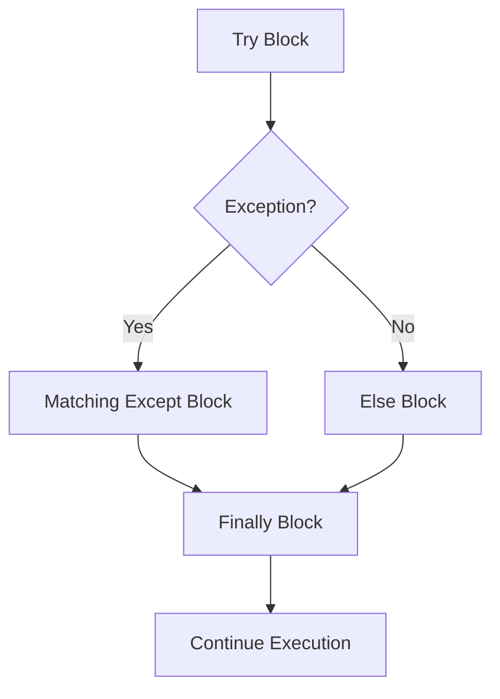

**Try Statements**

Try statements provide structured exception handling, allowing you to catch and handle errors gracefully instead of letting them crash your program.

**Basic Try-Except**

Lines 5-9 demonstrate fundamental exception handling. The try block (lines 5-6) contains code that might raise an exception. When division by zero occurs on line 6, execution jumps to the except block (lines 7-9). Line 8 prints a message instead of crashing.

**Exception Binding with 'as'**

Lines 12-16 show binding the exception to a variable. Line 14 uses `as e` to bind the exception object to variable `e`, making it accessible in the handler. Line 15 prints the exception details. The variable is only available within the except block's scope.

**Multiple Except Clauses**

Lines 19-27 demonstrate handling different exception types:

| Line | Exception Type | Handles |
|------|----------------|---------|
| 21 | `ValueError` | Invalid value conversions |
| 23 | `TypeError` | Type-related errors |
| 25 | `Exception` | Any other exception |

Line 20 attempts `int("not a number")`, which raises `ValueError`. The except clauses are checked in order:
- Line 21 catches `ValueError` (matches) - executes line 22
- Lines 23-24 would catch `TypeError` (skipped)
- Lines 25-26 would catch any other `Exception` (skipped)

Only the first matching except clause executes.

**Try-Except-Else**

Lines 30-36 demonstrate the `else` clause. The else block (lines 34-35) executes only if no exception occurred in the try block. Line 31 succeeds, so line 35 executes. The else clause is useful for:
- Code that should only run on success
- Distinguishing setup (try) from success handling (else)
- Keeping exception-prone code isolated in the try block

**Try-Finally**

Lines 39-45 demonstrate the `finally` clause. The finally block (lines 43-44) always executes, whether an exception occurred or not. Line 44 runs after the try block completes successfully. Finally clauses are essential for:
- Cleanup operations (closing files, releasing resources)
- Ensuring critical code runs regardless of errors
- Logging or auditing that must happen

**Complete Try-Except-Else-Finally**

Lines 48-57 show all four clauses together:

Execution order:
1. Try block (lines 48-50) - Attempt operation
2. If exception: matching except block (lines 51-52)
3. If no exception: else block (lines 53-54)
4. Always: finally block (lines 55-56)

In this example, line 50 accesses a valid list index (no exception), so line 54 in else executes, then line 56 in finally executes.

**Try-Finally Without Except**

Lines 60-64 show try-finally without exception handling. This pattern ensures cleanup code runs even if an exception propagates up. The finally block executes before the exception is re-raised.

**Nested Try Statements**

Lines 67-75 demonstrate nested exception handling. Line 69 raises `ZeroDivisionError`. The inner except (line 70) only catches `ValueError`, so it doesn't match. The exception propagates to the outer try, where line 73 catches it as `Exception`.

**Exception Handling Flow**

| Scenario | Try | Except | Else | Finally |
|----------|-----|--------|------|---------|
| No exception | Executes | Skipped | Executes | Executes |
| Exception caught | Partial | Executes | Skipped | Executes |
| Exception not caught | Partial | Skipped | Skipped | Executes (then re-raises) |

**Exception Hierarchy**

When using multiple except clauses:
- More specific exceptions should come first
- `Exception` catches most exceptions, so it should be last
- Python checks except clauses sequentially
- First match wins

Example order:
1. `ValueError` (specific)
2. `TypeError` (specific)
3. `Exception` (general)

**Best Practices**

The examples demonstrate several best practices:
- Catch specific exceptions rather than broad catches
- Use else for code that should only run on success
- Use finally for cleanup that must always occur
- Bind exceptions to variables when you need to examine them
- Order except clauses from specific to general

**Common Patterns**

Try-except patterns for different scenarios:
