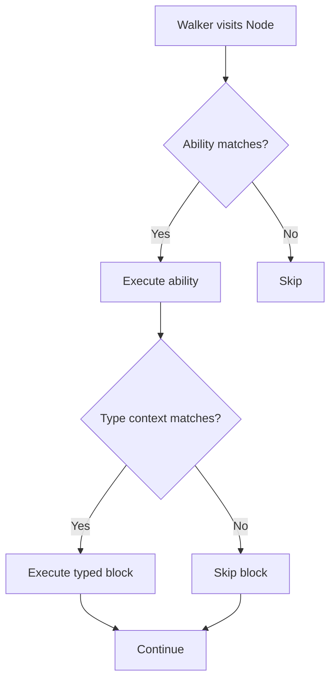

**Typed Context Blocks (OSP)**

Typed context blocks are a powerful feature in Jac's Object-Spatial Programming (OSP) model that allow conditional code execution based on the runtime type of nodes or walkers. They enable polymorphic behavior where a single ability can handle multiple types differently.

**Syntax**

The syntax uses the `->` operator followed by a type name and a code block:

`-> TypeName { #* code *# }`

The code inside executes **only if** the runtime type matches.

**Two Use Cases**

Typed context blocks work in two contexts:

1. **In Walker Abilities** (lines 55-95): Check the type of `here` (the current node)
2. **In Node Abilities** (lines 96-117): Check the type of `visitor` (the current walker)

**Two Approaches: Inheritance vs. Tuple**

Lines 4-23 define an inheritance hierarchy:

```
Product (base)
├── Media (intermediate)
│   ├── Book (leaf)
│   └── Magazine (leaf)
└── Electronics (leaf)
```

**Approach 1: Base Type with Inheritance (Lines 55-76)**

Use a base type in the ability signature to accept ALL subtypes. See line 55: the ability signature is `with Product entry`, which means it triggers for Product AND all its subtypes (Book, Magazine, Electronics).

Lines 59-71 show typed context blocks that differentiate between specific subtypes:
- Line 59: `-> Book` executes ONLY if here is a Book
- Line 64: `-> Magazine` executes ONLY if here is a Magazine
- Line 69: `-> Electronics` executes ONLY if here is Electronics

**Approach 2: Tuple of Specific Types (Lines 80-95)**

Use parentheses to list only the specific types that should trigger the ability. See line 80: the ability signature is `with (Book, Magazine) entry`, which means it triggers ONLY for Book and Magazine (NOT Electronics).

Lines 84-92 show typed context blocks differentiating the tuple members:
- Line 84: `-> Book` provides Book-specific discount logic
- Line 89: `-> Magazine` provides Magazine-specific discount logic

**Key Difference:**
- `with Product entry`: Electronics WILL trigger (inherits from Product)
- `with (Book, Magazine) entry`: Electronics will NOT trigger (not in tuple)

**Node Abilities with Inheritance Chains**

Lines 25-37 define a customer inheritance hierarchy:

```
Customer (base)
├── RegularCustomer (subtype)
└── VIPCustomer (subtype)
```

Lines 96-117 show the same pattern for `visitor` types. The ability signature at line 98 is `with Customer entry`, accepting the base type Customer, so ALL subtypes trigger this ability.

Lines 101-115 show typed context blocks for specific customer types:
- Lines 101-103: `-> RegularCustomer` handles regular customers
- Lines 106-111: `-> VIPCustomer` handles VIP customers with discount calculation
- Lines 114-116: `-> Customer` handles all Customers (including subtypes)

**The Key Difference:**
- In walker abilities: Typed context blocks check `here` (the node type)
- In node abilities: Typed context blocks check `visitor` (the walker type)
- Both use the same inheritance matching behavior

**Execution Flow**

When the walker visits a node:



**Demo 1: Shopping Cart (Lines 44-96)**

The `ShoppingCart` walker demonstrates BOTH approaches:

1. **Lines 44-51**: Creates inventory (Book, Magazine, Electronics - all inherit from Product)

2. **Lines 55-76**: `process_item` ability - **Inheritance approach**
   - Signature: `with Product entry`
   - Triggers for ALL Product subtypes (Book, Magazine, Electronics)
   - Typed context blocks differentiate: `-> Book`, `-> Magazine`, `-> Electronics`

3. **Lines 80-95**: `apply_discount` ability - **Tuple approach**
   - Signature: `with (Book, Magazine) entry`
   - Triggers ONLY for Book and Magazine (NOT Electronics)
   - Typed context blocks differentiate: `-> Book`, `-> Magazine`

**Output shows:**
- `[Inheritance]` appears for all 3 products (base type accepts all)
- `[Tuple]` appears only for Book and Magazine (explicit types only)

**Demo 2: Checkout (Lines 98-117)**

The `Checkout` node demonstrates typed context blocks for handling different customer types:

1. **Lines 98-117**: Single ability with three typed context blocks
2. **Lines 101-103**: `-> RegularCustomer` block handles regular customers
3. **Lines 106-111**: `-> VIPCustomer` block applies VIP discount
4. **Lines 114-116**: `-> Customer` block handles base customer type

When different walkers visit the checkout node:
- `Customer` walker → triggers Customer block
- `RegularCustomer` walker → triggers RegularCustomer AND Customer blocks
- `VIPCustomer` walker → triggers VIPCustomer AND Customer blocks

**Why Use Typed Context Blocks?**

**1. Polymorphic Handling**

Handle multiple types in a single ability without explicit if-statements. Compare line 175-183 (without typed context blocks) versus line 186-189 (with typed context blocks) - the latter is cleaner and more declarative.

**2. Type Safety**

The compiler knows the exact type inside the block, providing better type checking and autocomplete.

**3. Extensibility**

Add new typed context blocks without modifying existing code. See lines 199-204 for an example of adding a new Furniture type.

**4. Separation of Concerns**

Each type's logic is isolated in its own block, improving readability.

**Relationship to Abilities**

Typed context blocks complement the ability system:

| Feature | Purpose | Example |
|---------|---------|---------|
| **Ability signature** | Declares when ability triggers | `with Book entry` |
| **Typed context block** | Provides type-specific logic | `-> Book { }` |

You can combine them as shown in lines 55-76 (general ability with typed blocks) or use more specific ability signatures as shown in line 80.

**Multiple Typed Context Blocks**

You can have multiple typed context blocks in a single ability (see lines 98-117 for example). Code outside the blocks runs for all types, while each typed context block runs only when its type matches.

**Inheritance and Type Hierarchy**

Typed context blocks work seamlessly with inheritance. Lines 4-23 define the Product hierarchy.

**Two Ways to Handle Subtypes:**

**1. Base Type in Ability Signature**

Line 55 shows `with Product entry` - this triggers for Product AND all subtypes (Book, Magazine, Electronics).

**2. Tuple of Specific Types**

Line 80 shows `with (Book, Magazine) entry` - this triggers ONLY for the listed types.

**Typed Context Block Matching:**

A typed context block `-> Product` matches Product and all its subtypes (Book, Electronics, etc.), while `-> Book` only matches Book specifically. This is why in the output you see multiple blocks executing for a single node visit.

**Best Practice:** Check most specific types first if you have multiple blocks, as shown in lines 59-71 where specific types (Book, Magazine, Electronics) are checked before any generic Product handling.

**When to Use Typed Context Blocks**

**Use when:**
- A single ability needs to handle multiple types differently
- You want type-specific logic within a general ability
- Adding new types should be easy (extensibility)
- You want cleaner code than nested if-statements

**Don't use when:**
- Only handling one type (just use normal ability signature)
- Logic is the same for all types (no need for type checking)
- Types are unrelated and should have completely separate abilities

**Key Insights**

1. **Dual context**: Check `here` in walker abilities, `visitor` in node abilities
2. **Runtime dispatch**: Type checking happens at runtime based on actual instance types
3. **Optional execution**: Blocks only execute when types match, silently skip otherwise
4. **Complements abilities**: Work together with ability signatures for powerful dispatch
5. **Type-safe**: Compiler understands the type inside the block
6. **Inheritance aware**: Blocks match base types and all derived types

**Comparison to Traditional OOP**

In traditional OOP, you might use:
- **Method overloading** (compile-time): Different methods for different parameter types
- **Visitor pattern** (runtime): Double dispatch for type-specific behavior
- **Type checking** (runtime): `isinstance()` checks with if-statements

Typed context blocks provide:
- **Spatial dispatch**: Combines where (node/walker) with what (type)
- **Declarative syntax**: Clear, readable type-specific blocks
- **Bidirectional**: Both nodes and walkers can type-check each other

This is unique to Jac's Object-Spatial Programming model, where computation (walkers) moves through data (nodes/edges), and both can respond based on each other's types.
