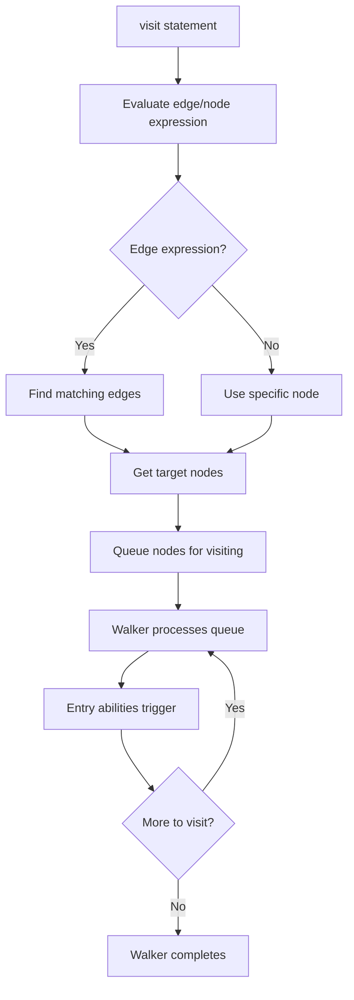

**Visit Statements**

Visit statements are the fundamental mechanism for walker traversal in Jac's Object-Spatial Programming model. They control how walkers move through graph structures, embodying the paradigm shift from "data flows to computation" to "computation flows to data."

**Node Definition**

Lines 3-5 define a `Person` node with a `name` attribute. This node type will be used throughout the examples to build a graph structure that walkers can traverse.

**Basic Visit Syntax**

Line 11 demonstrates the simplest visit form: `visit [-->];`

Components:
- `visit` - Keyword initiating traversal
- `[-->]` - Edge expression (outgoing edges)
- `;` - Statement terminator

This tells the walker to visit all nodes reachable via outgoing edges from the current node.

**Walker with Visit**

Lines 8-17 define a walker that demonstrates basic visiting:

Line 9 defines an ability that triggers when entering the root node. Line 11 executes the visit statement, queueing connected nodes. Lines 14-16 define an ability that triggers when entering Person nodes, using `here.name` to access the current node's attribute.

**Visit with Else Clause**

Lines 23-24 demonstrate the else clause:

The else block executes when the edge expression matches zero edges. This is useful for:
- Detecting terminal/leaf nodes
- Implementing backtracking behavior
- Handling dead ends in traversal
- Providing fallback navigation logic

Lines 30-32 show else in a Person ability, detecting when a node has no outgoing edges (leaf node).

**Directional Edge Operators**

| Expression | Direction | Description |
|------------|-----------|-------------|
| `[-->]` | Outgoing | All edges leaving current node |
| `[<--]` | Incoming | All edges entering current node |
| `[<-->]` | Bidirectional | All edges in both directions |

Line 11 uses `[-->]` for outgoing traversal, the most common pattern.

**Direct Node Visit**

Lines 37-49 demonstrate visiting a specific node:

Line 42 shows `visit self.target;` - instead of an edge expression, this visits the specific node stored in the walker's `target` attribute. Line 106 spawns this walker with `DirectVisit(target=charlie)`, passing the target node as a parameter.

**Typed Edge Traversal**

Lines 52-59 demonstrate visiting through specific edge types:

Line 57 uses `[->:Friend:->]` to traverse only Friend-typed edges. The pattern is:
- `->` - Outgoing direction indicator
- `:Friend:` - Edge type filter
- `->` - Target direction

This allows structural queries: "follow only these types of connections."

**Filtered Edge Traversal**

Lines 62-71 demonstrate edge attribute filtering:

Line 69 uses `[->:Colleague:strength > 5:->]` to traverse only Colleague edges where the `strength` attribute exceeds 5. The pattern is:
- `->:Colleague:` - Edge type
- `strength > 5` - Attribute filter condition
- `:->` - Target direction

This combines structural and property-based filtering.

**Multiple Visit Statements**

Lines 74-85 show a walker with multiple visit statements:

When this walker executes:
1. Line 77 visits from root
2. For each Person reached, lines 80-83 execute
3. Line 83 visits again from that Person
4. The process continues recursively

Multiple visits enable complex multi-phase traversal algorithms.

**Visit Execution Flow**

**Graph Construction**

Lines 88-97 build the graph structure:

| Line | Operation | Description |
|------|-----------|-------------|
| 93 | `root ++> alice;` | Connect root to Alice |
| 94 | `alice ++> bob;` | Connect Alice to Bob |
| 95 | `alice ++> charlie;` | Connect Alice to Charlie |
| 96 | `alice +>:Friend:+> bob;` | Create Friend edge to Bob |
| 97 | `alice +>:Colleague(strength=7):+> charlie;` | Create Colleague edge with attributes |

Lines 99-115 then spawn various walkers to traverse this graph structure using different visit patterns.

**Visit Patterns Summary**

| Pattern | Line | Description |
|---------|------|-------------|
| Basic outgoing | 11 | `visit [-->];` - Follow all outgoing edges |
| With else | 23 | `visit [-->] else { ... }` - Handle no edges case |
| Direct node | 42 | `visit self.target;` - Visit specific node |
| Typed edges | 57 | `visit [->:Friend:->];` - Filter by edge type |
| Filtered edges | 69 | `visit [->:Type:attr > val:->];` - Filter by attributes |
| Multiple visits | 77, 83 | Sequential visit statements |

**The here Reference**

Throughout the examples, `here` is used to access the current node:
- Line 16: `here.name` - Access node attribute
- Line 29: `here.name` - Used in Person ability
- Line 56: `here.name` - In typed edge walker
- Line 68: `here.name` - In filtered edge walker

The `here` special reference always points to the node the walker is currently visiting.

**Complete Traversal Example**

Lines 99-115 demonstrate running all the example walkers:

1. `root spawn BasicVisitor()` - Basic outgoing traversal
2. `root spawn VisitWithElse()` - Traversal with else handling
3. `root spawn DirectVisit(target=charlie)` - Direct node visit
4. `alice spawn TypedVisit()` - Typed edge filtering
5. `alice spawn FilteredVisit()` - Attribute filtering
6. `root spawn MultiVisit()` - Multiple visits

Each demonstrates a different visit pattern on the same graph structure.

**Key Characteristics**

Visit statements enable:
- Declarative graph traversal (specify what to visit, not how)
- Type-based filtering (visit only certain edge types)
- Attribute-based filtering (visit based on edge properties)
- Fallback logic (else clause for dead ends)
- Direct navigation (visit specific nodes)
- Complex algorithms (multiple sequential visits)

**Comparison with Traditional Control Flow**

| Traditional | Jac Visit |
|-------------|-----------|
| `for node in nodes: process(node)` | `visit [-->]` |
| Data comes to function | Walker goes to data |
| Imperative (how to iterate) | Declarative (what to visit) |
| Manual queueing | Runtime handles traversal |

Visit statements are the foundation of Object-Spatial Programming, making Jac particularly expressive for graph-based computation and spatial queries.
