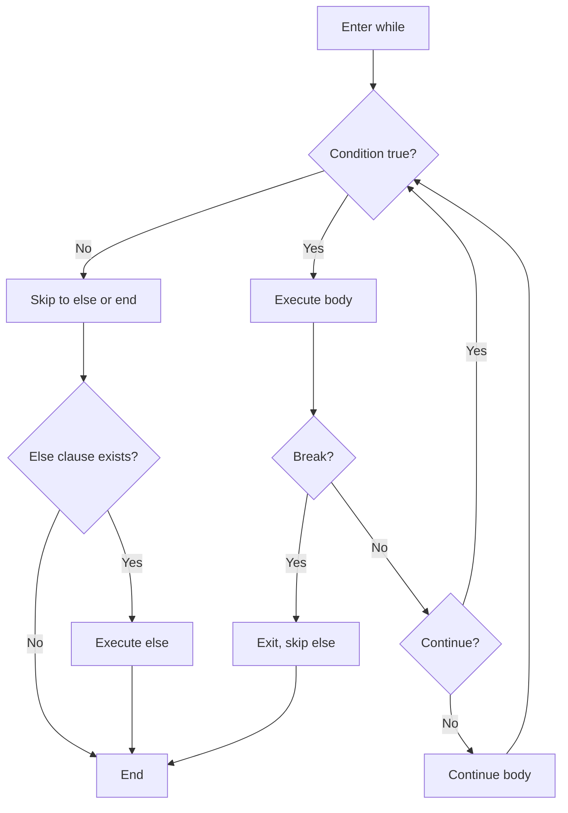

**While Statements**

While statements provide condition-based iteration, continuing execution as long as the specified condition remains true. While loops are ideal when the number of iterations is unknown in advance and depends on runtime conditions.

**Basic While Loop**

Lines 5-9 demonstrate fundamental while syntax:

```
x = 0;
while x < 5 {
    print(x);
    x += 1;
}
```

The loop evaluates `x < 5` before each iteration. If true, the body executes. Line 8 increments `x` to eventually make the condition false, preventing an infinite loop. This loop prints 0, 1, 2, 3, 4.

**While with Complex Condition**

Lines 12-18 show combining multiple conditions:

```
a = 0;
b = 10;
while a < 5 and b > 5 {
    print(f"a={a}, b={b}");
    a += 1;
    b -= 1;
}
```

Line 14 combines two conditions with `and`. Both must be true for the loop to continue. As `a` increases and `b` decreases, eventually one condition fails and the loop stops.

**While with Else Clause**

Lines 21-27 demonstrate the else clause:

```
count = 0;
while count < 3 {
    print(count);
    count += 1;
} else {
    print("completed");
}
```

The else block (lines 25-26) executes only if the loop completes normally (condition becomes false) without encountering `break`. This is useful for distinguishing between normal completion and early exit.

**While with Break**

Lines 30-39 show `break` exiting the loop:

```
i = 0;
while i < 10 {
    if i == 3 {
        break;
    }
    print(i);
    i += 1;
} else {
    print("not reached");
}
```

When `break` executes on line 33, the loop terminates immediately. The else clause (lines 37-38) is skipped. The loop prints 0, 1, 2, then exits.

**While with Continue**

Lines 42-49 show `continue` skipping to the next iteration:

```
num = 0;
while num < 5 {
    num += 1;
    if num % 2 == 0 {
        continue;
    }
    print(num);
}
```

Important: Line 44 increments `num` **before** the continue check. If incremented after, even numbers would cause an infinite loop. The continue statement skips line 48 for even numbers, printing only odd numbers: 1, 3, 5.

**Infinite Loop with Break**

Lines 52-59 show the `while True` pattern:

```
counter = 0;
while True {
    print(counter);
    counter += 1;
    if counter >= 3 {
        break;
    }
}
```

`while True` creates an infinite loop. Line 56 checks the exit condition and breaks when met. This pattern is clearer than complex loop conditions when you have multiple exit criteria checked within the body.

**Nested While Loops**

Lines 62-70 demonstrate nesting:

```
outer = 0;
while outer < 2 {
    inner = 0;
    while inner < 2 {
        print(f"{outer},{inner}");
        inner += 1;
    }
    outer += 1;
}
```

The inner loop (lines 64-67) completes fully for each iteration of the outer loop (lines 63-69). This prints: 0,0 then 0,1 then 1,0 then 1,1.

**Loop Control Flow Summary**

| Statement | Effect | Else Clause |
|-----------|--------|-------------|
| `break` | Exit loop immediately | Skipped |
| `continue` | Skip to next iteration | Not affected |
| Normal completion | Condition becomes false | Executes (if present) |

**While vs For Comparison**

| Feature | While Loop | For Loop |
|---------|------------|----------|
| Condition | Explicit boolean expression | Implicit iteration over iterable |
| Counter management | Manual | Automatic |
| Use case | Condition-based | Collection/range iteration |
| Known iterations | No (condition-dependent) | Yes (based on iterable size) |

**When to Use While**

Prefer while loops for:
- Condition-dependent iteration (unknown iteration count)
- Processing until a sentinel value appears
- Polling or waiting for conditions
- Collections that change size during iteration
- State machines or complex control flow

Prefer for loops for:
- Iterating a known number of times
- Processing all items in a collection
- Cleaner code when iteration count is fixed

**Execution Flow**



**Common Patterns**

Countdown:
```
while count > 0 {
    print(count);
    count -= 1;
}
```

Search with early exit:
```
idx = 0;
while idx < len(items) {
    if items[idx] == target {
        break;
    }
    idx += 1;
} else {
    print("not found");
}
```

Process until sentinel:
```
while True {
    item = get_next();
    if item == SENTINEL {
        break;
    }
    process(item);
}
```

Polling/waiting:
```
while not condition_met() {
    wait();
    check_again();
}
```

**Important Considerations**

Line 44 in the continue example demonstrates a critical point: when using `continue`, ensure the loop variable is updated **before** the continue check, otherwise you risk an infinite loop.

The else clause (lines 21-27, 37-38) executes only on normal completion. If `break` is used, else is skipped. This is useful for search patterns where else indicates "not found."

While loops require manual management of loop variables. Forgetting to update the variable (like line 8, 17, 36, etc.) creates infinite loops.

**Best Practices**

- Always update loop variables to ensure eventual termination
- Use `while True` with explicit `break` for multiple exit conditions
- Place variable updates before `continue` checks
- Use else clause to distinguish normal completion from break
- Prefer for loops when iteration count is known
- Cache expensive condition calculations outside the loop when possible
