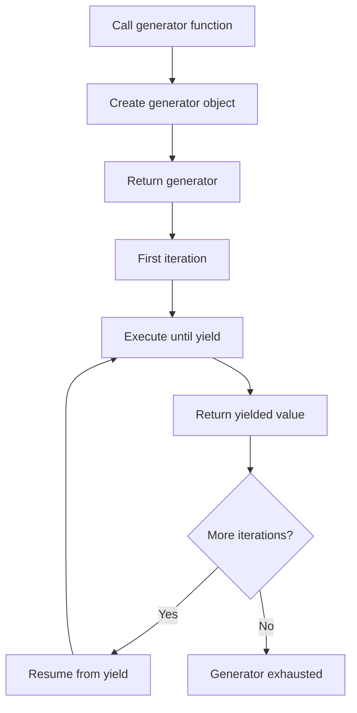

**Yield Statements**

Yield statements transform a regular function into a generator, enabling lazy evaluation and efficient iteration over sequences that would be expensive or impossible to compute all at once.

**Basic Yield Statement**

Lines 3-7 demonstrate the fundamental yield syntax:

Instead of returning a single value and terminating, this function yields three values one at a time. When called on line 47, `simple_generator()` doesn't execute the function body immediately. It returns a generator object that can be iterated.

**Generator Iteration**

Lines 46-49 show consuming a generator:

Each iteration:
1. Resumes the generator from where it last yielded
2. Executes until the next yield statement
3. Returns the yielded value
4. Suspends execution, preserving local state

This prints: 1, 2, 3 (each on a separate line).

**Yielding Different Types**

Lines 9-13 demonstrate yielding various value types:

Generators can yield any type:
- Line 10: String
- Line 11: Integer
- Line 12: List

Lines 52-55 iterate this generator, printing: "hello", 42, [1, 2, 3].

**Yield without Expression**

Lines 15-17 show yielding None:

Line 16 uses `yield;` without an expression, producing `None`. Lines 58-61 iterate this generator, printing: None.

**Yield in Loops**

Lines 19-23 demonstrate yielding in a loop:

This is a common pattern for generating sequences. Instead of building a complete list, values are generated one at a time. Lines 64-67 call with `n=5`, yielding: 0, 1, 2, 3, 4.

This is memory-efficient because values are generated on demand rather than stored in a list.

**Yield From**

Lines 25-28 demonstrate delegating to another generator:

`yield from` delegates to another iterable:
- Line 26: Yields each element from the list [1, 2, 3]
- Line 27: Yields each value from range(4, 7) which is 4, 5, 6

Lines 70-73 iterate this generator, printing: 1, 2, 3, 4, 5, 6.

`yield from` is more concise and efficient than manually looping and yielding each value.

**Conditional Yield**

Lines 30-36 show yielding based on conditions:

This iterates through items but only yields those satisfying the condition (even numbers). Lines 76-79 call with `[1, 2, 3, 4, 5, 6]`, yielding only: 2, 4, 6.

This pattern enables selective generation, filtering during iteration rather than pre-filtering.

**Yield with Expressions**

Lines 38-42 demonstrate yielding computed values:

Yields can be arbitrary expressions:
- Line 40: `x * 2` evaluates to 20
- Line 41: `x + 5` evaluates to 15

Lines 82-85 iterate, printing: 20, 15.

**Generator Characteristics**

| Characteristic | Description |
|----------------|-------------|
| Lazy evaluation | Values computed only when requested |
| State preservation | Local variables maintained between yields |
| Memory efficiency | Only one value in memory at a time |
| One-time iteration | Once exhausted, must create new generator |

**Yield vs Return**

| Feature | `yield` | `return` |
|---------|---------|----------|
| Function type | Generator | Regular function |
| Execution | Pauses and resumes | Terminates |
| Values produced | Multiple (or infinite) | Single |
| Memory | One value at a time | All values if returning collection |
| State | Preserved between yields | Lost on return |

**Generator Execution Flow**

**Use Cases**

Yield statements excel at:

| Use Case | Example | Benefit |
|----------|---------|---------|
| Large datasets | Processing files line-by-line | Memory efficient |
| Infinite sequences | Fibonacci generator | Never-ending values |
| Pipeline processing | Chaining generators | Data transformation |
| Lazy computation | Defer expensive calculations | Compute only what's needed |
| Stream processing | Reading from databases/APIs | Process as data arrives |

**Complete Example Flow**

Lines 44-86 demonstrate all yield patterns:

1. Simple yields (lines 46-49) - Basic generator
2. Different types (lines 52-55) - Type flexibility
3. Yield None (lines 58-61) - Bare yield
4. Yield in loop (lines 64-67) - Common pattern
5. Yield from (lines 70-73) - Delegation
6. Conditional yield (lines 76-79) - Filtering
7. Yield expressions (lines 82-85) - Computed values

**Generator Protocol**

Generators implement the iterator protocol:
- `__iter__()` - Returns the generator itself
- `__next__()` - Resumes execution until next yield
- Raises `StopIteration` when function completes without yielding

This allows generators in any iterable context: for loops, list comprehensions, `list()`, `sum()`, etc.

**Memory Comparison**

Without generators (builds entire list):

With generators (one at a time):

Generators enable processing arbitrarily large or infinite sequences with constant memory usage, making them essential for efficient data processing in Jac.
